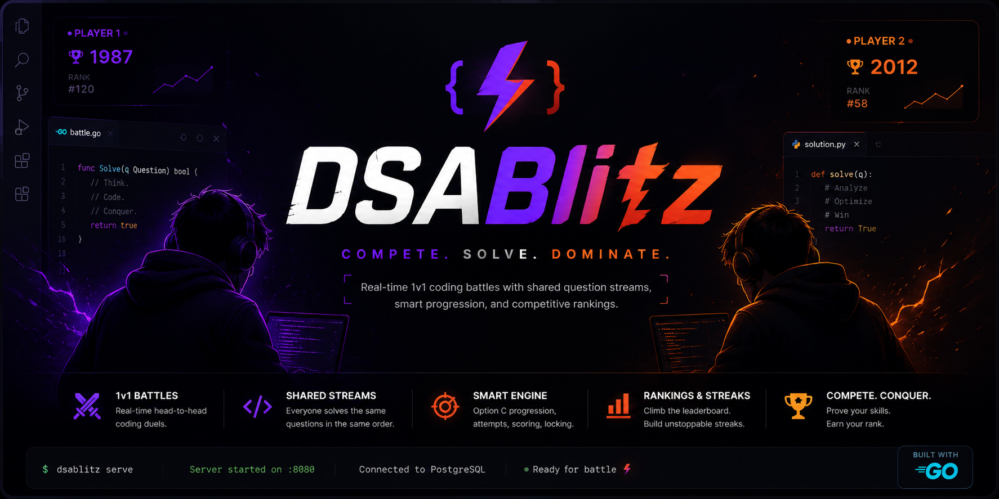

<p align="center">
  
</p>
# 🚀 DSAblitz

> A production-oriented real-time competitive coding platform built with Go.

DSAblitz is a backend-focused engineering project where two players compete in synchronized Data Structures & Algorithms battles using a shared deterministic question stream. The project emphasizes clean architecture, transactional consistency, concurrency control, and scalable backend design rather than simply implementing application features.

---

## ✨ Vision

Traditional DSA platforms are mostly single-player experiences.

DSAblitz aims to make algorithm practice engaging through:

- ⚔️ Real-time 1v1 coding battles
- 👥 Friend-based competition
- 📈 Ratings and progression
- 🔥 Winning streaks
- 🏆 Competitive leaderboards
- ⚡ Low-latency gameplay

Inspired by competitive multiplayer games while preserving interview-focused DSA practice.

---

# 🏗 Current Architecture

DSAblitz follows a **Modular Monolith** architecture.

```
                   Client
                      │
                HTTP / REST API
                      │
                 Gin Router
                      │
     ┌──────────┬──────────┬──────────┬──────────┐
     │          │          │          │
   Auth     Questions     Rooms     Battle
     │          │          │          │
     └──────────┴──────────┴──────────┘
                 Repository Layer
                      │
                 PostgreSQL (pgx)
```

Every module owns its domain while exposing only well-defined interfaces.

---

# 📦 Implemented Modules

## ✅ Authentication

- User Signup
- User Login
- JWT Authentication
- Refresh Token Flow
- Secure Password Hashing
- Protected Routes
- Stateless Access Tokens
- Stateful Refresh Sessions

---

## ✅ Questions Module

Implemented:

- Shared deterministic question streams
- Multiple question types
    - MCQ
    - Complexity Prediction
    - Numeric Answer
    - Algorithm Ordering
- Question sanitization
- Stateless validation engine
- JSON seeding pipeline
- In-memory read cache
- Repository pattern
- Domain validation
- Unit tests

---

## ✅ Rooms Module

Implemented:

- Room creation
- Join room
- Leave room
- Ready state handling
- Host ownership
- Player validation
- Capacity enforcement
- Transaction-safe operations
- Room lifecycle management

---

## ✅ Battle Module

Implemented:

- Shared deterministic question stream
- Battle creation
- Battle lifecycle
- Option C progression logic
- Two-attempt state machine
- Transaction boundaries
- Row-level locking
- Duplicate submission protection
- Configurable scoring abstraction
- Unit tests

---

# 🗄 Database

Current database includes:

- users
- refresh_tokens
- friendships
- rooms
- room_players
- battles
- battle_players
- battle_question_sequence
- questions
- question_stats
- submissions

Features:

- PostgreSQL
- pgx driver
- SQL migrations
- Foreign key constraints
- Repository pattern
- Idempotent seeders

---

# 🛠 Tech Stack

## Backend

- Go
- Gin
- PostgreSQL
- pgx
- JWT
- golang-migrate

## Testing

- Go Testing
- Table-driven tests
- Mock repositories

---

# ⚙ Engineering Highlights

This project focuses heavily on backend engineering principles.

Implemented:

- Modular Monolith Architecture
- Repository Pattern
- Service Layer Pattern
- Dependency Injection
- Domain-driven module boundaries
- Transaction ownership
- Row-level locking
- Idempotent operations
- Stateless validation
- Deterministic shared question generation
- Thread-safe in-memory caching
- Interface-based design
- Unit testing

---

# 📚 Documentation

The repository contains extensive engineering documentation.

```
docs/
│
├── architecture/
├── adr/
├── database/
├── deep-dives/
├── interview/
├── flows/
├── reviews/
├── roadmap/
├── glossary/
├── evolution/
├── knowledge-base/
└── PROJECT_CONTEXT.md
```

Documentation includes:

- Architecture Decisions (ADRs)
- Deep technical dives
- Flow diagrams
- Engineering reviews
- Interview preparation
- Design evolution timeline
- Risk registers
- Module documentation

---

# 🧪 Testing

Run the complete backend test suite:

```bash
go test ./...
```

Static analysis:

```bash
go vet ./...
```

Build:

```bash
go build ./cmd/dsablitz
```

---

# 📂 Project Structure

```
backend/
│
├── cmd/
├── configs/
├── internal/
│   ├── auth/
│   ├── battle/
│   ├── platform/
│   ├── questions/
│   ├── rooms/
│   ├── server/
│   └── users/
│
├── migrations/
└── docs/
```

---

# 📈 Current Progress

## ✅ Completed

- Backend Foundation
- PostgreSQL Integration
- Authentication Module
- Questions Module
- Rooms Module
- Battle Core
- Transactional Battle Engine
- Engineering Documentation
- ADRs
- Unit Testing

## 🚧 In Progress

- Battle Timer & Completion
- Battle HTTP APIs
- Documentation Expansion

## 📌 Planned Work (V2)

- WebSocket gameplay
- Elo Rating System
- Matchmaking Queue
- Redis integration
- Docker deployment
- Observability (Prometheus/Grafana)
- Distributed caching
- Leaderboards
- Production deployment

---

# 🎯 Engineering Goals

DSAblitz is intentionally built as a backend engineering project to practice and demonstrate:

- Backend System Design
- Go Backend Development
- PostgreSQL Design
- Concurrency Control
- Transaction Management
- Clean Architecture
- API Design
- Scalable Backend Patterns
- Production-ready Documentation

---

# 🤝 Contributing

This project is currently under active development.

Architecture-first changes are preferred over feature-first implementations.

Every significant change is expected to include:

- Updated documentation
- Unit tests
- Architectural review
- Design rationale (when applicable)

---

# 📄 License

This project is licensed under the MIT License.

---

## ⭐ Current Status

**DSAblitz is an actively evolving backend engineering project.**

The current focus is completing the battle engine, HTTP APIs, and production-grade backend infrastructure before moving to real-time gameplay and deployment.