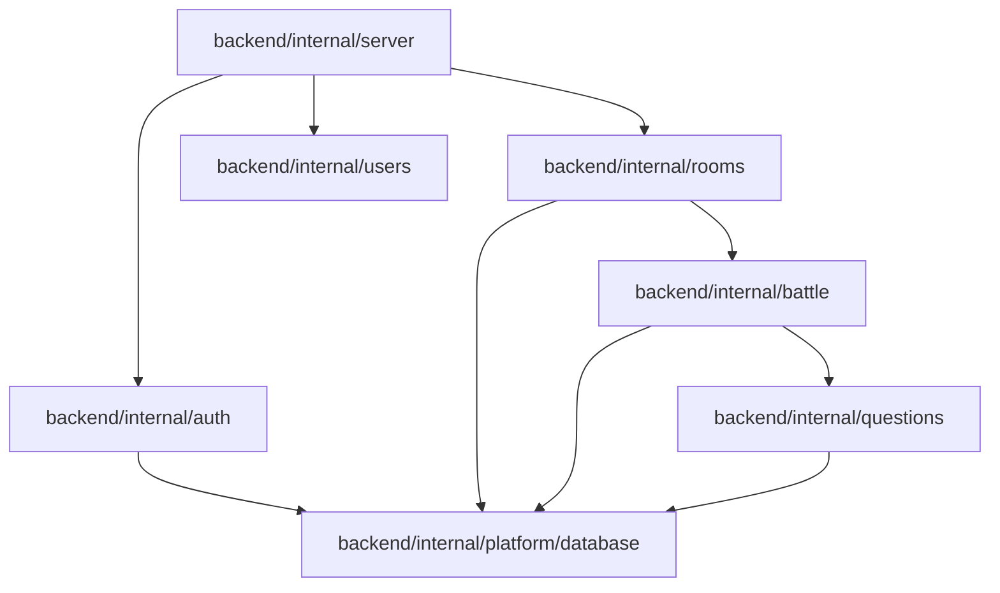

# Package Dependency Graph

This document answers the primary question: **What package relationships are allowed in the backend modular monolith, which are strictly prohibited, and how are compile-time boundaries enforced?**

---

## 1. Permitted Package Dependency Flow

The package dependency graph is strictly acyclic. Packages are organized in hierarchical levels, with higher layers importing lower layers:



---

## 2. Forbidden Dependency Directions

To maintain architectural integrity, the following imports are strictly prohibited:

* **Questions $\to$ Battle/Rooms/Server**: The `questions` module is a core utility. It must never import any gameplay state packages.
* **Battle $\to$ Rooms**: The `battle` engine is instantiated by a room, but the battle engine must not know about room structures, players in a lobby, or chat features.
* **Direct Domain $\to$ Server**: No core module (`auth`, `rooms`, `battle`, `questions`, `users`) may import the `server` package, as `server` acts as the root orchestrator.
* **Circular Dependencies**: Go's compiler strictly rejects circular packages. If package `A` imports `B`, `B` must never import `A`.

---

## 3. Resolving Cross-Module Operations (Interface Adapters)

To allow package `A` (e.g. `rooms`) to trigger logic in package `B` (e.g. `battle`) without importing it directly:

1. **Interface Definition**: `rooms` declares the [BattleCoordinator](file:///home/tanishq/dsablitz/backend/internal/rooms/service.go#L18) interface:
   ```go
   type BattleCoordinator interface {
       StartBattle(ctx context.Context, roomID uuid.UUID, players []BattlePlayer, seed int64, durationSeconds int) (uuid.UUID, error)
   }
   ```
2. **Adapter Implementation**: The `battle` package service implements this logic, or the server registers an adapter wrapper in [routes.go](file:///home/tanishq/dsablitz/backend/internal/server/routes.go#L61):
   ```go
   type battleCoordinatorAdapter struct {
       battleService *battle.Service
   }
   ```
3. **Dependency Injection**: At boot time, the adapter instance is injected into the `rooms` package service constructor. This achieves decoupling.

---

## 4. Alternatives Considered & Rejected

### Why not share database queries instead of Go interfaces?
* **Rejected**: Allowing `rooms` to query the `battles` table directly would couple their database schemas together. If we decide to split `battle` into a separate microservice, all queries in `rooms` would break. Restricting access to Go interfaces preserves modular boundaries.

### Why not use a Shared Event Bus (e.g. RabbitMQ, Kafka)?
* **Rejected**: Event brokers add substantial deployment complexity, require consumer loops, and introduce asynchronous latency. Standard Go interface method execution is local, synchronous, and runs in nanoseconds.

---

## 5. Architectural Tradeoffs

### Pros
* **Compile-Time Enforcement**: The Go compiler automatically rejects cyclic package dependencies, preventing the monolith from becoming tightly coupled.
* **Refactoring Simplicity**: Since imports only run downward, we can modify or refactor the `questions` module without risking unexpected side effects in the `rooms` or `server` packages.

### Cons
* **Adapter Proliferation**: Decoupling packages requires writing adapter boilerplate structs and interfaces, increasing line count.
* **Complex Mocking**: Testing requires creating mock structs for every injected interface.

---

## Key Takeaways
1. Code dependencies flow in one direction: from server controllers down to stateless platform tables.
2. Interfaces allow modules to call each other at runtime without importing each other at compile time.

## Common Interview Questions
* **How do you enforce modular boundaries in a monolithic codebase?**
  * *Answer*: By utilizing Go's package compiler rules. We structure features in separate package directories and prohibit imports that flow upward or create circular links. Cross-module calls must go through interfaces.
* **Why not use reflection or service location for decoupling?**
  * *Answer*: Reflection introduces runtime performance overhead and hides dependency errors until runtime. Constructor-based Dependency Injection resolves all dependencies at compilation/boot time.

## Related Documents
* For structural layering, see [overall_architecture.md](file:///home/tanishq/dsablitz/docs/architecture/overall_architecture.md).
* For Go package directory configurations, see [package_structure.md](file:///home/tanishq/dsablitz/docs/architecture/package_structure.md).
* For run-time interfaces, see [module_interactions.md](file:///home/tanishq/dsablitz/docs/architecture/module_interactions.md).
