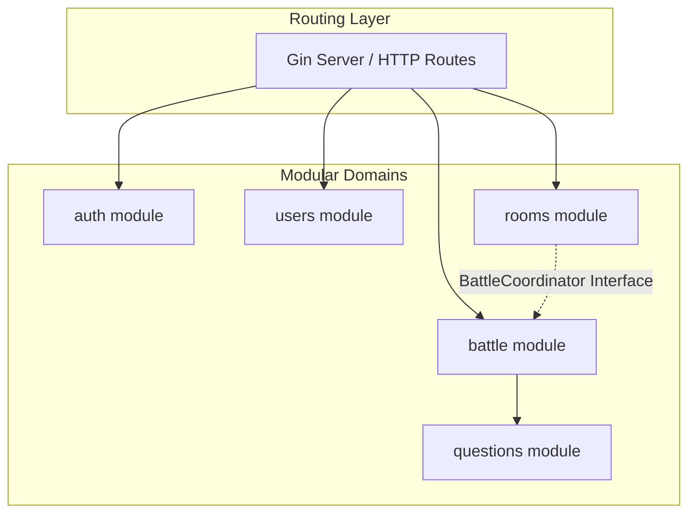

# Overall Backend System Architecture

This document answers the primary question: **What is the structural blueprint of the DSAblitz backend, how are modular monolith boundaries enforced, and what are the system tradeoffs?**

---

## 1. Architectural Style: Modular Monolith

DSAblitz is designed as a **Modular Monolith**. The application compiles into a single executable binary, but internal code is structured as isolated domain packages with strict boundary rules.

---

## 2. Layering Architecture

Within each package (e.g., `backend/internal/rooms`, `backend/internal/battle`), the code follows a three-tier layout:

1. **Routing & Delivery Layer**:
   * Registers REST endpoints and WebSocket pumps using Gin framework contexts.
   * Maps request payloads to internal domain models and returns structured JSON responses.
   * Implementation: `RegisterRoutes()` in [routes.go](file:///home/tanishq/dsablitz/backend/internal/server/routes.go#L56).

2. **Domain Service Layer**:
   * Contains core business rules, state machines, and validation logic.
   * Controls database transactions, ensuring all mutative queries succeed or roll back as one.
   * Implementation: `Service` in [service.go](file:///home/tanishq/dsablitz/backend/internal/battle/service.go#L52).

3. **Data Access (Repository) Layer**:
   * Encapsulates raw SQL queries executing against the PostgreSQL pool using `pgx`.
   * Accepts active transactions `tx pgx.Tx` from the service layer to support nested operations on the same DB connection.
   * Implementation: `Repository` in [repository.go](file:///home/tanishq/dsablitz/backend/internal/battle/repository.go#L33).

---

## 3. Boundary Rules & Decoupling

We enforce strict compile-time dependency limits:
* **Questions is Stateless & Leaf**: The `questions` package must never import any other core package (`rooms`, `battle`, `auth`).
* **No Circular Imports**: If `rooms` needs to start a gameplay session, it must not import `battle` directly. Instead, it defines a [BattleCoordinator](file:///home/tanishq/dsablitz/backend/internal/rooms/service.go#L18) interface. The `battle` module implements this adapter interface and is injected at server startup in [routes.go](file:///home/tanishq/dsablitz/backend/internal/server/routes.go#L61).
* **Database Co-Location**: All modules share a single PostgreSQL database connection pool (`pgxpool.Pool`), but queries must only join tables owned by the respective module.

---

## 4. Alternatives Considered & Rejected

### Why not Microservices?
* **Rejected**: Microservices introduce significant overhead (network serialization latency, distributed transaction complexities, service mesh orchestration). For 1v1 rapid-fire battles requiring sub-100ms response times, local Go method calls are far superior to gRPC or HTTP RPC hops.

### Why not Event Sourcing?
* **Rejected**: Event sourcing (replaying all historical state changes to determine current score/lobby membership) introduces unnecessary latency and read complexity for an MVP. Simple state columns backed by row-level serialization locks provide immediate consistency.

### Why not Redis for Primary State?
* **Rejected**: Storing room lobbies and active battle states solely in Redis introduces data loss risks upon cache crashes and increases complexity in relational indexing. We persist core states in PostgreSQL and read questions from an in-memory cache.

---

## 5. Architectural Tradeoffs

### Pros
* **High Performance**: In-memory interface calls take nanoseconds, avoiding RPC latency.
* **Simple Operations**: Compiles into a single binary, simplifying Docker packaging and Kubernetes deployment.
* **Strict Decoupling**: Interfaces prevent circular import errors, making package boundaries visible.

### Cons
* **Unified Resource Scaling**: We cannot scale only the CPU-intensive question validation engine without replicating the entire app binary.
* **Database Connection Bottleneck**: All modules share the same database pool (`pgxpool`), meaning a query leak in `rooms` can exhaust connections for `battle`.

### Limitations
* The single database configuration acts as a single point of failure (SPOF) and a throughput bottleneck under high concurrent matches.

### Future Improvements
* Introduction of read-replicas for questions lookup (if database querying is adopted in V2).
* Offloading leaderboard compilation to asynchronous worker routines.

---

## Key Takeaways
1. The modular monolith combines the deployment simplicity of a monolith with the logical decoupling of microservices.
2. Dependency inversion adapters are the key pattern to bypass circular imports in Go.

## Common Interview Questions
* **Why choose a Modular Monolith instead of Microservices?**
  * *Answer*: To avoid network serialization latency, distributed transaction overheads (Saga pattern), and operational complexity while maintaining clear package boundaries that allow future microservices migration if needed.
* **How do modules communicate without circular dependencies in Go?**
  * *Answer*: Using Dependency Inversion. We define consumer interfaces (e.g. `BattleCoordinator` inside the `rooms` package) and inject concrete implementations (e.g. `battleCoordinatorAdapter` in [routes.go](file:///home/tanishq/dsablitz/backend/internal/server/routes.go#L61)) at startup.

## Related Documents
* For code dependencies, see [dependency_graph.md](file:///home/tanishq/dsablitz/docs/architecture/dependency_graph.md).
* For dynamic execution paths, see [request_lifecycle.md](file:///home/tanishq/dsablitz/docs/architecture/request_lifecycle.md).
* For run-time interfaces, see [module_interactions.md](file:///home/tanishq/dsablitz/docs/architecture/module_interactions.md).
* For ADR records, see [ADR 0001](file:///home/tanishq/dsablitz/docs/adr/0001_modular_monolith_design.md).
