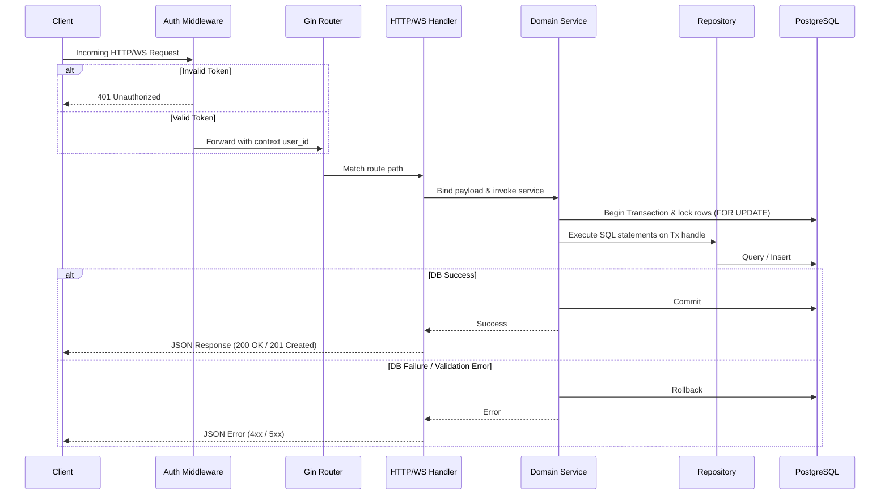

# Request Lifecycle

This document answers the primary question: **What path does an incoming HTTP/WebSocket request take through the DSAblitz backend system from the router down to database commits, and what are its performance tradeoffs?**

---

## 1. Request Flow Diagram

---

## 2. Step-by-Step Execution

### Step 1: Incoming Connection & TLS Termination
Requests are received by the Gin framework engine. If the route is protected (such as `/api/v1/battle/:id/current-question`), it passes through the JWT Auth Middleware ([middleware.go](file:///home/tanishq/dsablitz/backend/internal/auth/middleware.go#L15)) to verify token signatures and set `user_id` context variables.

### Step 2: Routing & Handler Binding
The router matches the endpoint URL and passes control to the package handler:
* Validates HTTP method types.
* Binds JSON request body inputs into strongly-typed validation structures.
* Extracts URL parameters and headers (such as the client monotonic `X-Submission-Index`).

### Step 3: Service Layer (Transaction Boundary)
The handler delegates calls to the domain service logic:
* The service invokes `repo.WithTransaction` to acquire a database transaction handle `tx pgx.Tx`.
* The service locks target rows (e.g. `SELECT FOR UPDATE` on `battle_players` or `rooms`) to serialize concurrent mutations.
* Evaluates domain state invariants (e.g. verifying that a battle timer has not expired using `clock.Now()`).

### Step 4: Repository (Data Mapping)
Under the service's open transaction block, the repository executes queries:
* Maps domain models into database rows.
* Updates state tables (e.g., `submissions`, `battles`, `rooms`).
* Scans Postgres column values back into Go structs.

### Step 5: Commit & Handshake Response
If all logic steps evaluate successfully, the service-layer transaction commits:
* The database releases active row locks.
* The handler writes a `200 OK` or `201 Created` JSON payload back to the network socket connection.
* If any step fails or returns an error, the transaction rolls back, abandoning all mutations.

---

## 3. Alternatives Considered & Rejected

### Why not standard library `http.Handler`?
* **Rejected**: The standard Go `net/http` package lacks built-in route parsing for nested parameters (e.g., `/battle/:id/current-question` in Go < 1.22) and context binding. Using Gin simplifies request parsing and middleware injection.

### Why not asynchronous DB updates?
* **Rejected**: Writing to a message queue and updating player progression asynchronously would introduce eventual consistency. In competitive battles, players must see their score advance and new questions load immediately. Synchronous transaction boundaries are required.

---

## 4. Performance Tradeoffs

### Pros
* **Absolute Consistency**: Row locks guarantee that concurrent submissions from a single user are executed sequentially.
* **Deterministic Rollback**: Any failure in the validation checks automatically aborts the entire transaction, preventing dirty states.

### Cons
* **Lock Contention**: Holding a database lock (`FOR UPDATE`) for the duration of the service validation steps blocks concurrent requests for that specific player row.
* **Connection Hold Time**: Connection is held from the beginning of the service block until commit/rollback, limiting total concurrency throughput.

### Limitations
* If the external questions validation had network I/O, the lock hold time would spike, causing connection pool exhaustion. (Resolved by cache co-location).

### Future Improvements
* Introduction of read-only non-transactional routing paths for metadata checks.

---

## Key Takeaways
1. Requests pass through Gin routing and JWT validation before hitting domain logic.
2. The service layer owns the database transaction boundary, while repositories execute on the provided transaction handle.

## Common Interview Questions
* **How do you handle request validation errors?**
  * *Answer*: Input parameters are validated and bound at the Handler level using Go structs. Any validation failure causes the handler to reject the request with `400 Bad Request` before starting a database transaction.
* **What happens to the database connection if a service call panics?**
  * *Answer*: The transaction is deferred to rollback on panic using `defer tx.Rollback()` inside the `WithTransaction` block, releasing active row locks.

## Related Documents
* For structural blueprint overview, see [overall_architecture.md](file:///home/tanishq/dsablitz/docs/architecture/overall_architecture.md).
* For module collaboration paths, see [module_interactions.md](file:///home/tanishq/dsablitz/docs/architecture/module_interactions.md).
