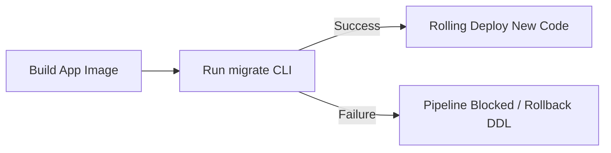

# Migration Strategy & Operations

This document describes the migration framework, execution rules, up/down rollback philosophies, and deployment considerations for the database schema of the DSAblitz monolith.

---

## 1. Purpose

Migrations manage schema changes deterministically across all environments (development, CI/CD, staging, and production). By tracking changes version-by-version, they ensure the database structure aligns with application code changes without manual intervention.

---

## 2. Design Rationale

### Why this design?
- **Raw SQL Migrations**: File-based raw SQL migrations provide direct control over PostgreSQL execution plans. They allow developers to write optimized DDL statements, specify constraints, set transaction boundaries explicitly, and customize index creations (e.g., partial or expression indexes) in a way that auto-generating ORMs cannot.
- **Bi-directional (Up/Down) Migrations**: Every structural change (`up`) must include a matching rollback script (`down`). This ensures changes can be reversed during failures, local testing, or rollback scenarios without restoring database backups.
- **Atomic Migration Executions**: Each version's script executes within an explicit database transaction to prevent half-applied migrations, which could leave environments in inconsistent states.

### Alternatives Considered

#### Why migrations instead of a single `schema.sql`?
- *Rejected Alternative*: Maintaining a single `schema.sql` script and reloading it or running diff engines.
- *Rationale for Rejection*: A single `schema.sql` is useful for initializing empty databases but cannot safely update running production databases with active data. Declarative schema diff tools can generate unsafe alter statements that lock tables, drop columns, or corrupt data. Incremental migrations provide a clear, step-by-step history of schema changes.
- *Tradeoffs*: Managing sequential migration files requires strict discipline, and merging branches with conflicting migration versions can cause pipeline failures.

---

## 3. Current Implementation

### 3.1 Tooling: golang-migrate
The project uses the `golang-migrate/migrate` CLI tool to run schema changes. It reads raw SQL files from the `backend/migrations` folder and uses a tracking table named `schema_migrations` inside PostgreSQL to manage state.

The `schema_migrations` table contains two columns:
- `version` (bigint): The sequential identifier of the active schema state.
- `dirty` (boolean): Flagged as `true` if a migration fails during execution, blocking subsequent operations until manually resolved.

### 3.2 Migration Numbering
Migrations use a 6-digit zero-padded sequential prefix (e.g., `000001`, `000002`) followed by a descriptive snake_case name:
```
backend/migrations/
├── 000001_create_core_schema.up.sql
├── 000001_create_core_schema.down.sql
├── 000002_create_auth_sessions.up.sql
├── 000002_create_auth_sessions.down.sql
├── 000003_add_battle_sequence_and_progression.up.sql
├── 000003_add_battle_sequence_and_progression.down.sql
├── 000004_fix_room_players_constraints.up.sql
├── 000004_fix_room_players_constraints.down.sql
```
This sequential naming enforces a clear, linear history.

### 3.3 Current Migration Log

1. **`000001_create_core_schema`**:
   - **UP**: Establishes system-wide triggers, UUID extensions (`pgcrypto`, `citext`), and basic entities (`users`, `friendships`, `rooms`, `room_players`, `battles`, `battle_players`, `questions`, `submissions`, `user_stats`, `question_stats`, `rating_history`).
   - **DOWN**: Drops all tables, triggers, custom functions, and extensions in reverse dependency order.
2. **`000002_create_auth_sessions`**:
   - **UP**: Configures the `auth_sessions` table and indexes for refresh token rotations.
   - **DOWN**: Drops the `auth_sessions` table and associated trigger.
3. **`000003_add_battle_sequence_and_progression`**:
   - **UP**: Adds `battle_seed` to `battles`, creates the `battle_question_sequence` mapping table, and appends progression index pointers (`current_question_index`, `current_question_attempts`) to `battle_players`.
   - **DOWN**: Drops `battle_question_sequence` and rolls back columns from `battles` and `battle_players`.
4. **`000004_fix_room_players_constraints`**:
   - **UP**: Drops table-level unique keys on `room_players` and replaces them with active-status partial unique indexes. Adds a partial unique index on `battles` to prevent concurrent active battles in a room.
   - **DOWN**: Drops partial indexes and restores the original table-level constraints.

> ### 💬 Interview Discussion: Raw SQL vs ORM Migrations
> - **Interviewer Intent**: Assess capacity to manage database schema updates at scale without downtime.
> - **Strong Answer**: Raw SQL migrations are preferred in high-performance applications because they allow developers to write explicit DDL statements and manage locks manually. Auto-generating ORMs abstract this control, which can lead to unexpected table locks in production.
> - **Common Mistakes**: Relying on an ORM's auto-migrate feature in production, which can cause connection exhaustion or data loss due to implicit changes.
> - **Follow-up Questions**: How does `golang-migrate` track execution state? (Answer: It uses a `schema_migrations` table containing the current version and a `dirty` flag).
> - **How DSAblitz demonstrates this**: Migration files are defined in [backend/migrations](file:///home/tanishq/dsablitz/backend/migrations).

---

## 4. Rollback & Idempotency Philosophy

### 4.1 Rollback Integrity
A migration is only considered complete if its rollback script (`down.sql`) returns the schema to the exact state it was in before the `up.sql` ran.
- **Rule of Reverse Dependency**: Down migrations must drop tables and constraints in the exact reverse order of creation. For instance, if Table B depends on Table A, `up.sql` creates A then B; `down.sql` must drop B then A.
- **Data Loss Acknowledgement**: Rolling back migrations in production will delete columns or tables, resulting in data loss. While safe for local development, production rollbacks must be planned carefully alongside backup restores.

### 4.2 Idempotency Rules
To prevent partial-state failures from corrupting environments, migrations must follow these principles:
- **Use Guard Clauses**: Prefer statements like `CREATE TABLE IF NOT EXISTS`, `CREATE EXTENSION IF NOT EXISTS`, and `DROP TABLE IF EXISTS` where appropriate.
- **Explicit Transaction Blocks**: Avoid multi-statement schema changes that mix non-transactional statements (like `CREATE INDEX CONCURRENTLY` in PostgreSQL) with transactional operations. If a step fails, the transaction rolls back, leaving no half-applied changes.

> ### 💬 Interview Discussion: Idempotency & Rollbacks
> - **Interviewer Intent**: Evaluate understanding of rollback risks and database consistency during migration failures.
> - **Strong Answer**: Write idempotent DDL statements using guard clauses (`IF EXISTS` / `IF NOT EXISTS`) to ensure scripts can be run repeatedly without failing. For production, rely on rolling forward with a new migration rather than rolling back, to avoid data loss.
> - **Common Mistakes**: Executing down migrations in production without checking if columns contain critical user data.
> - **Follow-up Questions**: What does it mean when a migration state is marked as "dirty"? (Answer: It means a migration failed midway through execution. The developer must manually fix the schema issue and reset the dirty flag).
> - **How DSAblitz demonstrates this**: Down migrations drop objects in reverse order of creation, as shown in [000001_create_core_schema.down.sql](file:///home/tanishq/dsablitz/backend/migrations/000001_create_core_schema.down.sql).

---

## 5. Deployment Strategy & Production Considerations

### 5.1 CI/CD Lifecycle Integration
Migrations run as a separate step in the deployment pipeline, **before** new application code is deployed. This is done by running `migrate -path ./migrations -database "$DATABASE_URL" up` in a runner container.



### 5.2 Zero-Downtime Operations
When deploying database updates while the application is running, schema changes must be backwards-compatible with the active application code.

- **Expanding Schema (Safe)**: Adding nullable columns or new tables is safe to deploy before updating application code.
- **Contracting Schema (Require Multi-Step)**: Removing a column or table requires a multi-phase deploy:
  1. *Deploy 1*: Update application code to stop reading or writing to the target column.
  2. *Deploy 2*: Run a migration to drop the column or table once it is no longer accessed by any active server instances.
- **Constraint Changes**: When adding unique constraints to large existing tables, create the constraint as a partial index or use `NOT VALID` followed by `VALIDATE CONSTRAINT` to avoid long table locks.

### 5.3 Lock Avoidance on Large Tables
DDL updates in PostgreSQL can lock tables, blocking reads and writes.
- **Adding Columns with Default Values**: In modern PostgreSQL versions (11+), adding a column with a default value does not rewrite the table, avoiding long locks. However, adding a column with a dynamic default (like a function call) will lock the table.
- **Index Creation**: Standard index creation locks the table against writes. In production, use `CREATE INDEX CONCURRENTLY` to avoid blocking writes, and run it outside of standard migration transactions.

---

## 6. Production Considerations

- **What changes in production?**
  Production migrations run against tables containing millions of rows, where locking can disrupt active users. We must set lock timeouts (`SET local lock_timeout = '3s'`) on migration runs to prevent migrations from waiting indefinitely and blocking application queries.
- **What monitoring is required?**
  - Track migration run durations in build logs.
  - Monitor PostgreSQL lock metrics during migrations.
- **What will fail first?**
  Adding constraints or columns on high-traffic tables (like `submissions`) without proper planning will cause transactions to time out and degrade application performance.
- **How would we evolve this design?**
  Use tools like `pg-roll` to run migrations in stages, keeping old and new columns active concurrently to support zero-downtime rollouts.

---

## 7. Planned Work (V2)

- **Migration CI Linter**: Integrate SQL linter rules in the pull request pipeline to block migration code that runs unsafe operations (e.g., raw table rewrites or index builds without `CONCURRENTLY`).
- **Dry-Run Validations**: Add staging dry-run executions that measure migration execution times against populated database clones before production runs.

---

## 8. Exact Code References

- **Migration Files**: Located in the [backend/migrations](file:///home/tanishq/dsablitz/backend/migrations) directory.
- **Core Schema definition**: [000001_create_core_schema.up.sql](file:///home/tanishq/dsablitz/backend/migrations/000001_create_core_schema.up.sql).
- **Constraints Resolution**: [000004_fix_room_players_constraints.up.sql](file:///home/tanishq/dsablitz/backend/migrations/000004_fix_room_players_constraints.up.sql).

---

## Key Takeaways

1. **Manual raw SQL migrations** keep database changes explicit and reviewable.
2. **Up and Down scripts** must be written together and tested locally before deployment.
3. **Deploying migrations before code** requires all schema additions to be backwards-compatible.

---

## Interview Questions

- **How do you add a new `NOT NULL` column to a production table with millions of rows without causing downtime?**
  * *Answer*: Do not add it directly. Instead, run a multi-step migration: (1) Add the column as nullable, (2) backfill the column with default values in small batches to avoid locking the entire table, (3) update the application code to write to the new column, and (4) run a final migration to apply the `NOT NULL` constraint.

---

## Common Mistakes

- **Creating Indexes inside Migration Transactions**: Executing `CREATE INDEX CONCURRENTLY` inside an active transaction block. PostgreSQL will fail, as concurrent index creation cannot run within transactions.

---

## Related Documents

- **Database Schema**: [schema.md](file:///home/tanishq/dsablitz/docs/database/schema.md)
- **Database Indexing**: [indexing.md](file:///home/tanishq/dsablitz/docs/database/indexing.md)
- **Database Transactions**: [transactions.md](file:///home/tanishq/dsablitz/docs/database/transactions.md)

---

## Lessons Learned

- **Branch Merges version forks**: During early development, multiple developers created migrations with the same version index (`000004_...`) on separate branches. This caused conflict failures in the CI pipeline. We resolved this by adopting a strict sequence registry and validating migration versions in pull requests.
