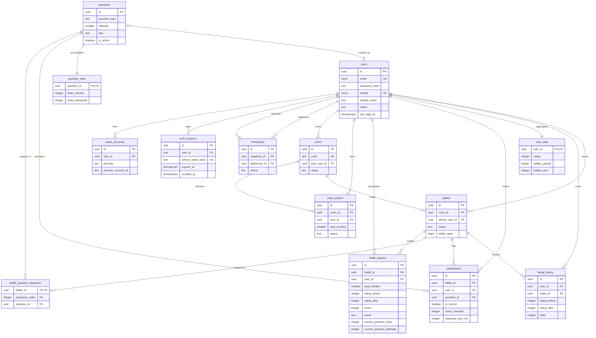

# Database Schema Reference

This document provides a comprehensive analysis of the PostgreSQL database schema for the DSAblitz modular monolith. It details every table, their purpose, module ownership, foreign key constraints, lifecycles, and scalability patterns.

---

## 1. Purpose

The database schema stores all persistent states for the platform: user identity, credentials, active lobbies, real-time battle statistics, stateless question reference data, and history logs. It serves as the single source of truth for the system.

---

## 2. Design Rationale

### Why this design?
- **Strict Invariant Enforcement**: Relational constraint integrity (e.g., table constraints, checks, unique keys, and foreign keys) is enforced at the database layer to ensure data remains consistent, even in cases of application crashes or concurrent mutations.
- **UUID Primary Keys**: Every table uses a cryptographically random UUID (`gen_random_uuid()`) for primary keys instead of auto-incrementing integers (`serial`). This prevents ID scanning attacks, simplifies client-side optimistic rendering (since IDs can be generated client-side without collision), and enables cleaner future migrations to distributed databases.
- **Temporal Traceability**: Every mutative table includes `created_at` and `updated_at` columns automatically maintained by a PL/pgSQL database trigger (`set_updated_at()`) to provide clear execution trace logs.

### Alternatives Considered

#### Why PostgreSQL instead of a Document Database (e.g., MongoDB)?
- *Rejected Alternative*: Storing player progression, lobbies, and submissions as JSON documents in MongoDB.
- *Rationale for Rejection*: Document stores lack ACID transactional safety at high isolation levels and do not support pessimistic row-level locking (`SELECT ... FOR UPDATE`) without significant overhead. Lobbies and battles require instant consistency to prevent players from taking the same seat or submitting duplicate answers at the same millisecond. MongoDB's default optimistic locking would cause massive write conflict retries under high concurrency.
- *Tradeoffs*: PostgreSQL requires strict, upfront migrations and schema definitions, slowing down initial prototyping compared to MongoDB's schema-less model. However, it guarantees data integrity.

#### Why UUIDs instead of BIGINT IDs?
- *Rejected Alternative*: Auto-incrementing 64-bit integer IDs (`BIGSERIAL`).
- *Rationale for Rejection*: Integer IDs expose sequential numbers in URLs (e.g., `/api/battles/42`), allowing attackers to scan the database (ID enumeration). They also create a central bottleneck, as the database must generate the next ID under a lock.
- *Tradeoffs*: UUIDs take 16 bytes of storage instead of 8 bytes for `BIGINT`. They also cause B-tree fragmentation because random UUIDs are inserted out of order, which degrades write throughput over time. This is mitigated by partitioning tables and maintaining query indices on smaller sub-ranges.

---

## 3. Entity-Relationship Model (ERD)

---

## 4. Current Table Details

### 4.1 Auth & Users Module

This module manages credentials, OAuth connections, and active JWT refresh token sessions.

#### `users`
Core entity containing profile information and credentials.
- **Ownership**: Auth / Users Module
- **Why it exists**: Tracks player identities.
- **Columns**:
  - `id` (UUID, PK, Default: `gen_random_uuid()`): Unique identifier.
  - `email` (CITEXT, NOT NULL, UNIQUE): User email (case-insensitive via PostgreSQL `citext` extension).
  - `password_hash` (TEXT, Nullable): Argon2/Bcrypt hash (null for pure OAuth accounts).
  - `handle` (CITEXT, NOT NULL, UNIQUE): Unique user handle.
  - `display_name` (TEXT, NOT NULL): Publicly visible name.
  - `avatar_url` (TEXT, Nullable): URL to avatar image.
  - `status` (TEXT, Default: `'active'`): User state.
  - `last_login_at` (TIMESTAMPTZ, Nullable): Trace of authentication activity.
- **Constraints**:
  - `users_status_check`: CHECK (`status` IN (`'active'`, `'disabled'`, `'deleted'`))
  - `users_handle_length_check`: CHECK (char_length(`handle`) BETWEEN 3 AND 32)
  - `users_display_name_length_check`: CHECK (char_length(`display_name`) BETWEEN 1 AND 80)
- **Lifecycle**: Created during signup. Never hard-deleted (transitions to `'deleted'` status).

#### `oauth_accounts`
Links external identities (Google/GitHub) to a core user record.
- **Ownership**: Auth Module
- **Why it exists**: Enables passwordless social authentication.
- **Columns**:
  - `id` (UUID, PK).
  - `user_id` (UUID, FK -> `users(id)` ON DELETE CASCADE).
  - `provider` (TEXT, NOT NULL): OAuth provider name.
  - `provider_account_id` (TEXT, NOT NULL): Provider's unique user identifier.
  - `provider_email` (CITEXT, Nullable): Provider-supplied email.
- **Constraints**:
  - `oauth_accounts_provider_check`: CHECK (`provider` IN (`'google'`, `'github'`))
  - `oauth_accounts_provider_account_unique`: UNIQUE (`provider`, `provider_account_id`)
  - `oauth_accounts_user_provider_unique`: UNIQUE (`user_id`, `provider`)
- **Lifecycle**: Tied directly to `users`. Deleted via CASCADE when the corresponding user is removed.

#### `auth_sessions`
Manages active JSON Web Token (JWT) refresh tokens.
- **Ownership**: Auth Module
- **Why it exists**: Supports persistent login states and token rotation.
- **Columns**:
  - `id` (UUID, PK).
  - `user_id` (UUID, FK -> `users(id)` ON DELETE CASCADE).
  - `refresh_token_hash` (TEXT, NOT NULL, UNIQUE): SHA-256 hash of the token.
  - `user_agent` (TEXT, Nullable): Browser details.
  - `ip_address` (INET, Nullable): Client IP address.
  - `expires_at` (TIMESTAMPTZ, NOT NULL): Expiry boundary.
  - `revoked_at` (TIMESTAMPTZ, Nullable): Set if explicitly logged out or rotated.
- **Constraints**:
  - `auth_sessions_expiry_check`: CHECK (`expires_at` > `created_at`)
  - `auth_sessions_refresh_token_hash_length_check`: CHECK (char_length(`refresh_token_hash`) >= 64)
- **Lifecycle**: Short-lived (typically 7-30 days). Expired or revoked sessions can be periodically pruned.

> ### 💬 Interview Discussion: Auth Schema Design
> - **Interviewer Intent**: Assess understanding of secure session storage and passwordless account linking.
> - **Strong Answer**: Link multiple OAuth provider accounts to a single `users` row via an `oauth_accounts` table. Store refresh tokens as SHA-256 hashes in `auth_sessions` to prevent database compromise from revealing active sessions.
> - **Common Mistakes**: Storing raw refresh tokens in the database or saving separate user records for Google and Github logins, preventing account linking.
> - **Follow-up Questions**: How would you handle session hijacking detection during token rotation? (Answer: If a client attempts to use a revoked token, revoke all sessions associated with that user family to block attackers).
> - **How DSAblitz demonstrates this**: Auth sessions are hashed in [repository.go:L133-L138](file:///home/tanishq/dsablitz/backend/internal/auth/repository.go#L133-L138) and rotated atomically in [repository.go:L164-L199](file:///home/tanishq/dsablitz/backend/internal/auth/repository.go#L164-L199).

---

### 4.2 Matchmaking & Rooms Module

This module manages friend relations, matchmaking lobbies, and active seat arrangements.

#### `friendships`
Manages user relationships.
- **Ownership**: Users Module
- **Why it exists**: Renders friend lists and presence updates.
- **Columns**:
  - `id` (UUID, PK).
  - `requester_id` (UUID, FK -> `users(id)` ON DELETE CASCADE).
  - `addressee_id` (UUID, FK -> `users(id)` ON DELETE CASCADE).
  - `status` (TEXT, NOT NULL, Default: `'pending'`).
  - `requested_at` (TIMESTAMPTZ, Default: `NOW()`).
  - `responded_at` (TIMESTAMPTZ, Nullable): Timestamp of accept/decline.
- **Constraints**:
  - `friendships_distinct_users_check`: CHECK (`requester_id` <> `addressee_id`)
  - `friendships_status_check`: CHECK (`status` IN (`'pending'`, `'accepted'`, `'declined'`, `'blocked'`))
- **Lifecycle**: Created when a friend request is sent. Status updates upon response.

#### `rooms`
Manages matchmaking lobby records.
- **Ownership**: Rooms Module
- **Why it exists**: Lobbies coordinate client connections before starting a battle.
- **Columns**:
  - `id` (UUID, PK).
  - `code` (TEXT, NOT NULL, UNIQUE): 6-character uppercase code (e.g., `AB12XY`).
  - `host_user_id` (UUID, FK -> `users(id)` ON DELETE RESTRICT): Host prevents room deletion while active.
  - `status` (TEXT, Default: `'waiting'`).
  - `max_players` (SMALLINT, Default: 2).
  - `duration_seconds` (INTEGER, NOT NULL): Game length options.
  - `expires_at` (TIMESTAMPTZ, Nullable): Lifespan threshold for lobby cleanups.
- **Constraints**:
  - `rooms_status_check`: CHECK (`status` IN (`'waiting'`, `'ready'`, `'in_battle'`, `'closed'`, `'expired'`))
  - `rooms_max_players_check`: CHECK (`max_players` = 2) (strictly 1v1 battles)
  - `rooms_duration_seconds_check`: CHECK (`duration_seconds` IN (120, 300))
  - `rooms_code_length_check`: CHECK (char_length(`code`) BETWEEN 4 AND 16)
- **Lifecycle**: Short-lived. Lobbies expire after 10 minutes if not started, triggering automatic transition to `'expired'`.

#### `room_players`
Tracks active participants in matchmaking lobbies.
- **Ownership**: Rooms Module
- **Why it exists**: Seat management and presence updates.
- **Columns**:
  - `id` (UUID, PK).
  - `room_id` (UUID, FK -> `rooms(id)` ON DELETE CASCADE).
  - `user_id` (UUID, FK -> `users(id)` ON DELETE CASCADE).
  - `seat_number` (SMALLINT, NOT NULL).
  - `status` (TEXT, Default: `'joined'`).
  - `joined_at` (TIMESTAMPTZ, Default: `NOW()`).
  - `left_at` (TIMESTAMPTZ, Nullable).
- **Constraints**:
  - `room_players_status_check`: CHECK (`status` IN (`'joined'`, `'ready'`, `'left'`, `'kicked'`))
  - `room_players_seat_number_check`: CHECK (`seat_number` BETWEEN 1 AND 2)
- **Lifecycle**: Row created upon join. Leaving flags status to `'left'` and sets `left_at` rather than immediately hard-deleting the row, ensuring a clean audit trail.

> ### 💬 Interview Discussion: Matchmaking & Lobbies
> - **Interviewer Intent**: Assess capacity management and concurrency handling in real-time lobbies.
> - **Strong Answer**: Use partial unique indexes rather than database-wide constraints to allow players to re-join rooms they previously left. The index `idx_room_players_room_user_active` unique on `(room_id, user_id) WHERE status IN ('joined', 'ready')` prevents double-joining while preserving left/kicked audit logs.
> - **Common Mistakes**: Deleting rows when players leave a lobby, destroying user activity history and presence trails.
> - **Follow-up Questions**: Why does `rooms.host_user_id` use `ON DELETE RESTRICT`? (Answer: To prevent the deletion of a user who is hosting an active match, avoiding orphaned lobbies).
> - **How DSAblitz demonstrates this**: Partial unique indexing is implemented in [000004_fix_room_players_constraints.up.sql:L6-L12](file:///home/tanishq/dsablitz/backend/migrations/000004_fix_room_players_constraints.up.sql#L6-L12).

---

### 4.3 Battle Execution & Progression Module

This module manages active gameplay sessions, sequences, and submission metrics.

#### `battles`
Metadata header for an active or completed 1v1 match.
- **Ownership**: Battle Module
- **Why it exists**: Ties two players to a sequence of questions and tracks game states.
- **Columns**:
  - `id` (UUID, PK).
  - `room_id` (UUID, Nullable, FK -> `rooms(id)` ON DELETE SET NULL): Links match to origin lobby.
  - `status` (TEXT, Default: `'created'`).
  - `duration_seconds` (INTEGER, NOT NULL).
  - `question_count` (INTEGER, Default: 0).
  - `winner_user_id` (UUID, Nullable, FK -> `users(id)` ON DELETE SET NULL).
  - `started_at` (TIMESTAMPTZ, Nullable).
  - `ended_at` (TIMESTAMPTZ, Nullable).
  - `battle_seed` (BIGINT, NOT NULL): The stateful seed used to randomize the question sequence.
- **Constraints**:
  - `battles_status_check`: CHECK (`status` IN (`'created'`, `'countdown'`, `'active'`, `'finished'`, `'aborted'`))
  - `battles_duration_seconds_check`: CHECK (`duration_seconds` IN (120, 300))
  - `battles_question_count_check`: CHECK (`question_count` >= 0)
  - `battles_time_order_check`: CHECK (`ended_at` IS NULL OR `started_at` IS NULL OR `ended_at` >= `started_at`)

#### `battle_players`
Match participant scorecards and progression indices.
- **Ownership**: Battle Module
- **Why it exists**: Tracks score state, correct/incorrect counters, and progression indices per battle.
- **Columns**:
  - `id` (UUID, PK).
  - `battle_id` (UUID, FK -> `battles(id)` ON DELETE CASCADE).
  - `user_id` (UUID, FK -> `users(id)` ON DELETE CASCADE).
  - `seat_number` (SMALLINT, NOT NULL).
  - `rating_before` (INTEGER, NOT NULL): Rating prior to match.
  - `rating_after` (INTEGER, Nullable): Final calculated rating.
  - `score` (INTEGER, Default: 0): Active accumulation score.
  - `correct_count` (INTEGER, Default: 0).
  - `incorrect_count` (INTEGER, Default: 0).
  - `max_streak` (INTEGER, Default: 0).
  - `result` (TEXT, Nullable): Outcome tags (`'win'`, `'loss'`, `'draw'`, `'abandoned'`).
  - `current_question_index` (INTEGER, Default: 0): Index pointing to `battle_question_sequence`.
  - `current_question_attempts` (INTEGER, Default: 0): Number of attempts on current question.
- **Constraints**:
  - `battle_players_seat_number_check`: CHECK (`seat_number` BETWEEN 1 AND 2)
  - `battle_players_rating_before_check`: CHECK (`rating_before` >= 0)
  - `battle_players_rating_after_check`: CHECK (`rating_after` IS NULL OR `rating_after` >= 0)
  - `battle_players_score_check`: CHECK (`score` >= 0)
  - `battle_players_counts_check`: CHECK all counts >= 0.
  - `battle_players_result_check`: CHECK (`result` IS NULL OR `result` IN (`'win'`, `'loss'`, `'draw'`, `'abandoned'`))
  - `battle_players_battle_user_unique`: UNIQUE (`battle_id`, `user_id`)
  - `battle_players_battle_seat_unique`: UNIQUE (`battle_id`, `seat_number`)

#### `battle_question_sequence`
Stores the pre-generated stream of question mappings for a match.
- **Ownership**: Battle Module
- **Why it exists**: Ensures both players answer the same set of questions in the exact same randomized order.
- **Columns**:
  - `battle_id` (UUID, FK -> `battles(id)` ON DELETE CASCADE).
  - `sequence_index` (INTEGER, NOT NULL).
  - `question_id` (UUID, FK -> `questions(id)` ON DELETE RESTRICT).
- **Constraints**:
  - `PRIMARY KEY (battle_id, sequence_index)`

#### `submissions`
Detailed logs of every single answer attempt.
- **Ownership**: Battle Module
- **Why it exists**: Provides audit capability, anti-cheat detection, and analytic history.
- **Columns**:
  - `id` (UUID, PK).
  - `battle_id` (UUID, FK -> `battles(id)` ON DELETE CASCADE).
  - `user_id` (UUID, FK -> `users(id)` ON DELETE CASCADE).
  - `question_id` (UUID, FK -> `questions(id)` ON DELETE RESTRICT): Prevents question deletion while referenced.
  - `raw_answer` (JSONB, NOT NULL): The answer payload submitted by the client.
  - `normalized_answer` (TEXT, Nullable).
  - `is_correct` (BOOLEAN, NOT NULL).
  - `response_time_ms` (INTEGER, NOT NULL).
  - `score_awarded` (INTEGER, Default: 0).
  - `submitted_at` (TIMESTAMPTZ, Default: `NOW()`).
- **Constraints**:
  - `submissions_raw_answer_shape_check`: CHECK (`jsonb_typeof(raw_answer)` IN (`'string'`, `'number'`, `'boolean'`, `'array'`, `'object'`))
  - `submissions_response_time_check`: CHECK (`response_time_ms` >= 0)
  - `submissions_score_awarded_check`: CHECK (`score_awarded` >= 0)

> ### 💬 Interview Discussion: Battle Progression Design
> - **Interviewer Intent**: Assess scaling and latency prevention in real-time game play.
> - **Strong Answer**: Decouple the question catalog from active play by generating a sequence mapping `battle_question_sequence` once at battle startup. The `submissions` table remains append-only, and active scores are updated via pessimistic serialization locks on `battle_players` to prevent concurrent submission anomalies.
> - **Common Mistakes**: Storing the question text in every submission, causing database size to balloon and slowing down disk writes.
> - **Follow-up Questions**: Why is `question_id` configured with `ON DELETE RESTRICT`? (Answer: To prevent deleting a question from the catalog if it is referenced by past user submissions, preserving historical data).
> - **How DSAblitz demonstrates this**: Submissions are logged in [repository.go:L163-L177](file:///home/tanishq/dsablitz/backend/internal/battle/repository.go#L163-L177).

---

### 4.4 Questions Reference & Statistics Module

This module manages the reference question catalog, question usage metrics, and user statistics.

#### `questions`
Stateless question bank repository.
- **Ownership**: Questions Module
- **Why it exists**: Serves as the primary content storage catalog.
- **Columns**:
  - `id` (UUID, PK).
  - `question_type` (TEXT, NOT NULL).
  - `difficulty` (SMALLINT, NOT NULL).
  - `title` (TEXT, NOT NULL).
  - `prompt` (TEXT, NOT NULL): Markdown text containing question details.
  - `options` (JSONB, Nullable): Arrays for MCQs or algorithm ordering options.
  - `correct_answer` (TEXT, NOT NULL): Evaluated server-side.
  - `explanation` (TEXT, Nullable).
  - `time_limit_sec` (INTEGER, NOT NULL).
  - `tags` (TEXT[], Default: `{}`): Array of labels (e.g. `{"graphs", "dfs"}`).
  - `source` (TEXT, Nullable).
  - `created_by` (UUID, Nullable, FK -> `users(id)` ON DELETE SET NULL).
  - `is_active` (BOOLEAN, Default: `TRUE`).
- **Constraints**:
  - `questions_type_check`: CHECK (`question_type` IN (`'mcq'`, `'complexity_prediction'`, `'pattern_recognition'`, `'numeric_answer'`, `'algorithm_ordering'`))
  - `questions_difficulty_check`: CHECK (`difficulty` BETWEEN 1 AND 5)
  - `questions_time_limit_sec_check`: CHECK (`time_limit_sec` > 0)
  - `questions_options_shape_check`: CHECK (`options` IS NULL OR `jsonb_typeof(options)` = `'array'`)
  - `questions_title_length_check`: CHECK (char_length(`title`) BETWEEN 1 AND 200)

#### `question_stats`
Aggregated analytic metrics for questions.
- **Ownership**: Questions Module
- **Why it exists**: Calculates global question statistics.
- **Columns**:
  - `question_id` (UUID, PK, FK -> `questions(id)` ON DELETE CASCADE).
  - `times_served` (INTEGER, Default: 0).
  - `times_answered` (INTEGER, Default: 0).
  - `times_correct` (INTEGER, Default: 0).
  - `average_response_time_ms` (INTEGER, Nullable).
- **Constraints**:
  - `question_stats_counts_check`: CHECK all counts >= 0.
  - `question_stats_answered_total_check`: CHECK (`times_served` >= `times_answered`)
  - `question_stats_correct_total_check`: CHECK (`times_answered` >= `times_correct`)

#### `user_stats`
Stores aggregated statistics and rating values for leaderboard sorting.
- **Ownership**: Users Module (shared with battle outcomes).
- **Why it exists**: Fast, index-friendly rating lookups.
- **Columns**:
  - `user_id` (UUID, PK, FK -> `users(id)` ON DELETE CASCADE).
  - `rating` (INTEGER, Default: 1000).
  - `battles_played` (INTEGER, Default: 0).
  - `battles_won` (INTEGER, Default: 0).
  - `battles_lost` (INTEGER, Default: 0).
  - `battles_drawn` (INTEGER, Default: 0).
  - `questions_attempted` (INTEGER, Default: 0).
  - `questions_correct` (INTEGER, Default: 0).
  - `current_streak` (INTEGER, Default: 0).
  - `best_streak` (INTEGER, Default: 0).
  - `total_score` (BIGINT, Default: 0).
- **Constraints**:
  - `user_stats_rating_check`: CHECK (`rating` >= 0)
  - `user_stats_counts_check`: CHECK all counts >= 0.
  - `user_stats_battle_total_check`: CHECK (`battles_played` >= `battles_won` + `battles_lost` + `battles_drawn`)
  - `user_stats_question_total_check`: CHECK (`questions_attempted` >= `questions_correct`)

#### `rating_history`
Maintains a log of Glicko/Elo rating adjustments.
- **Ownership**: Users Module
- **Why it exists**: Renders history graphs and tracks progression.
- **Columns**:
  - `id` (UUID, PK).
  - `user_id` (UUID, FK -> `users(id)` ON DELETE CASCADE).
  - `battle_id` (UUID, Nullable, FK -> `battles(id)` ON DELETE SET NULL).
  - `rating_before` (INTEGER, NOT NULL).
  - `rating_after` (INTEGER, NOT NULL).
  - `delta` (INTEGER, NOT NULL).
  - `reason` (TEXT, Default: `'battle_result'`).
- **Constraints**:
  - `rating_history_rating_check`: CHECK (`rating_before` >= 0 AND `rating_after` >= 0)
  - `rating_history_delta_check`: CHECK (`delta` = `rating_after` - `rating_before`)
  - `rating_history_reason_check`: CHECK (`reason` IN (`'battle_result'`, `'admin_adjustment'`, `'season_reset'`))

> ### 💬 Interview Discussion: Question Statistics & Caching
> - **Interviewer Intent**: Assess how to scale read-heavy catalog tables alongside write-heavy logs.
> - **Support Model**: Offload read-heavy lookup queries (`questions`) into a thread-safe in-memory cache loaded at startup. This decouples catalog reads from transaction locks and allows write operations (like `submissions`) to execute without database read contention.
> - **Common Mistakes**: Fetching the entire question table from PostgreSQL for every active match, which degrades performance under high load.
> - **Follow-up Questions**: How do you keep the cache consistent when questions are updated? (Answer: We would publish invalidation events via Redis Pub/Sub to trigger cache updates across all nodes).
> - **How DSAblitz demonstrates this**: Questions are cached in-memory using `sync.RWMutex` in [questions/service.go:L18-L46](file:///home/tanishq/dsablitz/backend/internal/questions/service.go#L18-L46).

---

## 5. Production Considerations

- **What changes in production?**
  In production, PostgreSQL uses connection pool parameters (e.g. `max_conns` set to 50 in `pgxpool`), meaning we must monitor and limit transaction lock durations to prevent connection pool exhaustion.
- **What monitoring is required?**
  - Monitor database CPU and memory metrics.
  - Track lock wait times (`pg_locks` views) to detect blocked transactions.
  - Monitor the sizes of the `submissions` and `rating_history` tables to plan future partitioning or vacuum schedules.
- **What will fail first?**
  The `submissions` table will grow rapidly, causing index operations (and inserts) to slow down. High lock contention on `battle_players` during concurrent submissions can also cause connection pools to starve.
- **How would we evolve this design?**
  Partition the `submissions` table by month using PostgreSQL native range partitioning, and archive old matches to cold storage.

---

## 6. Planned Work (V2)

- **Glicko-2 ratings fields**: Add fields like `rating_deviation` (RD) and `volatility` to `user_stats` to support the Glicko-2 Elo rating engine.
- **Partitioning on `submissions`**: Partition the table by range on `submitted_at` to isolate write workloads.

---

## 7. Exact Code References

- **Core migrations definition**: Configured in [000001_create_core_schema.up.sql](file:///home/tanishq/dsablitz/backend/migrations/000001_create_core_schema.up.sql).
- **Session Auth Extensions**: Configured in [000002_create_auth_sessions.up.sql](file:///home/tanishq/dsablitz/backend/migrations/000002_create_auth_sessions.up.sql).
- **Match Sequence Additions**: Defined in [000003_add_battle_sequence_and_progression.up.sql](file:///home/tanishq/dsablitz/backend/migrations/000003_add_battle_sequence_and_progression.up.sql).

---

## Key Takeaways

1. **Relational Constraints** act as the final defense line for database state integrity.
2. **UUID Primary Keys** prevent ID scanning attacks but require partitioning to avoid index fragmentation.
3. **Stateless data caching** decouples catalog read traffic from write-heavy transactional operations.

---

## Interview Questions

- **Why should user stats use a separate `user_stats` table instead of storing counters directly in the `users` table?**
  * *Answer*: Splitting static profiles from dynamic statistics separates concerns and improves performance. The `users` table contains credentials and handles, which are read frequently but updated rarely. The `user_stats` table is updated frequently after matches. Keeping them separate prevents write operations on stats from locking profile rows.

---

## Common Mistakes

- **Cascading Deletes on Reference Data**: Using `ON DELETE CASCADE` on catalog keys (like `questions`). If a question is deleted, it would delete all associated records in `submissions`, corrupting user histories.

---

## Related Documents

- **Overall Backend System Architecture**: [overall_architecture.md](file:///home/tanishq/dsablitz/docs/architecture/overall_architecture.md)
- **Database Transactions**: [transactions.md](file:///home/tanishq/dsablitz/docs/database/transactions.md)
- **Database Indexing**: [indexing.md](file:///home/tanishq/dsablitz/docs/database/indexing.md)

---

## Lessons Learned

- **Lobby constraints refactoring**: In the initial design, table-level unique constraints prevented players from re-joining rooms they had left. We refactored this in migration 4, replacing them with partial unique indexes `idx_room_players_room_user_active` that only apply to active status codes (`joined` and `ready`). This resolved the issue while preserving historical data.
