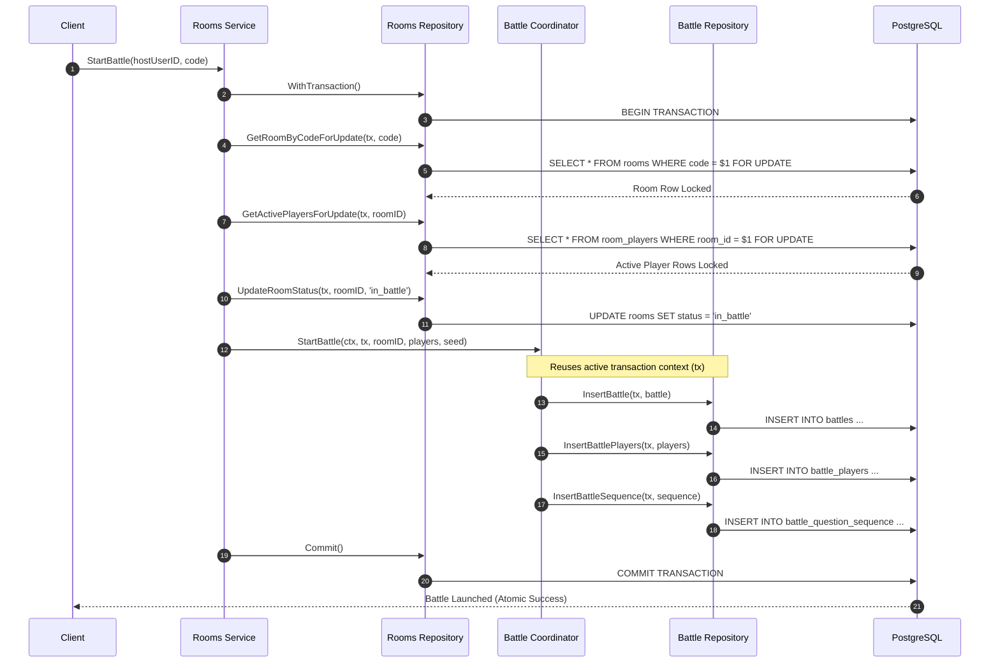
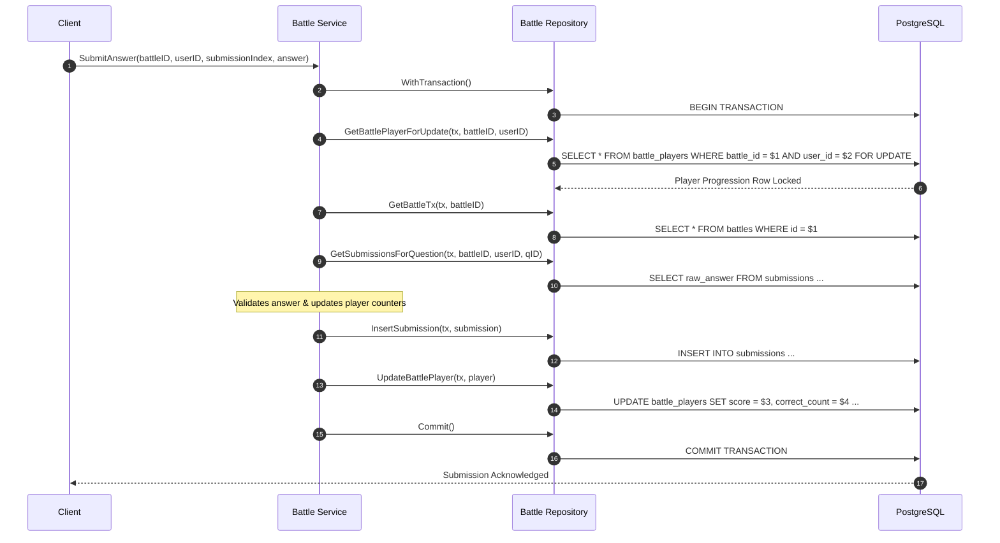

# Database Transaction & Locking Strategy

This document describes the design principles, row locking strategy (`SELECT ... FOR UPDATE`), transaction boundaries, and deadlock prevention rules implemented in the DSAblitz monolith.

---

## 1. Purpose

Transactions ensure state transitions across matchmaking lobbies (`rooms`) and live gameplay sessions (`battles`) remain consistent under concurrent operations. Pessimistic row locking ensures that player actions (e.g. joining rooms, starting matches, or submitting answers) are serialized correctly to prevent data corruption.

---

## 2. Design Rationale

### Why this design?
- **Pessimistic Row Locking (`FOR UPDATE`)**: Real-time multiplayer operations (like rapid-fire question submissions) require strict consistency. We acquire database row locks using `FOR UPDATE` at the beginning of mutations to prevent concurrent transactions from modifying the same record.
- **Service-Owned Transaction Boundaries**: The domain service layer manages transactions, starting, committing, or rolling them back. This isolates database connections and keeps transaction boundaries close to the business logic.
- **Shared Transaction Context Propagation**: When a transaction spans multiple modules (e.g., Rooms starting a Battle), the parent transaction handle (`pgx.Tx`) is passed to the other module's coordinator. This ensures the entire operation is atomic and runs on a single database connection.
- **Lock Ordering Rules**: Any transaction that locks multiple tables must acquire locks in a strict hierarchy. This prevents deadlock loops, where Transaction A locks Table 1 and waits for Table 2, while Transaction B locks Table 2 and waits for Table 1.

### Alternatives Considered

#### Why `pgx` instead of `database/sql`?
- *Rejected Alternative*: Standard Go `database/sql` driver library.
- *Rationale for Rejection*: Standard `database/sql` uses `interface{}` parameter binding, causing interface allocation overheads and type coercion. It also lacks native support for PostgreSQL-specific features like logical replication, copy protocols, and advanced array bindings (`pgtype`). The `jackc/pgx/v5` library provides type-safe parameter mapping, improved performance, and native connection pool management.
- *Tradeoffs*: Using `pgx` binds the codebase to PostgreSQL, preventing a future switch to other SQL engines (like MySQL) without rewriting data access code. Since PostgreSQL is our primary database, this is an acceptable tradeoff.

#### Why `FOR UPDATE` instead of Optimistic Concurrency Control (OCC)?
- *Rejected Alternative*: Version-check columns (optimistic locking) to detect and retry conflicts.
- *Rationale for Rejection*: OCC works well in read-heavy applications with low write conflict rates. However, in a 1v1 rapid-fire battle where both players submit answers and trigger rating updates concurrently, OCC leads to high write conflict retry rates. This degrades response times and increases CPU load. Pessimistic locking serialize operations by blocking concurrent writes, reducing retry overhead.
- *Tradeoffs*: Holding row locks blocks concurrent requests, increasing lock wait queues. We mitigate this by keeping transaction blocks small and releasing locks quickly.

#### Why service-owned transactions instead of repository-owned?
- *Rejected Alternative*: Starting and committing transactions inside repository functions.
- *Rationale for Rejection*: Repositories manage data access, not business logic. If repositories managed transactions, we could not combine multiple repository calls (like inserting a room and a host player) into a single atomic transaction. It would also lead to circular imports between modules.
- *Tradeoffs*: Passing transaction handles (`pgx.Tx`) through service interfaces adds signature boilerplate. However, it ensures atomic operations across modules.

---

## 3. Transaction Isolation & Assumptions

DSAblitz runs on the standard PostgreSQL isolation level: **Read Committed**.
- **Phantom Reads & Non-Repeatable Reads**: Read Committed allows other transactions to modify data between reads. To prevent this from causing inconsistencies during critical operations (like checking room capacity or player submission indices), we use explicit row locking (`FOR UPDATE`) to block concurrent modifications.

---

## 4. Current Transaction Implementations

### 4.1 Matchmaking & Room Transactions
Matchmaking mutations are coordinated by [rooms/service.go](file:///home/tanishq/dsablitz/backend/internal/rooms/service.go).

*   **`CreateRoom`**: Generates a 6-character room code and attempts to insert the room and host player in an atomic block. If a code collision occurs, the transaction rolls back, and the loop retries with a new code.
*   **`JoinRoom`**:
    1.  Acquires a row lock on the room: `SELECT ... FROM rooms WHERE code = $1 FOR UPDATE`.
    2.  Locks active players in the room: `SELECT ... FROM room_players WHERE room_id = $1 FOR UPDATE`.
    3.  Checks if the user is already in the room (idempotency).
    4.  Verifies the room is in the `waiting` state and not full.
    5.  Assigns a seat and inserts the player.
*   **`ToggleReady`**:
    1.  Locks the room: `GetRoomByCodeForUpdate`.
    2.  Locks active players: `GetActivePlayersForUpdate`.
    3.  Updates the player's status and evaluates if the room status should transition to `ready`.
*   **`LeaveRoom`**:
    1.  Locks the room and active players.
    2.  If the host leaves, updates the room status to `closed` and marks all players as `left`.
    3.  If a guest leaves, marks them as `left` and resets the room status from `ready` to `waiting`.
*   **`ExpireRooms`**: Runs a cleanup task that queries expired rooms, ordering them by ID (`ORDER BY id ASC FOR UPDATE`) to prevent deadlocks before updating their status to `expired`.

> ### 💬 Interview Discussion: Pessimistic vs Optimistic locking
> - **Interviewer Intent**: Assess capacity to choose correct locking models under high concurrency.
> - **Strong Answer**: Choose pessimistic locking (`FOR UPDATE`) for high-concurrency write paths (like active battles) to serialize state updates and prevent write conflicts. Choose optimistic locking (or stateless caching) for read-heavy directories (like the questions catalog) to maximize read performance.
> - **Common Mistakes**: Using optimistic concurrency control on real-time multiplayer states, causing write collisions and high latency under load.
> - **Follow-up Questions**: How does pessimistic row locking handle database deadlocks? (Answer: It blocks conflicting queries. If a deadlock loop occurs, the database engine detects it and aborts one of the transactions).
> - **How DSAblitz demonstrates this**: Row locking is implemented in [repository.go:L119-L128](file:///home/tanishq/dsablitz/backend/internal/battle/repository.go#L119-L128).

---

### 4.2 Gameplay & Battle Transactions
Gameplay mutations are coordinated by [battle/service.go](file:///home/tanishq/dsablitz/backend/internal/battle/service.go).

*   **`StartBattle`**: Spawns a battle from a room lobby. This operation must update the room status and initialize the battle atomically:
    1.  The Rooms service begins a transaction and locks the room: `GetRoomByCodeForUpdate`.
    2.  Locks room players to load their current Elo ratings: `GetActivePlayersForUpdate`.
    3.  Updates the room status to `in_battle`.
    4.  Passes the parent transaction context (`tx pgx.Tx`) to the Battle module using the `BattleCoordinator` interface: `StartBattle(ctx, tx, room.ID, battlePlayers, seed)`.
    5.  Inside the Battle module, the coordinator initializes the battle record, inserts players, and writes the pre-generated question sequence using the same transaction.
    6.  The Rooms service commits the transaction, ensuring either both the room update and battle creation succeed, or the entire operation rolls back.

*   **`SubmitAnswer`**:
    1.  The Battle service starts a transaction.
    2.  Locks the player's scorecard: `SELECT ... FROM battle_players WHERE battle_id = $1 AND user_id = $2 FOR UPDATE`.
    3.  Verifies the client-supplied `submissionIndex` matches the expected sequence index (`CorrectCount + IncorrectCount + 1`) to prevent duplicate or out-of-order submissions.
    4.  Fetches previous submissions for the question to prevent duplicate answers.
    5.  Loads battle metadata to check the timer: `GetBattleTx`.
    6.  Validates the submitted answer.
    7.  Updates player stats (score, correct/incorrect counters, and progression index).
    8.  Inserts a record into the `submissions` log.
    9.  Persists updates: `UpdateBattlePlayer`.
    10. Commits the transaction.

*   **`CompleteBattle`**:
    1.  Starts a transaction.
    2.  Loads battle metadata: `GetBattleTx`.
    3.  Locks match participants sorted by user ID: `SELECT ... FROM battle_players WHERE battle_id = $1 ORDER BY user_id ASC FOR UPDATE` (deterministic ordering prevents deadlocks).
    4.  Evaluates scores, determines the winner, and updates player results (`win`/`loss`/`draw`).
    5.  Updates the room status back to `ready` to allow new matches.
    6.  Updates the battle status to `finished` and records the winner.
    7.  Commits the transaction.

> ### 💬 Interview Discussion: Connection Pool Deadlocks
> - **Interviewer Intent**: Evaluate understanding of database connection usage inside nested transactions.
> - **Strong Answer**: Avoid starting nested transactions that acquire new database connections. If a service method calls another module inside a transaction, propagate the existing transaction handle (`pgx.Tx`). Opening a second transaction from the pool inside an active transaction block can cause pool starvation and deadlocks under high load.
> - **Common Mistakes**: Opening a new transaction block inside another module's service method, consuming a second database connection.
> - **Follow-up Questions**: How do you monitor connection pool usage? (Answer: Monitor active connections, wait durations, and pool idle states using `pgxpool.Stat()`).
> - **How DSAblitz demonstrates this**: Transaction context propagation is managed via the `BattleCoordinator` interface, as shown in [rooms/service.go:L410](file:///home/tanishq/dsablitz/backend/internal/rooms/service.go#L410).

---

## 5. Deadlock Prevention Rules

To prevent deadlock cycles, we enforce two strict design rules:

### Rule 1: Global Lock Hierarchy
Any transaction that spans multiple tables must acquire row locks in this exact order:
$$\text{rooms} \rightarrow \text{room\_players} \rightarrow \text{battles} \rightarrow \text{battle\_players} \rightarrow \text{battle\_question\_sequence}$$

### Rule 2: Deterministic Row Sorting
When locking multiple rows in the same table concurrently (e.g., in batch updates or room cleanups), rows must be sorted deterministically before acquiring locks.
- **Implementation**: We sort rows by primary key (`ORDER BY id ASC` or `ORDER BY user_id ASC`) before applying the `FOR UPDATE` lock. This ensures all concurrent transactions lock rows in the same order, preventing deadlock cycles.

---

## 6. Production Considerations

- **What changes in production?**
  High traffic can saturate connection pools, increasing lock wait times. We must set short lock timeouts (`SET local lock_timeout = '2s'`) to prevent slow queries from blocking the entire system.
- **What monitoring is required?**
  - Monitor connection pool wait times and active connection counts.
  - Track lock conflicts and deadlock warnings in PostgreSQL logs.
  - Set alerts for transactions that remain active for more than 5 seconds.
- **What will fail first?**
  The database connection pool will exhaust first if transaction execution times slow down (due to network latency or slow queries).
- **How would we evolve this design?**
  Implement an Outbox pattern to decouple post-transaction side effects (like updating leaderboards or sending push notifications) from the primary transaction block, keeping transactions short.

---

## 7. Planned Work (V2)

- **PostgreSQL Lock Timeout**: Set a short lock timeout (e.g., `SET local lock_timeout = '2s'`) for transactions to prevent blocked queries from consuming database connections under high load.
- **Transaction Retry Middleware**: Implement automatic retry logic for transactions that fail due to serialization conflicts or deadlock exceptions.

---

## 8. Exact Code References

- **Global Lock Ordering Rule**: Documented in the [PROJECT_CONTEXT.md:L61-L62](file:///home/tanishq/dsablitz/docs/PROJECT_CONTEXT.md#L61-L62).
- **Shared Transaction Context Rule**: Documented in the [PROJECT_CONTEXT.md:L67-L69](file:///home/tanishq/dsablitz/docs/PROJECT_CONTEXT.md#L67-L69).
- **StartBattle Implementation**: Configured in [rooms/service.go:L338-L424](file:///home/tanishq/dsablitz/backend/internal/rooms/service.go#L338-L424).
- **StartBattleTx Coordinator Flow**: Defined in [battle/service.go:L103-L154](file:///home/tanishq/dsablitz/backend/internal/battle/service.go#L103-L154).
- **SubmitAnswer Row Locking**: Located in [battle/service.go:L184-L300](file:///home/tanishq/dsablitz/backend/internal/battle/service.go#L184-L300).
- **CompleteBattle Row Sorting Lock**: Defined in [battle/repository.go:L291-L313](file:///home/tanishq/dsablitz/backend/internal/battle/repository.go#L291-L313).

---

## Key Takeaways

1. **The service layer** owns database transaction boundaries.
2. **Cross-module mutations** must pass `pgx.Tx` handles to reuse the same database connection context.
3. **Lock ordering and row sorting** must be enforced to prevent deadlocks.

---

## Interview Questions

- **How do you prevent deadlocks when updating scores for multiple users concurrently in the same transaction?**
  * *Answer*: Sort user IDs deterministically (e.g., `ORDER BY user_id ASC`) before applying the row lock (`FOR UPDATE`). This ensures all concurrent transactions lock user rows in the exact same order, preventing deadlock cycles.

---

## Common Mistakes

- **Starting Nested Transactions**: Opening a new transaction block inside a method that is already running under an active transaction, consuming a second database connection.
- **Unsorted Row Locks**: Locking multiple rows without sorting them first, causing deadlocks when concurrent transactions lock the same rows in different orders.

---

## Related Documents

- **Database Schema**: [schema.md](file:///home/tanishq/dsablitz/docs/database/schema.md)
- **Database Indexing**: [indexing.md](file:///home/tanishq/dsablitz/docs/database/indexing.md)

---

## Lessons Learned

- **Connection Pool Starvation**: During initial testing under heavy concurrent match loads, the server deadlocked due to connection starvation. This was caused by the Rooms service starting a transaction and calling the Battle service, which opened a second, nested transaction. We resolved this by propagating the transaction handle (`pgx.Tx`) through the `BattleCoordinator` interface, ensuring both services share the same database connection.
