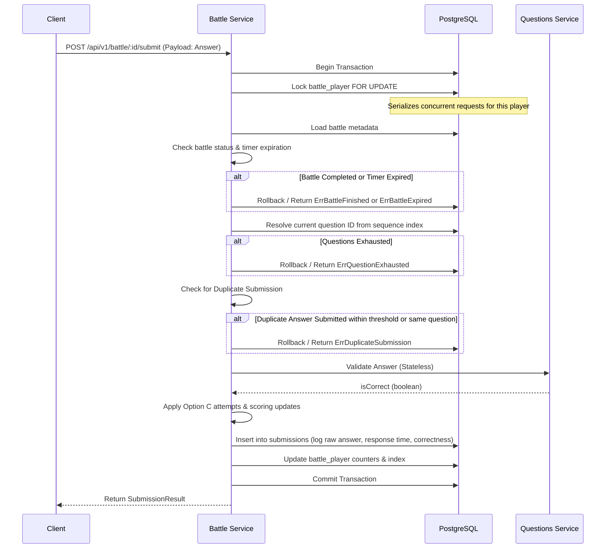

# Submission Lifecycle

This document describes the lifecycle of an answer submission within the DSAblitz Battle Engine. The submission flow is designed to be atomic, deadlock-free, and highly resilient against concurrent/duplicate submissions and race conditions.

---

## The Submission Transaction Flow

Every answer submission undergoes a strict, stateful sequence of operations executed inside a single PostgreSQL database transaction.



### Detailed Execution Steps

#### 1. Begin Transaction
Start a standard `pgx` transaction context to bundle read and write operations.

#### 2. Lock `battle_player`
Execute a query targeting the participant's progression row:
```sql
SELECT ... FROM battle_players 
WHERE battle_id = $1 AND user_id = $2 
FOR UPDATE
```
* **Why**: This serializes all gameplay actions for this specific player. Concurrent submissions (e.g. from user double-clicking or running scripts) are queued, preventing race conditions on progress updates.

#### 3. Load `battle`
Fetch the battle metadata row to obtain the battle's overall status (`status`), `started_at`, and `ended_at`.

#### 4. Check Expiration
Verify the battle's state:
* If the status is already `finished` / `StatusCompleted`, abort and return `ErrBattleFinished`.
* If the current clock time is greater than or equal to `ended_at`, abort and return `ErrBattleExpired`.

#### 5. Resolve Current Question
Resolve the question currently assigned to the player:
* Read the player's `current_question_index`.
* If the index is greater than or equal to the sequence limits (e.g., `MaxQuestionStreamSize`), abort and return `ErrQuestionExhausted`.
* Query the `battle_question_sequence` mapping to resolve the specific `question_id`.

#### 6. Check for Duplicate Submissions
We use a monotonic client-supplied submission index (`submissionIndex`) to prevent duplicate submissions:
* Calculate the expected submission index on the server: `ExpectedIndex = player.CorrectCount + player.IncorrectCount + 1`.
* If `submissionIndex < ExpectedIndex`, the request is a duplicate (e.g. from network retries or double clicks) and is rejected with `ErrDuplicateSubmission`.
* If `submissionIndex > ExpectedIndex`, the request is out-of-order and is rejected with `ErrInvalidSubmission`.
* As an additional safety check, fetch previous submissions for the current `question_id`. If the answer payload is identical to any existing attempt, return `ErrDuplicateSubmission`.

#### 7. Validate Answer
Submit the `question_id` and the client's answer payload to the stateless Questions module using `ValidateAnswer`.

#### 8. Update Progression Counters & Score (Option C Rule)
Apply the score and attempts progression logic:
* Fetch question metadata (such as `Difficulty`) via Questions Service.
* Calculate score using the injected `ScoreCalculator.Calculate(isCorrect, attempts, difficulty)` implementation.
* **If Correct**:
  * Increment score by calculated points.
  * Advance `current_question_index` by `1`.
  * Reset `current_question_attempts` to `0`.
* **If Incorrect**:
  * Increment `current_question_attempts` by `1`.
  * **First Attempt**: Player stays on the current question.
  * **Second Attempt**: Player is skipped to the next question (`current_question_index++`) with `0` points awarded.

#### 9. Log Submission
Insert a row into the `submissions` table, storing:
* `battle_id`, `user_id`, `question_id`
* `raw_answer` (serialized JSON containing the answer payload)
* `is_correct` (boolean result)
* `score_awarded` (1 or 0)
* `response_time_ms`
* `submitted_at` / `created_at` (current clock time)

#### 10. Persist Counters
Update the player's progression state in the `battle_players` table.

#### 11. Commit Transaction
Save all modifications. If any error or validation check failed along the way, rollback the transaction to ensure zero partial state leakage.

---

## Domain Errors Mapping

To maintain clean module boundaries and clear API responses, the following typed domain errors are raised by the Battle Engine during submission processing:

| Domain Error | Description | HTTP Status Mapping |
| :--- | :--- | :--- |
| `ErrBattleFinished` | Submitting to a battle that has already been finalized and closed. | `400 Bad Request` |
| `ErrBattleExpired` | Submitting after the timer (`ended_at`) has elapsed. | `400 Bad Request` |
| `ErrQuestionExhausted` | Player has completed all pre-generated questions in the stream. | `400 Bad Request` |
| `ErrDuplicateSubmission` | Resubmitting the same answer or submitting within the rate-limit window. | `409 Conflict` |
| `ErrInvalidSubmission` | Empty answer payload or incorrect payload structure. | `422 Unprocessable Entity` |
