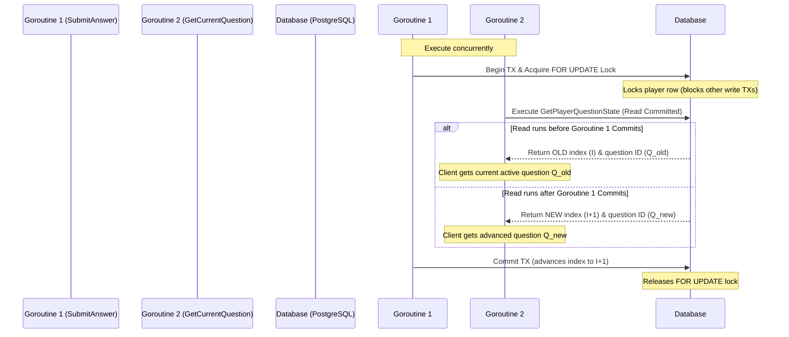

# WebSocket Concurrency & Read-Write Consistency

In a real-time multiplayer application like DSAblitz, players interact over active WebSocket connections. This triggers concurrent execution of HTTP/WS handlers for the same player, such as:
1. **`SubmitAnswer`**: A write handler that validates answers, calculates score increases, and advances the player's question pointer.
2. **`GetCurrentQuestion`**: A read handler that retrieves the sanitized active question data for the player.

Without synchronization, concurrent read/write execution could lead to dirty reads (e.g. returning a question that corresponds to an uncommitted state or mismatching the current index). This document details how consistency is preserved.

---

## The Read-Write Goroutine Flow

In the Go backend, each incoming WebSocket message is processed in its own goroutine spawned by the Gin web server or the WebSocket room connection pump. 

---

## Safety Mechanisms

### 1. Read Committed Isolation & Consistent Snapshots
* **No Dirty Reads**: PostgreSQL runs under the `Read Committed` isolation level. Goroutine 2 (`GetCurrentQuestion`) executes a single joined query without a transaction lock. It reads only committed data. It can never read a partially updated `current_question_index` from an active, uncommitted `SubmitAnswer` transaction.
* **Deterministic Results**: If a read starts before `SubmitAnswer` commits, it gets the previous index. If it starts after, it gets the next index. There is no intermediate/broken state visible (such as an index incremented without a logged submission, or vice versa).

### 2. Lock-free Read Optimization
Because the Questions module is stateless and read-only (reading from a thread-safe local in-memory map), the database read operation does not need to acquire a lock:
* We join `battle_players`, `battles`, and `battle_question_sequence` using a single SELECT query (`GetPlayerQuestionState`).
* This eliminates database transaction overhead for reads and avoids blocking the player's active gameplay loop while waiting for lock releases.

### 3. Client State Tracking (Monotonic Indexes)
If the client submits an answer (`SubmitAnswer`) and immediately queries their current question (`GetCurrentQuestion`) due to a local state refresh, the monotonic index check acts as the ultimate guard:
* Even if the client sends concurrent HTTP requests, the database `FOR UPDATE` lock forces the write operations to run sequentially.
* The monotonic submission counter `submissionIndex` sent by the client ensures that if the server has already processed the answer and advanced the index, any duplicate submission requests are rejected with `ErrDuplicateSubmission` immediately.
