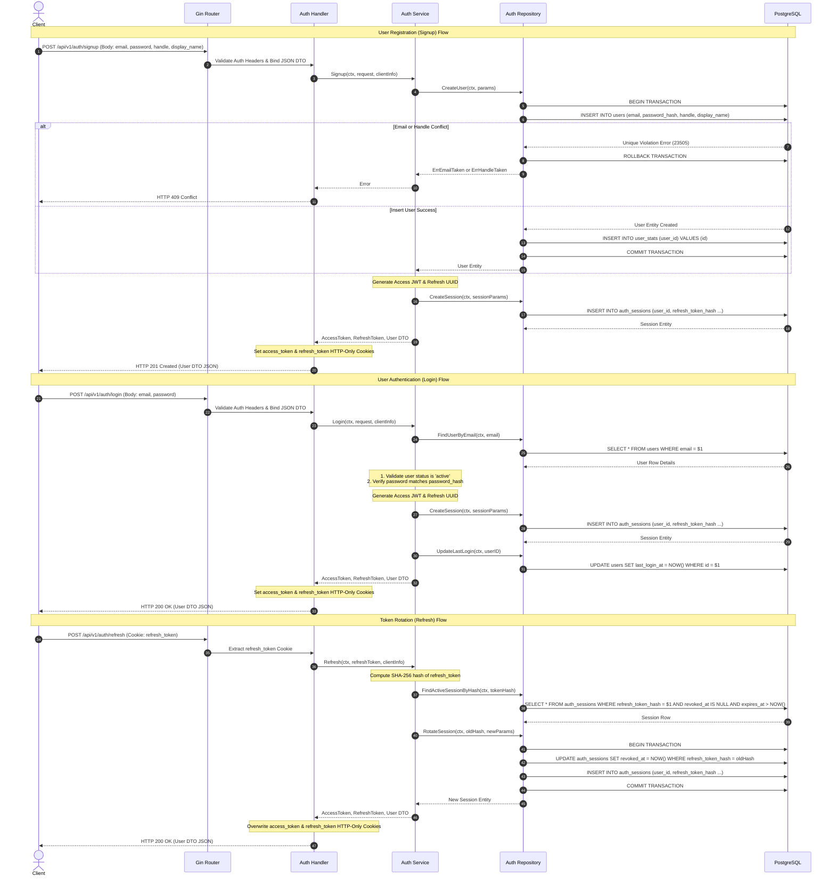

# Authentication Sequence Diagram

This document presents a sequence diagram showing the request lifecycle for user signup, login, and token refresh.

---

## 1. Sequence Diagram

---

## 2. Step-by-Step Trace

### 2.1 Signup Step-by-Step:
1.  **POST `/signup`**: Client sends signup details. Handlers bind to the JSON DTO and validate formats.
2.  **`CreateUser` Transaction**: Opens a transaction, inserts the user row, and checks for unique constraint violations (returns `409 Conflict` on duplicates). It then initializes the user's statistics in `user_stats` and commits.
3.  **Session Generation**: Generates access and refresh tokens, saves the refresh token hash in `auth_sessions`, sets cookies, and returns `201 Created`.

### 2.2 Login Step-by-Step:
1.  **POST `/login`**: Client sends login details.
2.  **Lookup & Compare**: Queries the user by email, checks their status is `active`, and verifies the password hash.
3.  **Establish Session**: Generates tokens, logs the refresh token hash in `auth_sessions`, updates the last login timestamp, sets cookies, and returns `200 OK`.

### 2.3 Refresh Step-by-Step:
1.  **POST `/refresh`**: Client sends refresh token cookie.
2.  **Verify Active Session**: Hashes the refresh token and queries the database for an active, unrevoked, unexpired session matching the hash.
3.  **Atomic Rotation**: Starts a transaction, revokes the old session, inserts a new rotated session row, commits, sets new cookies, and returns `200 OK`.
