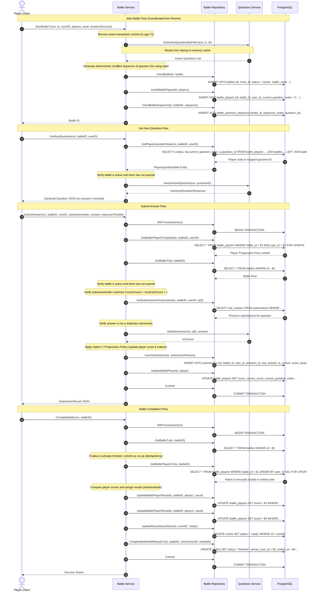

# Battle Sequence Diagram

This document presents a sequence diagram showing the request lifecycle for initializing battles, retrieving questions, submitting answers, and completing matches.

---

## 1. Sequence Diagram

---

## 2. Step-by-Step Trace

1.  **Start Battle Coordination**: The Rooms module starts a transaction and calls the Battle service, passing the transaction context (`tx`). The Battle service queries questions from the in-memory cache, shuffles them deterministically, and inserts the battle sequence.
2.  **Get Next Question**: Fetches progress pointers and sequence mappings in a single query using joins, reducing network roundtrips.
3.  **Submit Answer**: Starts a transaction, acquires a row lock on the player's scorecard, checks the monotonic index to prevent duplicates, validates correctness, applies the attempt policy, logs the submission, updates player counters, and commits.
4.  **Complete Battle**: Locks match participant rows sorted by ID to prevent deadlocks, evaluates scores, updates player results, resets the lobby status to `ready`, sets the battle status to `finished`, and commits.
