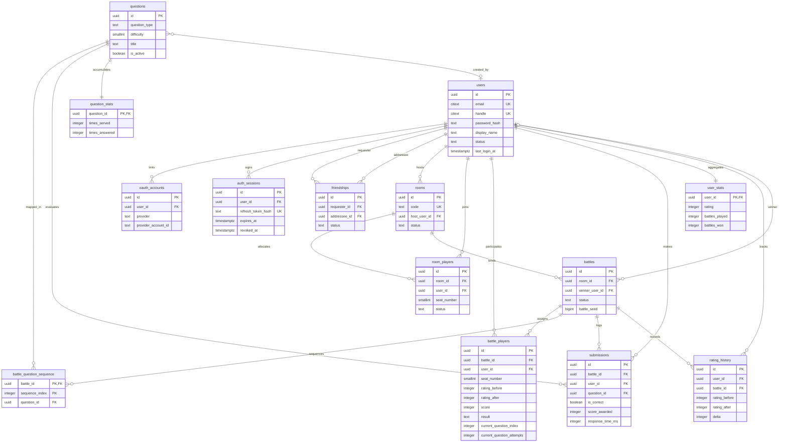

# Database Schema Diagram

This document presents a comprehensive Mermaid Entity-Relationship (ER) diagram representing the 14 database tables currently implemented in the DSAblitz database schema.

---

## 1. Purpose

The ER model maps the relationship boundaries and key structures of the PostgreSQL schema. It serves as a visual guide for engineers working on new service layers or database updates.

---

## 2. Design Rationale

### Why this design?
- **Entity Grouping**: Tables are grouped by module ownership (Auth, Users, Rooms, Battle, Questions) to maintain modular boundaries.
- **Relational Integrity Mapping**: Relations are mapped using crows-foot notation to indicate cardinality (e.g. one-to-many, one-to-one) and optionality, helping developers understand how cascade deletes and nullable fields affect the database.

### Alternatives Considered

#### Why strongly-typed relational schemas instead of denormalized schemas?
- *Rejected Alternative*: Storing the entire matchmaking lobby and active battle details as a single denormalized document.
- *Rationale for Rejection*: While denormalization simplifies simple queries, it makes handling concurrent operations (like two players joining a lobby at the same time) complex. Denormalized documents require full-document write locks or complex field merges. By normalization, we isolate operations to specific tables and lock only the necessary rows.
- *Tradeoffs*: Querying requires joining multiple tables, which is more expensive than retrieving a single document. We mitigate this using composite indexes and in-memory caching for static catalogs.

---

## 3. Entity-Relationship Diagram

> ### 💬 Interview Discussion: Visualizing Database Architectures
> - **Interviewer Intent**: Assess capacity to communicate complex schemas clearly to other engineering team members.
> - **Strong Answer**: Use standard notations (like crows-foot notation) and group tables by module boundaries. Ensure foreign key mappings are explicitly visualized to show cascade behaviors and optionality.
> - **Common Mistakes**: Creating cluttered diagrams that mix system tables with application tables, or using incorrect cardinality symbols.
> - **Follow-up Questions**: How do relationships affect scaling? (Answer: Tight relationships with CASCADE deletes can lock tables during deletions. Highly connected tables are harder to split into separate databases).
> - **How DSAblitz demonstrates this**: Tables are grouped by domain boundaries, as configured in the migrations directory [backend/migrations](file:///home/tanishq/dsablitz/backend/migrations).

---

## 4. Current Implementation

The database consists of **14 tables** representing five distinct sub-domains.
1.  **Identity & Security**: `users`, `oauth_accounts`, and `auth_sessions`.
2.  **Lobby Matchmaking**: `rooms` and `room_players` (maintaining active state before a game).
3.  **Core Battle Engine**: `battles`, `battle_players`, `battle_question_sequence`, and `submissions`.
4.  **Content Catalog**: `questions` and `question_stats`.
5.  **Historical Analytics**: `user_stats`, `rating_history`, and `friendships`.

---

## 5. Production Considerations

- **What changes in production?**
  High volume will require read-replicas for query offloading. We must identify which relationships can be queries from replicas vs those that require primary write consistency.
- **What monitoring is required?**
  - Track foreign key index usage.
  - Monitor database schema deviations.
- **What will fail first?**
  Cascade deletes on parent tables (like deleting a user and cascading to `submissions`) will lock multiple tables and cause timeouts.
- **How would we evolve this design?**
  Transition from cascade deletes to soft deletes with background cleanup workers.

---

## 6. Planned Work (V2)

- **Glicko-2 Ratings Fields**: Add fields like `rating_deviation` (RD) and `volatility` to the `user_stats` schema to support the Glicko-2 Elo rating engine.
- **Lobby Configuration Tables**: Add a separate `room_configurations` table to support customization options like question category filters or custom time limits.

---

## 7. Exact Code References

- **Core Migrations Schema**: Configured in [000001_create_core_schema.up.sql](file:///home/tanishq/dsablitz/backend/migrations/000001_create_core_schema.up.sql).
- **Session Auth Extensions**: Configured in [000002_create_auth_sessions.up.sql](file:///home/tanishq/dsablitz/backend/migrations/000002_create_auth_sessions.up.sql).
- **Match Sequence Additions**: Defined in [000003_add_battle_sequence_and_progression.up.sql](file:///home/tanishq/dsablitz/backend/migrations/000003_add_battle_sequence_and_progression.up.sql).

---

## Key Takeaways

1. **Relationship Cardinality** guides data lifecycle management, ensuring CASCADE actions don't cause unintended deletions.
2. **Foreign Keys** are explicitly linked at the database layer to enforce referential integrity.
3. **Module Isolation** is maintained by routing all cross-module mutations through service interfaces.

---

## Interview Questions

- **Why does `battles.winner_user_id` use `ON DELETE SET NULL` instead of `ON DELETE CASCADE`?**
  * *Answer*: If a user account is deleted, we want to retain the match records they participated in for historical integrity and leaderboard analytics. Using `ON DELETE SET NULL` clears the winner field while preserving the battle history. Using `ON DELETE CASCADE` would delete all battles won by that user, corrupting match histories and statistics for their opponents.

---

## Common Mistakes

- **Incorrect Cardinality representation**: Depicting a one-to-many relationship where a one-to-one is required (e.g. `users` to `user_stats`), leading to schema implementation mismatches.

---

## Related Documents

- **Database Schema Reference**: [schema.md](file:///home/tanishq/dsablitz/docs/database/schema.md)
- **Database Indexing**: [indexing.md](file:///home/tanishq/dsablitz/docs/database/indexing.md)
- **Database Transactions**: [transactions.md](file:///home/tanishq/dsablitz/docs/database/transactions.md)

---

## Lessons Learned

- **Trigger Maintenance overhead**: Initially, we added triggers to update parent statistics tables (`user_stats`) on every submission. This caused lock contention on `user_stats` during matches. We removed these triggers, refactoring statistics updates to run asynchronously after a battle is completed.
