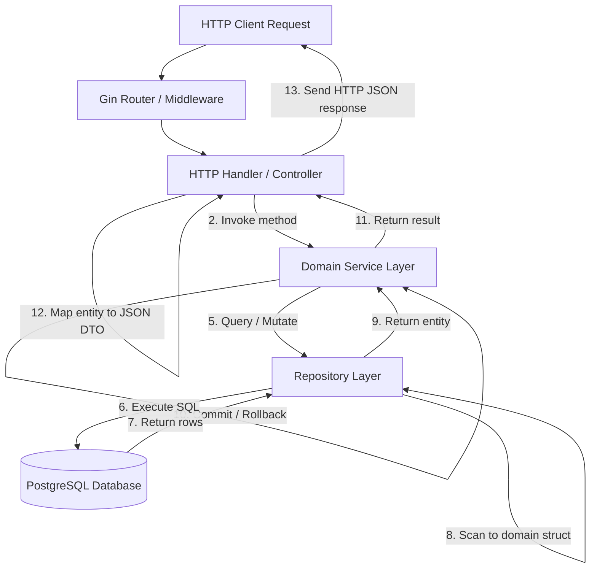
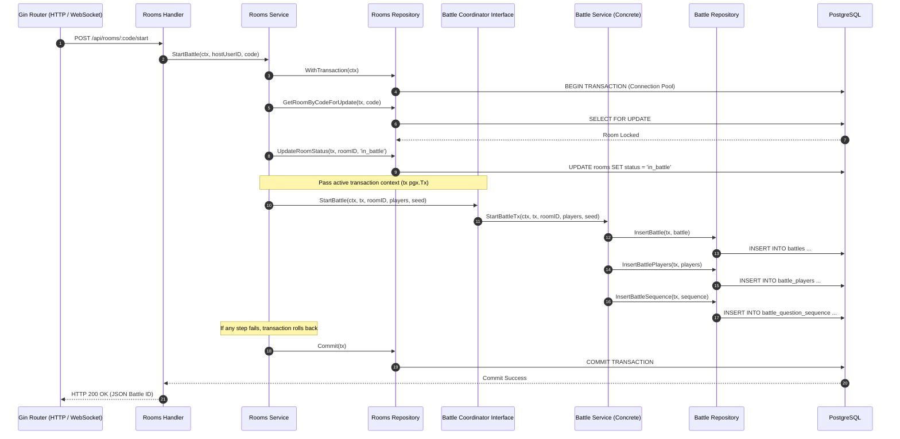

# Request & Repository Data Flow

This document describes the layered data flow pattern of the DSAblitz monolith, tracing how requests travel from HTTP clients down to PostgreSQL, and explaining module boundaries and transaction propagation.

---

## 1. Purpose

The layered data flow pattern isolates delivery layers (REST/WebSockets) from business logic and data access, ensuring codebase maintainability, clean boundaries, and reliable state updates.

---

## 2. Design Rationale

### Why this design?
- **Separation of Concerns**: Each layer has a single responsibility. HTTP handlers parse requests, services validate business logic and manage transactions, and repositories execute SQL queries. This makes components modular, easy to test, and swapable.
- **Dependency Inversion Pattern**: The service layer depends on interfaces rather than concrete repositories. This allows developer to mock database access during testing, enabling unit tests to run without an active PostgreSQL instance.
- **Shared Transaction propagation**: To keep transactions atomic when mutations span multiple modules, we pass the transaction context (`pgx.Tx`) through service interfaces, ensuring all operations use the same database connection.

### Alternatives Considered

#### Why repository pattern instead of direct SQL execution in the service layer?
- *Rejected Alternative*: Writing SQL queries directly inside service functions.
- *Rationale for Rejection*: Mixing database queries with business logic makes the code difficult to maintain and test. It prevents mocking the database during tests, forcing developer to run database instances for simple unit tests. Isolating SQL queries in a repository layer decouples storage implementations from business rules.
- *Tradeoffs*: Requires writing interface definitions and data mapping code, increasing boilerplate.

#### Why seed-based deterministic streams instead of fetching questions on-demand?
- *Rejected Alternative*: Fetching a random question from PostgreSQL every time a player advances.
- *Rationale for Rejection*: Querying a random row using `ORDER BY random()` requires a full table scan and is extremely slow. Additionally, in a 1v1 match, on-demand random fetching can result in players receiving questions of varying difficulty, undermining fairness. By generating a seed-based deterministic sequence `battle_question_sequence` once at battle startup, we ensure both players receive the exact same questions in the same order, and we can fetch questions from memory cache using pre-generated IDs.
- *Tradeoffs*: Requires generating the sequence map during battle startup, which adds a minor write delay at the start of the match.

---

## 3. Request Flow Diagram

The diagram below shows how an HTTP request (like `/api/rooms/:code/join`) travels through the layered architecture:

> ### 💬 Interview Discussion: Layered Architecture & Repository Pattern
> - **Interviewer Intent**: Assess capacity to design modular, testable, and maintainable systems.
> - **Strong Answer**: Isolate components into distinct layers (routing, service, repository) and enforce dependencies from outer to inner layers. Services should define repository interfaces to decouple business logic from storage implementations, allowing mock-based testing.
> - **Common Mistakes**: Leaking transport details (like Gin contexts) into the service layer, or running SQL queries inside handlers.
> - **Follow-up Questions**: How do you unit test a service method that depends on a repository? (Answer: Write a mock repository that implements the repository interface, allowing unit tests to run without database queries).
> - **How DSAblitz demonstrates this**: Handlers parse requests and delegate to services, which call repositories. For example, see [rooms/routes.go:L61-L85](file:///home/tanishq/dsablitz/backend/internal/rooms/routes.go#L61-L85).

---

## 4. Cross-Module Transaction Flow

When an operation spans multiple modules (like Rooms starting a Battle), we pass the transaction context through a coordinator interface to ensure atomicity:

> ### 💬 Interview Discussion: Cross-Module Interactions
> - **Interviewer Intent**: Evaluate capacity to design low-coupling components in a modular monolith.
> - **Strong Answer**: Modules must never import other modules directly. Use Dependency Inversion: define coordinator interfaces (like `BattleCoordinator` inside the Rooms module) and inject concrete implementations at startup. Pass parent transactions (`pgx.Tx`) through these interfaces to maintain atomic updates across modules.
> - **Common Mistakes**: Allowing circular imports or managing independent, uncoordinated transactions across modules, leading to partial-state inconsistencies.
> - **Follow-up Questions**: Why do we pass `pgx.Tx` instead of the database pool pointer `*pgxpool.Pool`? (Answer: Passing the database pool would cause the receiving module to start a separate transaction on a new connection, violating atomicity and risking deadlocks).
> - **How DSAblitz demonstrates this**: The `BattleCoordinator` interface is defined in [rooms/models.go:L122-L124](file:///home/tanishq/dsablitz/backend/internal/rooms/models.go#L122-L124) and implemented in [server/routes.go:L21-L35](file:///home/tanishq/dsablitz/backend/internal/server/routes.go#L21-L35).

---

## 5. Production Considerations

- **What changes in production?**
  In production, network latency between layers increases. We must monitor request execution times at each boundary (handler, service, repository) to identify performance bottlenecks.
- **What monitoring is required?**
  - Track API endpoint response times and error rates (using Prometheus metrics).
  - Trace SQL query durations and execution plans.
  - Log database pool metrics (waiting connections, active handles).
- **What will fail first?**
  High HTTP request volume can exhaust the thread pool or Gin handler queues, causing connection timeouts before requests reach the database.
- **How would we evolve this design?**
  Add middleware-level rate limiting and implement cache headers on read-only endpoints (like fetching question details) to reduce database read traffic.

---

## 6. Planned Work (V2)

- **Domain Event Dispatcher**: Add a domain event dispatcher that runs after successful commits (e.g., publishing `BattleStarted` or `RoomClosed` events to Redis Pub/Sub) to decouple post-update side effects.
- **Middleware validation mapping**: Move basic input validation (e.g., checking code lengths or formats) to Gin middleware to reject invalid requests early, reducing load on the service layer.

---

## 7. Exact Code References

- **Dependency Inversion Wiring**: Interface setups are configured in [server/routes.go:L55-L70](file:///home/tanishq/dsablitz/backend/internal/server/routes.go#L55-L70).
- **Rooms Handler Example**: Defined in [rooms/routes.go:L42-L72](file:///home/tanishq/dsablitz/backend/internal/rooms/routes.go#L42-L72).
- **Service Transaction Setup**: Configured in [rooms/service.go:L338-L343](file:///home/tanishq/dsablitz/backend/internal/rooms/service.go#L338-L343).
- **Repository pgx Scanning**: Located in [rooms/repository.go:L70-L86](file:///home/tanishq/dsablitz/backend/internal/rooms/repository.go#L70-L86).

---

## Key Takeaways

1. **HTTP concerns** (like status codes and JSON serialization) are isolated in the Handler layer.
2. **Business rules** (like match status checks and score limits) are isolated in the Service layer.
3. **Repository adapters** accept transaction handles (`pgx.Tx`) to support atomic transactions across service operations.

---

## Interview Questions

- **How do you handle Gin handler testing without database connectivity?**
  * *Answer*: Inject a mock service implementation that implements the service interface. This allows testing handler logic (like route registration, parameter binding, and response formatting) in isolation, without database dependencies.

---

## Common Mistakes

- **Leaking framework contexts**: Passing Gin context pointers (`*gin.Context`) into service or repository methods, which binds the business logic to the Gin framework and prevents reuse in CLI commands or background workers.

---

## Related Documents

- **Overall Backend System Architecture**: [overall_architecture.md](file:///home/tanishq/dsablitz/docs/architecture/overall_architecture.md)
- **Database Schema**: [schema.md](file:///home/tanishq/dsablitz/docs/database/schema.md)
- **Database Transactions**: [transactions.md](file:///home/tanishq/dsablitz/docs/database/transactions.md)

---

## Lessons Learned

- **Decoupling modules via interfaces**: In the initial design, the Rooms module imported the Battle module directly. This created circular dependencies and blocked building. We resolved this by implementing the dependency inversion pattern, defining the `BattleCoordinator` interface in Rooms and resolving it at server startup in the main package.
