# Room Sequence Diagram

This document presents a sequence diagram showing the request lifecycle for creating, joining, toggling ready states, leaving, and starting battles within matchmaking rooms.

---

## 1. Sequence Diagram

```mermaid
sequenceDiagram
    autonumber
    actor Client as Player Client
    participant Router as Gin Router / Middleware
    participant Handler as Rooms Handler
    participant Service as Rooms Service
    participant Repo as Rooms Repository
    participant B_Coord as Battle Coordinator
    participant DB as PostgreSQL

    %% Create Room
    Note over Client, DB: Room Creation Flow
    Client->>Router: POST /api/v1/rooms (Body: duration_seconds)
    Router->>Handler: Validate Access Cookie & Parse Body
    Handler->>Service: CreateRoom(ctx, hostUserID, durationSeconds)
    
    Service->>Repo: WithTransaction(ctx)
    Repo->>DB: BEGIN TRANSACTION
    Service->>Repo: GetRoomByCodeForUpdate(tx, code)
    Repo->>DB: SELECT * FROM rooms WHERE code = $1 FOR UPDATE
    Note over Service, DB: If collision, rollback and retry with new code (up to 3 times)
    Service->>Repo: InsertRoom(tx, room)
    Repo->>DB: INSERT INTO rooms (id, code, host_user_id ...)
    Service->>Repo: InsertRoomPlayer(tx, hostPlayer)
    Repo->>DB: INSERT INTO room_players (id, room_id, user_id, seat_number ...)
    Service->>Repo: Commit
    Repo->>DB: COMMIT TRANSACTION
    Service-->>Handler: Room Entity
    Handler-->>Client: HTTP 201 Created (Room DTO JSON)

    %% Join Room
    Note over Client, DB: Room Joining Flow
    Client->>Router: POST /api/v1/rooms/:code/join
    Router->>Handler: Validate Access Cookie & Extract Code
    Handler->>Service: JoinRoom(ctx, userID, code)
    
    Service->>Repo: WithTransaction(ctx)
    Repo->>DB: BEGIN TRANSACTION
    Service->>Repo: GetRoomByCodeForUpdate(tx, code)
    Repo->>DB: SELECT * FROM rooms WHERE code = $1 FOR UPDATE
    DB-->>Repo: Room Locked
    Service->>Repo: GetActivePlayersForUpdate(tx, roomID)
    Repo->>DB: SELECT * FROM room_players WHERE room_id = $1 AND status IN ('joined', 'ready') FOR UPDATE
    DB-->>Repo: Active Players Locked
    Note over Service: Verify room status is 'waiting' and capacity < 2
    Service->>Repo: InsertRoomPlayer(tx, guestPlayer)
    Repo->>DB: INSERT INTO room_players (id, room_id, user_id, seat_number = 2 ...)
    Service->>Repo: Commit
    Repo->>DB: COMMIT TRANSACTION
    Service-->>Handler: Room Entity
    Handler-->>Client: HTTP 200 OK (Room DTO JSON)

    %% Toggle Ready
    Note over Client, DB: Player Readiness Toggle
    Client->>Router: POST /api/v1/rooms/:code/ready (Body: ready)
    Router->>Handler: Validate Access Cookie & Parse Body
    Handler->>Service: ToggleReady(ctx, userID, code, ready)
    
    Service->>Repo: WithTransaction(ctx)
    Repo->>DB: BEGIN TRANSACTION
    Service->>Repo: GetRoomByCodeForUpdate(tx, code)
    Repo->>DB: SELECT * FROM rooms WHERE code = $1 FOR UPDATE
    Service->>Repo: GetActivePlayersForUpdate(tx, roomID)
    Repo->>DB: SELECT * FROM room_players WHERE room_id = $1 AND status IN ('joined', 'ready') FOR UPDATE
    Service->>Repo: UpdatePlayerStatus(tx, roomID, userID, status)
    Repo->>DB: UPDATE room_players SET status = $3 WHERE room_id = $1 AND user_id = $2
    Note over Service: If both players are ready, update room status to 'ready'
    Service->>Repo: UpdateRoomStatus(tx, roomID, 'ready')
    Repo->>DB: UPDATE rooms SET status = 'ready'
    Service->>Repo: Commit
    Repo->>DB: COMMIT TRANSACTION
    Service-->>Handler: Room Entity
    Handler-->>Client: HTTP 200 OK (Room DTO JSON)

    %% Leave Room
    Note over Client, DB: Player Leaving Flow
    Client->>Router: POST /api/v1/rooms/:code/leave
    Router->>Handler: Validate Access Cookie & Extract Code
    Handler->>Service: LeaveRoom(ctx, userID, code)
    
    Service->>Repo: WithTransaction(ctx)
    Repo->>DB: BEGIN TRANSACTION
    Service->>Repo: GetRoomByCodeForUpdate(tx, code)
    Repo->>DB: SELECT * FROM rooms WHERE code = $1 FOR UPDATE
    Service->>Repo: GetActivePlayersForUpdate(tx, roomID)
    Repo->>DB: SELECT * FROM room_players WHERE room_id = $1 AND status IN ('joined', 'ready') FOR UPDATE
    
    alt Caller is Host
        Note over Service: Close lobby and remove all players
        Service->>Repo: UpdateRoomStatus(tx, roomID, 'closed')
        Repo->>DB: UPDATE rooms SET status = 'closed'
        Service->>Repo: MarkAllPlayersLeft(tx, roomID)
        Repo->>DB: UPDATE room_players SET status = 'left', left_at = NOW() WHERE status IN ('joined', 'ready')
    else Caller is Guest
        Note over Service: Remove guest and reset room status
        Service->>Repo: MarkPlayerLeft(tx, roomID, userID)
        Repo->>DB: UPDATE room_players SET status = 'left', left_at = NOW() WHERE user_id = userID
        Service->>Repo: UpdateRoomStatus(tx, roomID, 'waiting')
        Repo->>DB: UPDATE rooms SET status = 'waiting'
    end
    
    Service->>Repo: Commit
    Repo->>DB: COMMIT TRANSACTION
    Service-->>Handler: Success Status
    Handler-->>Client: HTTP 200 OK (Success JSON)

    %% Start Battle
    Note over Client, DB: Start Battle Flow (Host Only)
    Client->>Router: POST /api/v1/rooms/:code/start-battle
    Router->>Handler: Validate Access Cookie & Extract Code
    Handler->>Service: StartBattle(ctx, userID, code)
    
    Service->>Repo: WithTransaction(ctx)
    Repo->>DB: BEGIN TRANSACTION
    Service->>Repo: GetRoomByCodeForUpdate(tx, code)
    Repo->>DB: SELECT * FROM rooms WHERE code = $1 FOR UPDATE
    Note over Service: Verify caller is host and room status is 'ready'
    Service->>Repo: GetActivePlayersForUpdate(tx, roomID)
    Repo->>DB: SELECT * FROM room_players WHERE room_id = $1 AND status IN ('joined', 'ready') FOR UPDATE
    Service->>Repo: UpdateRoomStatus(tx, roomID, 'in_battle')
    Repo->>DB: UPDATE rooms SET status = 'in_battle'
    
    Note over Service: Propagate transaction context (tx pgx.Tx)
    Service->>B_Coord: StartBattle(ctx, tx, roomID, players, seed)
    B_Coord->>DB: INSERT INTO battles ...
    B_Coord->>DB: INSERT INTO battle_players ...
    B_Coord->>DB: INSERT INTO battle_question_sequence ...
    
    Service->>Repo: Commit
    Repo->>DB: COMMIT TRANSACTION
    Service-->>Handler: Battle ID
    Handler-->>Client: HTTP 200 OK (Battle ID JSON)
```

---

## 2. Step-by-Step Trace

1.  **Lobby Lifecycle Operations**: Matchmaking actions are coordinated by the Rooms service inside sequential database transactions.
2.  **Concurrency Locking**: `rooms` and `room_players` are locked using `FOR UPDATE` in matchmaking methods to serialize seating capacity, ready status updates, and match starts.
3.  **Start Battle Coordination**: Starting a match requires a single atomic transaction. The Rooms service locks the lobby, updates the status to `in_battle`, and passes the transaction context (`tx pgx.Tx`) to the Battle coordinator to create the battle, player scorecards, and question sequence.
