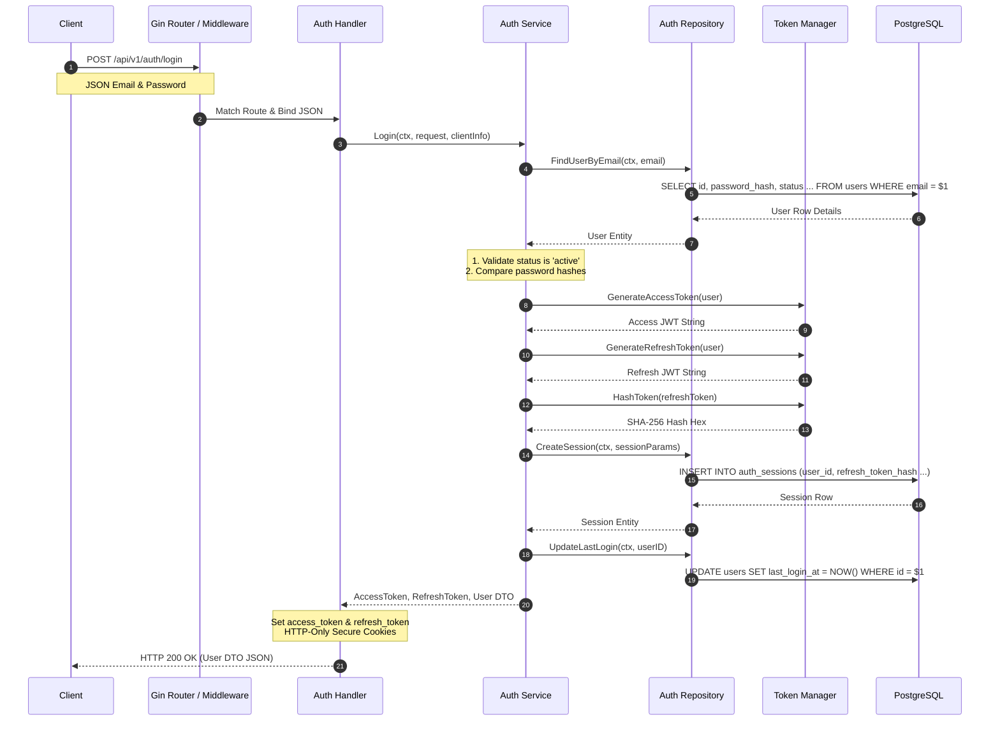

# User Login Flow Deep Dive

This document provides a technical walkthrough of the user authentication and session establishment flow in the DSAblitz monolith.

---

## 1. Sequence Diagram

---

## 2. Step-by-Step Execution

1.  **Request Parsing**: The client calls `POST /api/v1/auth/login`. The Gin router validates and binds the request payload to the `LoginRequest` DTO, checking JSON validation rules (`binding:"required,email"`).
2.  **Database Lookup**: The service calls `FindUserByEmail`. The repository queries the `users` table for the matching email. If no user is found, it returns `ErrInvalidCredentials`.
3.  **Account Status Validation**: The service verifies the user's status is `active`. If the account is disabled or soft-deleted, it aborts the process and returns `ErrUserDisabled`.
4.  **Password Verification**: The service compares the submitted password with the database `password_hash` using the Bcrypt library's `CompareHashAndPassword` helper. If a mismatch is detected, it returns `ErrInvalidCredentials`.
5.  **Token Generation**: Upon successful verification, the service calls `TokenManager` to generate:
    *   An `access_token` (JWT) containing the user ID, handle, and email, expiring in 15 minutes.
    *   A `refresh_token` (random UUID string) expiring in 7 days.
6.  **Session Logging**: The service hashes the refresh token using SHA-256 and calls `CreateSession` to store the session metadata (user agent, IP address, hash, and expiry) in the `auth_sessions` table.
7.  **Timestamp Update**: The service calls `UpdateLastLogin` to update the user's login activity.
8.  **Cookie Setup**: The HTTP handler sets the tokens as HTTP-Only cookies (`access_token` and `refresh_token`), configuring the `Secure` flag for production, and returns the user's profile details.

---

## 3. Failure Paths

-   **Invalid Credentials**: If the user is not found or the password comparison fails, the service returns `ErrInvalidCredentials`. The handler captures this and returns `401 Unauthorized` with the body `{"error": "invalid credentials"}`.
-   **Disabled Account**: If `status == "disabled"`, the service returns `ErrUserDisabled`. The handler maps this to `403 Forbidden` with the body `{"error": "user status is disabled"}`.
-   **Database Down**: If any query fails due to database connectivity issues, the handler maps the error to `500 Internal Server Error`, hiding SQL exception details.

---

## 4. Concurrency & Security Considerations

-   **No Row Locking Required**: Reading user records for authentication does not lock rows, ensuring high throughput.
-   **Collision Avoidance**: Session records are inserted using random UUID primary keys, preventing write conflicts.
-   **Constant-Time Comparisons**: The Bcrypt comparison function uses constant-time matching to prevent timing attacks from revealing valid passwords.

---

## 5. Related Implementation

-   **HTTP Handler**: [auth/handler.go:L52-L67](file:///home/tanishq/dsablitz/backend/internal/auth/handler.go#L52-L67)
-   **Service Logic**: [auth/service.go:L43-L77](file:///home/tanishq/dsablitz/backend/internal/auth/service.go#L43-L77)
-   **Data Queries**: [auth/repository.go:L93-L144](file:///home/tanishq/dsablitz/backend/internal/auth/repository.go#L93-L144)

---

## 6. Common Interview Questions

-   **Why should refresh tokens be stored as hashes in the database?**
  * *Answer*: Refresh tokens are long-lived credentials. If an attacker gains read access to the database (e.g. through SQL injection or database backups), storing raw refresh tokens would allow them to hijack all active user sessions. Storing SHA-256 hashes prevents attackers from using compromised database records to authenticate.
-   **How do you prevent timing attacks during password validation?**
  * *Answer*: Do not compare password hashes using standard string equality, as these operations exit early upon finding the first mismatched character, creating timing variances. Use constant-time comparison functions (like Go's `subtle.ConstantTimeCompare`) to ensure comparisons take the same duration regardless of matching length.
