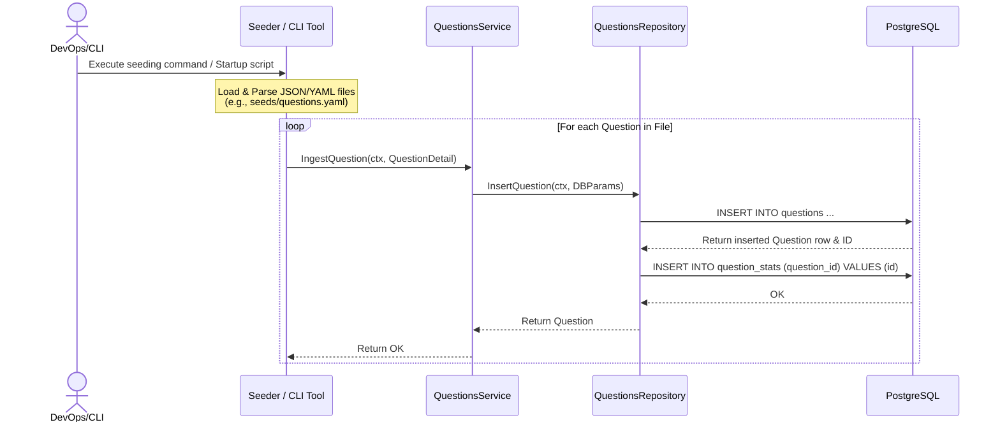
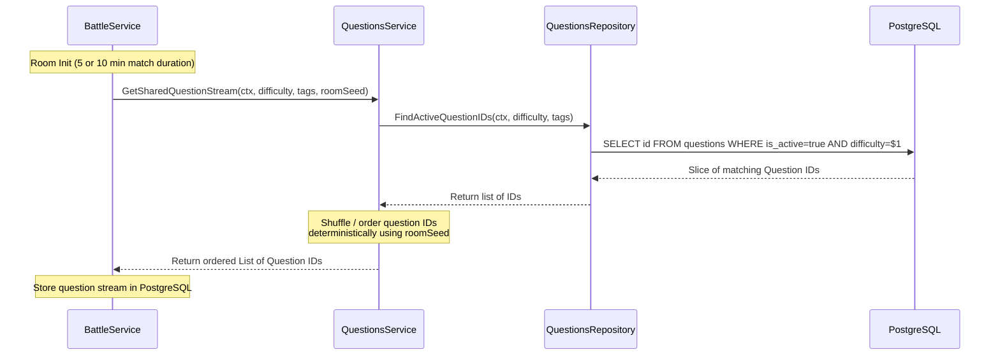
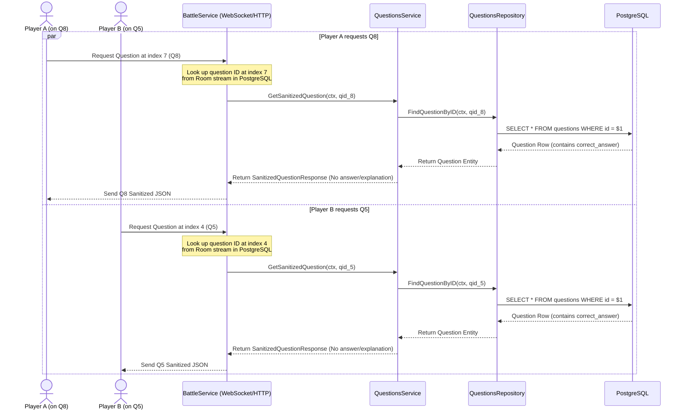

# Questions Module Execution Flows

This document details the critical execution paths for the Questions module.

## 1. Question Ingestion Flow (File-Based Seeding)

During application startup, local JSON/YAML files containing predefined questions are parsed and loaded into the database. Admin HTTP CRUD APIs are deferred to V2.

## 2. Shared Question Stream Generation (Battle Init)

When a match starts, the Battle Module generates a shared, deterministic question stream (e.g., unlimited stream capacity or a very large pool) based on the room's difficulty, tags, and seed. Both players share this identical stream of question IDs.

## 3. Question Retrieval & Sanitization Flow (Asynchronous Battle Progression)

Players progress through the shared question stream at different speeds. When Player A requests their current question (e.g., Q8) or Player B requests theirs (e.g., Q5), the Battle Service retrieves the question ID from the shared stream, gets the sanitized question, and returns it to the player.

