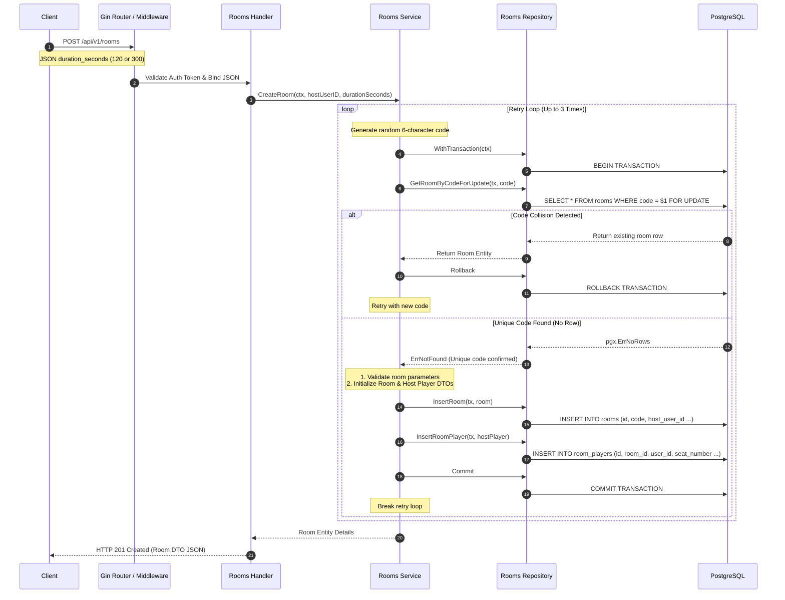

# Room Creation Flow Deep Dive

This document details the request execution path, transaction boundaries, and collision retry rules when a player creates a new matchmaking room lobby in the DSAblitz monolith.

---

## 1. Sequence Diagram

---

## 2. Step-by-Step Execution

1.  **Request Handling**: The client calls `POST /api/v1/rooms` with the body `{"duration_seconds": 300}`. The handler extracts the host's `userID` from the authenticated context and verifies the request payload.
2.  **Code Generation**: The service generates a cryptographically random 6-character alphanumeric code using `crypto/rand` to prevent predictability.
3.  **Transaction Initialization**: The service starts a database transaction by calling the repository's `WithTransaction` wrapper.
4.  **Collision Validation**: The service calls `GetRoomByCodeForUpdate` to check if the generated code is unique. If a row is returned, a code collision occurred. The transaction rolls back, and the service retries with a new code.
5.  **Room Insertion**: If the code is unique, the service validates room parameters (duration must be 120 or 300) and inserts the room record into the `rooms` table with status `waiting`.
6.  **Host Seating**: The service registers the host player in the `room_players` table, assigning them `seat_number = 1` and status `joined`.
7.  **Commit**: The transaction commits, releasing locks and returning the created room details.

---

## 3. Failure Paths

-   **Invalid Room Duration**: If `duration_seconds` is not 120 or 300, the handler returns `400 Bad Request` with `"duration must be 120 or 300 seconds"`.
-   **Max Collision Retries Reached**: If the retry loop fails to find a unique code after 3 attempts, the service aborts and returns an error. The handler maps this to `500 Internal Server Error` with `"failed to generate unique room code"`.

---

## 4. Retry Behavior

-   **Out-of-Transaction Retries**: The retry loop runs outside of the transaction block. This is critical for PostgreSQL, as query errors abort transactions permanently. Moving retry logic outside of the transaction ensures each retry starts a clean, fresh transaction.

---

## 5. Concurrency Considerations

-   **Pessimistic Locking**: Checking code uniqueness uses `FOR UPDATE` to lock the matching code record. This prevents concurrent creations from inserting the same room code simultaneously (which would cause a unique constraint violation).

---

## 6. Related Implementation

-   **HTTP Route Mapping**: [rooms/routes.go:L39-L59](file:///home/tanishq/dsablitz/backend/internal/rooms/routes.go#L39-L59)
-   **Service Logic**: [rooms/service.go:L45-L120](file:///home/tanishq/dsablitz/backend/internal/rooms/service.go#L45-L120)
-   **Database Queries**: [rooms/repository.go:L41-L86](file:///home/tanishq/dsablitz/backend/internal/rooms/repository.go#L41-L86)

---

## 7. Common Interview Questions

-   **Why should collision retry loops run outside of the transaction block in PostgreSQL?**
  * *Answer*: In database engines like MySQL, a failed statement inside a transaction does not abort the entire transaction, allowing subsequent statements to execute. In PostgreSQL, any query error (like a unique constraint violation) marks the transaction as aborted. Any subsequent query fails with `current transaction is aborted, commands ignored until end of transaction block`. To retry successfully, the transaction must roll back, and the next attempt must start a clean transaction.
-   **How does using cryptographically secure random generators prevent lobby prediction attacks?**
  * *Answer*: Standard pseudo-random number generators (like math/rand) are seed-based and deterministic. If an attacker discovers the seed, they can predict future room codes. Using cryptographically secure random generators (`crypto/rand`) utilizes system entropy to generate unpredictable codes.
