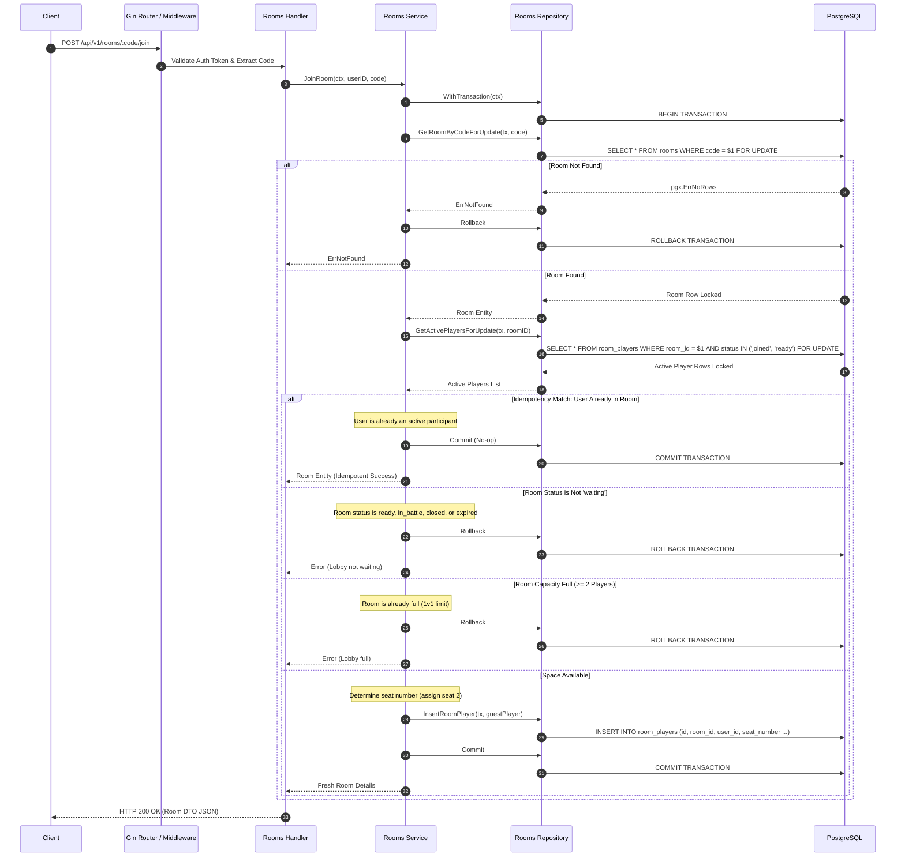

# Room Joining Flow Deep Dive

This document details the execution path, transaction boundaries, capacity verification, and concurrency locks when a player joins an existing matchmaking room lobby in the DSAblitz monolith.

---

## 1. Sequence Diagram

---

## 2. Step-by-Step Execution

1.  **Route Parsing**: The client calls `POST /api/v1/rooms/:code/join` with the room code parameter. The handler extracts the guest's `userID` from the authenticated context.
2.  **Transaction Initialization**: The service starts a transaction by calling the repository's `WithTransaction` wrapper.
3.  **Lobby Locking**: The service locks the room row using `GetRoomByCodeForUpdate` to serialize concurrent join attempts. If the room code is not found, the transaction rolls back, and the service returns `ErrNotFound`.
4.  **Active Players Locking**: The service queries and locks active players in the room using `GetActivePlayersForUpdate`.
5.  **Idempotency Check**: The service checks if the guest is already in the active players list. If so, it commits the transaction as a no-op (idempotency) and returns the current room details.
6.  **Status Validation**: The service verifies the room's status is `waiting`. If the status is `in_battle` or `closed`, the transaction rolls back, and the service returns an error.
7.  **Capacity Check**: The service checks the number of active players. If the room is full ($\ge 2$ players), the transaction rolls back, and the service returns a capacity error.
8.  **Seat Assignment**: The service determines the seat number (assigning seat 2 for the guest) and inserts the guest record into the `room_players` table.
9.  **Commit**: The transaction commits, releasing locks and returning the updated room details.

---

## 3. Failure Paths

-   **Room Not Found**: If the room code does not match any active lobby, the handler returns `404 Not Found` with `"room not found"`.
-   **Invalid Room Status**: If the room status is not `waiting`, the handler returns `400 Bad Request` with `"cannot join: room is in status ..."`.
-   **Lobby Full**: If two players are already ready or joined, the handler returns `400 Bad Request` with `"cannot join: room is full"`.

---

## 4. Concurrency Considerations

-   **Preventing Race Conditions**: Locking both the room and active player rows ensures capacity checks are serialized. If three players attempt to join the same 2-player lobby simultaneously, the first joiner locks the room, inserts their record, and commits. The next joiner reads the updated capacity and is rejected, preventing the lobby from exceeding its capacity limit.

---

## 5. Related Implementation

-   **HTTP Route Mapping**: [rooms/routes.go:L61-L85](file:///home/tanishq/dsablitz/backend/internal/rooms/routes.go#L61-L85)
-   **Service Logic**: [rooms/service.go:L123-L190](file:///home/tanishq/dsablitz/backend/internal/rooms/service.go#L123-L190)
-   **Database Queries**: [rooms/repository.go:L70-L86](file:///home/tanishq/dsablitz/backend/internal/rooms/repository.go#L70-L86) and [rooms/repository.go:L149-L175](file:///home/tanishq/dsablitz/backend/internal/rooms/repository.go#L149-L175).

---

## 6. Common Interview Questions

-   **How do you prevent race conditions where multiple players attempt to join the same room concurrently?**
  * *Answer*: Use pessimistic row-level locking. Acquire a write lock on the room and active player rows inside a transaction, serialize capacity checks and inserts, and reject subsequent joins if the room is full.
-   **Why is it important to lock both the `rooms` and `room_players` tables instead of just checking the player count?**
  * *Answer*: Locking only the player count allows concurrent transactions to perform dirty reads. Two transactions could read the count as 1, proceed to insert their player records concurrently, and commit, causing the room to exceed its 2-player capacity limit. Locking the room and players tables serializes these checks, ensuring only one transaction can modify the room state at a time.
