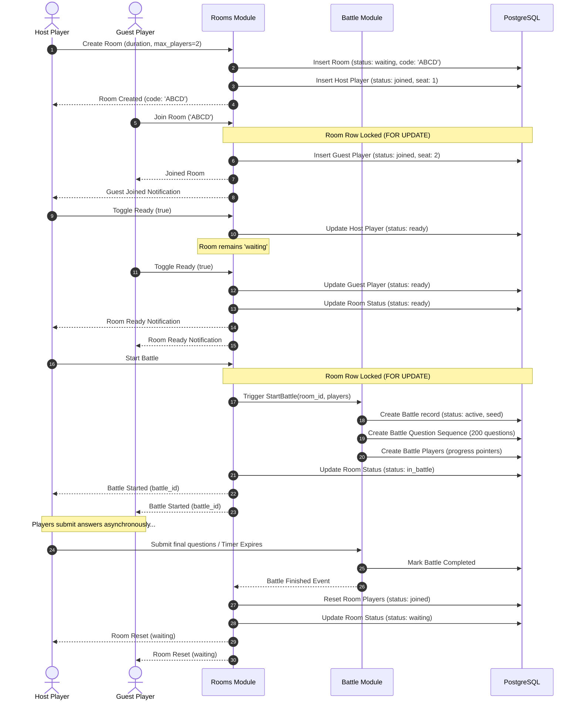

# Room Lifecycle & Flows

This document details the end-to-end lifecycle and user flows of a multiplayer game lobby (Room) in **DSAblitz**.

---

## 1. Room Lifecycle Flow

A Room acts as an orchestrator and lobby presence system. It handles matchmaking, player seating, ready checks, and battle orchestration. Below is the sequence of events from room creation to disbanding:

---

## 2. Core Flows

### 2.1. Create Room
* **Trigger**: Host calls `POST /api/v1/rooms` with parameters:
  - `duration_seconds` (120 or 300)
  - `max_players` (default 2)
* **API Validation**:
  - `duration_seconds` must be exactly 120 or 300.
  - `max_players` must be 2 (MVP constraint).
* **Database Action**:
  - A unique, human-readable alphanumeric code (4-16 characters, e.g., 6-character uppercase string like `DSAXYZ`) is generated.
  - Inserts room row with status `waiting`.
  - Inserts host player row in `room_players` with status `joined` and `seat_number = 1`.
  - Enforced within a single transaction.

### 2.2. Join Room
* **Trigger**: Guest calls `POST /api/v1/rooms/join` with body `{"code": "DSAXYZ"}`.
* **Database Action**:
  - Locks the room row using `SELECT ... FOR UPDATE` by code.
  - Validates room status is `waiting`.
  - Queries active players in `room_players` for the room.
  - If active player count is $\ge 2$, rejects the request ("Room full").
  - Identifies the open seat (since host is seat 1, guest gets seat 2).
  - Inserts guest player row in `room_players` with status `joined` and `seat_number = 2`.
  - Enforced within a single transaction.

### 2.3. Toggle Ready Status
* **Trigger**: A player in the room calls `POST /api/v1/rooms/ready` with body `{"ready": true|false}`.
* **Database Action**:
  - Starts transaction.
  - Locks the room row (`SELECT ... FOR UPDATE` on `rooms`) using the player's active room ID.
  - Updates the player's status in `room_players` to `ready` (if `ready: true`) or `joined` (if `ready: false`).
  - Fetches the status of all active players in the room.
  - If both players are `ready`, updates the room status to `ready`.
  - If either player is not ready, resets room status to `waiting`.
  - Enforced within a single transaction.

### 2.4. Leave Room
* **Trigger**: A player calls `POST /api/v1/rooms/leave`.
* **Database Action**:
  - Starts transaction.
  - Locks the room row (`SELECT ... FOR UPDATE` on `rooms`).
  - If the leaving player is the **Host**:
    - Updates the room status to `closed`.
    - Updates all active players in `room_players` to status `left` and sets `left_at = NOW()`.
  - If the leaving player is the **Guest**:
    - Updates the guest's player record in `room_players` to status `left` and sets `left_at = NOW()`.
    - If the room was `ready`, resets room status to `waiting`.
  - Enforced within a single transaction.

### 2.5. Start Battle
* **Trigger**: Host calls `POST /api/v1/rooms/start-battle` (only allowed when room status is `ready`).
* **Database Action**:
  - Starts transaction.
  - Locks the room row (`SELECT ... FOR UPDATE` on `rooms`).
  - Verifies room status is `ready` and active player count is exactly 2.
  - Calls Battle module to create a new Battle (with deterministic sequence generation).
  - Updates room status to `in_battle`.
  - Commits transaction. (Supports idempotency: if room is already `in_battle`, returns the current active battle ID).

### 2.6. Battle Completion
* **Trigger**: Battle ends (timer expires or all questions answered).
* **Action**:
  - Rooms module (or Battle module completion hook) receives notice that the battle is finished.
  - Starts transaction.
  - Locks the room row (`SELECT ... FOR UPDATE` on `rooms`).
  - Updates room status to `waiting`.
  - Resets all players in `room_players` back to status `joined` and clears their ready states.
  - Commits transaction.

---

## 3. Room Expiry (Cron/Cleanup)
* **Trigger**: Background worker runs every 60 seconds.
* **Action**:
  - Queries all rooms where `status IN ('waiting', 'ready')` and `expires_at < NOW()`.
  - For each expired room, updates status to `expired` and marks all active players as `left`.
