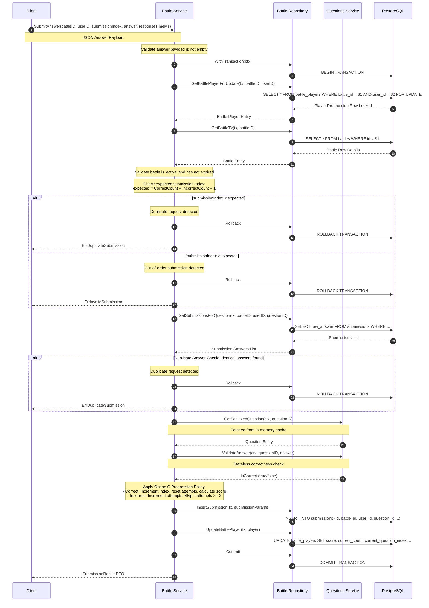

# Answer Submission Flow Deep Dive

This document details the execution path, transaction boundaries, score evaluation, and duplicate checks when a player submits an answer during an active battle in the DSAblitz monolith.

---

## 1. Sequence Diagram

---

## 2. Step-by-Step Execution

1.  **Input Validation**: The client submits an answer. The service verifies the payload is not empty (contains a value for text, numeric, or order list).
2.  **Transaction Initialization**: The service starts a transaction by calling the repository's `WithTransaction` wrapper.
3.  **Scorecard Locking**: The service locks the player's scorecard row using `GetBattlePlayerForUpdate` to serialize concurrent submission attempts.
4.  **Battle State Validation**: The service loads the battle details using `GetBattleTx` and verifies the status is `active` and the timer has not expired.
5.  **Monotonic Index Check**: The service checks the client's `submissionIndex` against the expected value (`CorrectCount + IncorrectCount + 1`). If the index is smaller, it returns `ErrDuplicateSubmission`; if it is larger, it returns `ErrInvalidSubmission`, rolling back the transaction.
6.  **Duplicate Answer Check**: The service calls `GetSubmissionsForQuestion` to verify the client has not already submitted the same answer for the current question, preventing duplicate scoring.
7.  **Answer Validation**: The service fetches the question details from the in-memory cache and validates the answer.
8.  **Option C Progression Policy**:
    *   **Correct**: Calculates points using `ScoreCalculator.Calculate`, updates the player's score, increments `CorrectCount` and `current_question_index`, and resets `current_question_attempts` to 0.
    *   **Incorrect**: Increments `IncorrectCount` and `current_question_attempts`. If attempts reach 2, the service increments `current_question_index` (skipping the question) and resets `current_question_attempts` to 0.
9.  **Logging & Persisting**: The service logs the attempt in the `submissions` table and updates the scorecard in `battle_players`.
10. **Commit**: The transaction commits, releasing locks and returning the submission result.

---

## 3. Failure Paths

-   **Battle Expired**: If the battle timer has expired, the service rolls back the transaction and returns `ErrBattleExpired`.
-   **Battle Concluded**: If the battle status is already `finished`, the service rolls back the transaction and returns `ErrBattleFinished`.
-   **Duplicate Request**: If the index check or duplicate answer check fails, the service rolls back the transaction and returns `ErrDuplicateSubmission`.
-   **Out-of-Order Request**: If the index check detects a gap, the service rolls back the transaction and returns `ErrInvalidSubmission`.
-   **Questions Exhausted**: If the player has completed the entire question sequence, the service rolls back the transaction and returns `ErrQuestionExhausted`.

---

## 4. Concurrency Considerations

-   **Pessimistic Locking**: Row-level locking on `battle_players` ensures duplicate submissions are serialized. The first submission locks the row, updates the progression index, and commits. The next submission reads the updated index, detects a mismatch, and is rejected, preventing duplicate scoring.

---

## 5. Related Implementation

-   **Service Logic**: [battle/service.go:L184-L300](file:///home/tanishq/dsablitz/backend/internal/battle/service.go#L184-L300)
-   **Monotonic check**: [battle/service.go:L227-L233](file:///home/tanishq/dsablitz/backend/internal/battle/service.go#L227-L233)
-   **Option C Logic**: [battle/service.go:L259-L274](file:///home/tanishq/dsablitz/backend/internal/battle/service.go#L259-L274)
-   **Scorecard Locking SQL**: [battle/repository.go:L119-L128](file:///home/tanishq/dsablitz/backend/internal/battle/repository.go#L119-L128)

---

## 6. Common Interview Questions

-   **How do you prevent duplicate submissions under high concurrency in a quiz application?**
  * *Answer*: Use a client-supplied monotonic submission index. Lock the player scorecard row, verify the index matches the expected value, and reject duplicates or out-of-order requests.
-   **Why run validation logic inside a database lock transaction?**
  * *Answer*: If validation checks (such as verifying the player has not exceeded the 2-attempt limit) ran outside of the database lock, concurrent requests could bypass the check. Two requests could read the attempt count as 1, proceed to validate, and insert their attempts concurrently, exceeding the limit. Running these checks under a row lock ensures consistency.
