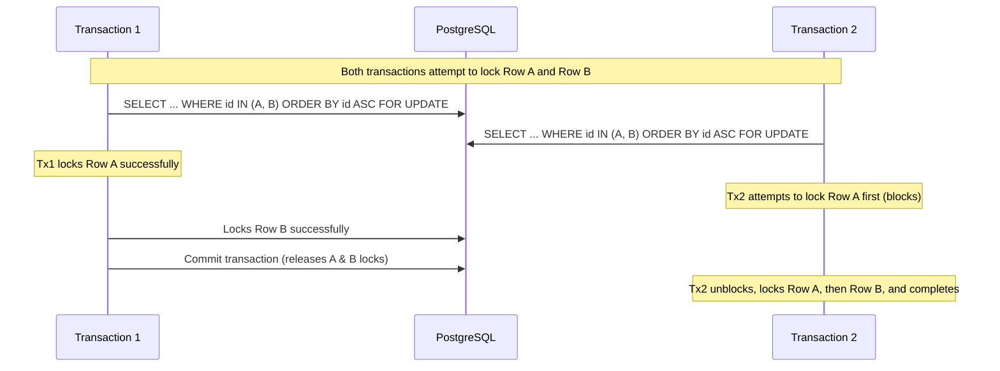
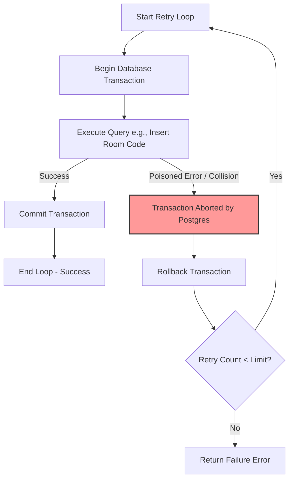

# Concurrency Controls - Senior Level Interview Prep

This guide covers advanced database concurrency, deterministic batch row-locking, PostgreSQL transaction poisoning mechanics, and clean application-level retry boundary design.

---

## Q&A Sets

### Q1: Why is sorting rows deterministically (e.g., `ORDER BY id ASC`) mandatory before acquiring batch locks (e.g., `FOR UPDATE`), and what failure modes occur if this is neglected?

#### Interviewer Intent
Assess deep knowledge of relational database locking mechanisms, B-Tree index traversal paths, and the ability to diagnose and prevent cyclic deadlocks in batch processing systems.

#### Strong Answer
When a transaction locks a single row using `SELECT ... FOR UPDATE`, it locks only that specific record. However, when a transaction attempts to lock **multiple rows** concurrently (such as in batch updates, cleanups, or retrieving all players in a match), PostgreSQL locks those rows sequentially as it scans them.

If two concurrent transactions attempt to lock the same set of multiple rows without a deterministic sorting order, they are highly prone to cyclic deadlocks:
* **Transaction 1** executes a query that retrieves and locks Row B first, then Row A (due to database physical layout, index ordering, or random query optimizer decisions).
* **Transaction 2** executes a concurrent query that retrieves and locks Row A first, then Row B.
* If they execute in parallel, Transaction 1 locks Row B and waits for Row A. Transaction 2 locks Row A and waits for Row B. A cyclic deadlock occurs immediately.

To prevent this, we must enforce **Deterministic Row Locking**:
* Before executing `FOR UPDATE`, we sort the target rows using a guaranteed unique key, such as `ORDER BY id ASC` or `ORDER BY user_id ASC`.
* This guarantees that both Transaction 1 and Transaction 2 will attempt to acquire locks in the exact same sequence: Row A first, then Row B.
* The transaction that gets the lock on Row A first will block the other transaction completely before it can lock Row B, preventing the circular wait condition.

#### Common Mistakes
* Assuming that `WHERE id IN (A, B)` automatically locks rows in the order they are listed in the `IN` clause (the database engine ignores the `IN` list order and locks rows based on the access path or physical storage layout).
* Ordering rows by non-unique columns (like `status` or `created_at`), which can result in non-deterministic sorting order when values are identical.
* Forgetting to apply sorting in batch delete operations (which also acquire exclusive locks on matching rows).

#### Follow-up Questions
* How does the database query optimizer choose between a table scan and an index scan when executing a locked query?
* What is the performance cost of adding `ORDER BY` to a query that will be locked? (If the sort column is indexed, the cost is negligible; if not, it requires an in-memory sort which holds locks longer).
* What is the difference between `FOR UPDATE`, `FOR SHARE`, and `FOR NO KEY UPDATE` in PostgreSQL?

#### How DSAblitz demonstrates this concept
DSAblitz enforces deterministic row locking in batch operations. In `backend/internal/battle/repository.go`, the method `GetBattlePlayersTx` retrieves all players in a match under a lock, enforcing `ORDER BY user_id ASC` before `FOR UPDATE`. Similarly, in `backend/internal/rooms/service.go`, the room expiration job (`ExpireRooms`) locks expired rooms ordered deterministically by `id ASC` before executing status transitions.

#### Relevant code references
* [repository.go:L291-L298](file:///home/tanishq/dsablitz/backend/internal/battle/repository.go#L291-L298) - `GetBattlePlayersTx` utilizing deterministic `ORDER BY user_id ASC FOR UPDATE`.
* [service.go:L430-L435](file:///home/tanishq/dsablitz/backend/internal/rooms/service.go#L430-L435) - `ExpireRooms` locking expired rooms using `ORDER BY id ASC FOR UPDATE`.

#### Related documentation
* [database/transactions.md](file:///home/tanishq/dsablitz/docs/database/transactions.md)
* [PROJECT_CONTEXT.md](file:///home/tanishq/dsablitz/docs/PROJECT_CONTEXT.md)

---

### Q2: Explain PostgreSQL's transaction abort behavior. How does it dictate application retry boundaries, and why must retry loops execute outside the transaction block?

#### Interviewer Intent
Assess deep understanding of PostgreSQL query states, transactional integrity, connection reuse, and clean application architecture regarding error recovery boundaries.

#### Strong Answer
In PostgreSQL, if any query inside a transaction block encounters an error (such as a unique constraint violation, foreign key failure, or syntax error), PostgreSQL permanently poisons (aborts) that entire transaction. 

From that point onward, the transaction refuses to execute any further commands, returning the error:
`ERROR: current transaction is aborted, commands ignored until end of transaction block`

The only valid operations remaining for that transaction are `ROLLBACK` or closing the connection. 

This behavior dictates where **application-level retry loops** (such as generating a unique room code or handling optimistic conflicts) must be placed:
* If the retry loop is placed **inside** the transaction block (e.g., trying to catch the unique violation error and executing another `INSERT` query on the same transaction handle), the subsequent inserts will fail immediately with the "transaction is aborted" error.
* Therefore, the retry boundary must be positioned **outside** the transaction block. 
* Each retry attempt must start a clean, brand new database transaction. If an attempt fails, the transaction is rolled back completely, releasing connection state and locks, and the loop advances to start a fresh transaction for the next attempt.

#### Common Mistakes
* Placing retry loops inside a transaction block, leading to infinite loop cycles or cascading "command ignored" errors.
* Reusing the same connection object for retries without calling `Rollback` first, which leaks connection resources and leaves the connection in a poisoned state.
* Assuming that SQL databases like MySQL behave the same way (MySQL allows transactions to continue after certain non-fatal errors; PostgreSQL is strictly fail-fast).

#### Follow-up Questions
* How does PostgreSQL's transaction poisoning affect savepoint management? (Savepoints allow rolling back to a specific checkpoint without poisoning the parent transaction, but they introduce extra lock overhead).
* What is the performance impact of executing multiple transactions in a loop compared to a single batch transaction? (It increases network round-trips and transaction commit overhead, but is necessary for retry recovery).
* How does Go's `pgx` driver handle poisoned transactions when connection pools are reused? (When `Rollback` is called, the driver cleans the connection state before returning it to the pool).

#### How DSAblitz demonstrates this concept
DSAblitz enforces retry boundaries outside transaction blocks. In `CreateRoom` inside `backend/internal/rooms/service.go`, the application attempts to generate a unique room code. To handle code collisions, the `for` loop is declared **outside** the `WithTransaction` block. If a code collision occurs, the transaction is rolled back, and the next loop iteration starts a fresh transaction.

#### Relevant code references
* [service.go:L56-L105](file:///home/tanishq/dsablitz/backend/internal/rooms/service.go#L56-L105) - `CreateRoom` retry loop declared outside the `WithTransaction` block to handle code collision retries.

#### Related documentation
* [deep-dives/transaction_boundaries.md](file:///home/tanishq/dsablitz/docs/deep-dives/transaction_boundaries.md)
* [deep-dives/room_transactions.md](file:///home/tanishq/dsablitz/docs/deep-dives/room_transactions.md)

---

## Key Takeaways
* **Deterministic Sorting**: Always order rows (e.g., `ORDER BY unique_key ASC`) before locking multiple records to prevent cyclic deadlocks.
* **PostgreSQL Fail-Fast**: Any error poisons the transaction, requiring a full rollback before any new queries can be executed on that connection.
* **Retry Boundaries**: Place retry loops (such as code generators or optimistic retries) outside the transaction block so each attempt gets a clean connection state.

## Interview Questions
1. Why does a non-deterministic locking order on multiple rows lead to cyclic deadlocks under concurrency?
2. What happens to subsequent queries in a PostgreSQL transaction if a unique key constraint violation occurs?
3. How do you design retry logic for database operations to ensure that poisoned transaction states do not block subsequent attempts?

## Common Mistakes
* Relying on `WHERE id IN (...)` without an explicit `ORDER BY` to lock rows deterministically.
* Attempting to recover from insert collisions by running query statements on an aborted transaction.
* Locking too many rows at once, causing massive queueing bottlenecks and query timeouts in high-traffic APIs.

## Related Documents
* [database/transactions.md](file:///home/tanishq/dsablitz/docs/database/transactions.md)
* [deep-dives/transaction_boundaries.md](file:///home/tanishq/dsablitz/docs/deep-dives/transaction_boundaries.md)
* [flows/room_creation_flow.md](file:///home/tanishq/dsablitz/docs/flows/room_creation_flow.md)

## Lessons Learned
* Scalable relational database transactions must be kept small and fast. Acquire locks in a strict, sorted sequence.
* Design error-handling boundaries to respect database engine constraints: separate logical operations from physical transaction lifecycles.
