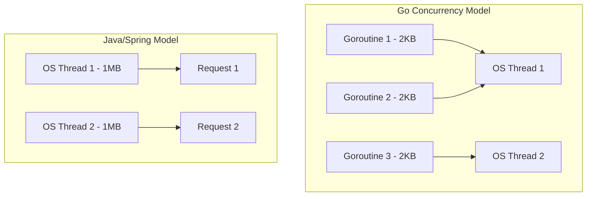

# DSAblitz Interview Prep: Cross-Framework Comparisons (Graduate Level)

This document provides comparisons between different technology stacks and design decisions for junior/graduate level engineers, focusing on the core choices in **DSAblitz**.

---

## Q&A 1: Go vs. Spring Boot / FastAPI for Real-Time Gameplay Engines

### Interviewer Intent
The interviewer wants to understand if you comprehend the basic concurrency model of Go (Goroutines) compared to Java (Spring Boot thread-per-request) or Python (FastAPI async event loop), and why Go is suited for high-concurrency real-time systems like multiplayer game lobbies.

### Strong Answer
For a real-time multiplayer application like DSAblitz, performance, latency, memory consumption, and concurrency model are primary concerns. 



Here is a comparison of Go vs. Spring Boot (Java) and FastAPI (Python):

| Metric / Feature | Go (Gin / WebSockets) | Spring Boot (Java) | FastAPI (Python) |
| :--- | :--- | :--- | :--- |
| **Concurrency Model** | Goroutines (M:N multiplexed scheduler) | Thread-per-request (mapped to OS threads) | Asyncio event loop (single-threaded cooperatively scheduled) |
| **Memory Footprint** | Extremely low (Goroutines start at 2KB) | High (OS threads default to 1MB stack size) | Moderate (Event loop overhead, interpreter footprint) |
| **Startup Time** | Sub-second (compiles to a single static binary) | Slow (JVM class loading, dependency injection overhead) | Fast (interpreted, but slower than Go binary) |
| **CPU Blocking** | Safe (Scheduler multiplexes blocking calls) | Expensive (OS thread blocks, context switch overhead) | Critical (blocking CPU code freezes the entire event loop) |

Go is chosen for DSAblitz because:
1. **Low Overhead**: WebSockets require long-lived connections. Multiplexing tens of thousands of active WebSocket connections in Go requires minimal memory (2KB per goroutine) compared to Spring Boot where thread allocation would exhaust memory quickly.
2. **Simplified Concurrency**: Go's CSP (Communicating Sequential Processes) channels and simple mutex primitives allow writing concurrent code without complex reactive streams (Spring WebFlux) or asynchronous await boilerplate (FastAPI).

### Common Mistakes
- **Assuming Async Python is faster**: Believing that Python's `async/await` is faster than Go. FastAPI's event loop runs on a single thread. If a request does CPU-heavy tasks (like evaluating answer correctness or generating random seeds), it blocks the event loop for all other requests. Go utilizes all available CPU cores natively.
- **Ignoring Memory Footprint**: Forgetting that long-lived WebSocket connections map to concurrent active users. A 10,000 player lobby would consume at least 10GB of RAM in a standard thread-per-request Spring Boot app for thread stacks alone, whereas Go consumes less than 50MB.

### Follow-up Questions
1. *How does Go's garbage collector (GC) affect real-time gameplay latency compared to Java's GC tuning?*
2. *What happens if a Goroutine blocks on a system call or file I/O? Does it block the other Goroutines?*

### How DSAblitz demonstrates this concept
DSAblitz uses Go and Gin to run the HTTP routing and handle concurrent submission requests. The runtime relies on Gin's concurrent request handling.
- **Go Routing & Initialization**: Configured in [routes.go:L37-L74](file:///home/tanishq/dsablitz/backend/internal/server/routes.go#L37-L74)
- **Gin Server Scaffolding**: Structured in [server.go:L1-L50](file:///home/tanishq/dsablitz/backend/internal/server/server.go)

### Related Documentation
- [Overall Architecture](file:///home/tanishq/dsablitz/docs/architecture/overall_architecture.md)
- [Request Lifecycle](file:///home/tanishq/dsablitz/docs/architecture/request_lifecycle.md)

---

## Q&A 2: PostgreSQL vs. MongoDB for Competitive Battle State

### Interviewer Intent
The interviewer wants to test your understanding of transactional boundaries (ACID), schema design constraints, and relational consistency compared to document storage, specifically in the context of multiplayer matchmaking and scoring.

### Strong Answer
In a competitive multiplayer platform like DSAblitz, maintaining consistent room states (e.g. ready, in-battle, expired) and score validation is critical. We compared PostgreSQL (Relational) with MongoDB (Document) for our core engine:

- **ACID Transactions**: DSAblitz requires atomic state mutations. For instance, when a room transitions to `in_battle`, we must insert a `battles` record, update the status of the `rooms` record, and verify `room_players` count. If any operation fails, the entire transition must roll back. Postgres guarantees this natively via standard ACID transactions. MongoDB has added multi-document transactions, but they incur massive latency penalties and lack the row locking constructs of SQL.
- **Schema Validation & Integrity**: Relational constraints (foreign keys, cascading updates, unique indices) prevent invalid states (e.g., players joining rooms that don't exist). In MongoDB, this referential integrity must be manually maintained in application code, which is prone to race conditions and bugs.
- **Row-Level Pessimistic Locking**: Postgres supports `SELECT ... FOR UPDATE` which blocks concurrent threads from reading or writing the exact same row. This is the cornerstone of our anti-race condition submit logic.

```
Relational (Postgres):
[Room Table] --(Foreign Key)--> [Room Players Table] (Enforced at DB level)

Document-based (MongoDB):
[Room Document { Players: [...] }] (Requires full document rewrites, risk of overwrite races)
```

Therefore, PostgreSQL was chosen for the core transactional data (rooms, battles, and submissions) because consistency and transaction reliability are paramount.

### Common Mistakes
- **Choosing MongoDB "because it's faster"**: Assuming MongoDB's default write performance translates to better real-time gameplay. Real-time gameplay requires *consistent* writes. Out-of-order writes in MongoDB can cause a user's score to double-increment or bypass room capacity constraints.
- **Document Overwrite Races**: Assuming document nesting solves relationships. If two players join a MongoDB room document concurrently, and the server fetches, appends, and saves the document, one write could overwrite the other unless using atomic operators (`$push`), which limits schema complexity.

### Follow-up Questions
1. *How would you structure a schema in Postgres for a 1v1 matchmaking lobby versus a document in MongoDB?*
2. *When does a document database make sense in a gaming platform? (e.g., player profile stats or game history log archives)*

### How DSAblitz demonstrates this concept
DSAblitz uses PostgreSQL transactional boundaries to enforce consistency between rooms, players, and battles.
- **Atomic Room-Battle Initialization**: The room status transition and battle generation run within an atomic transaction in `StartBattle` in [service.go:L338-L424](file:///home/tanishq/dsablitz/backend/internal/rooms/service.go#L338-L424).
- **Relational Schemas**: Configured in database migration files, ensuring foreign key constraints between tables.

### Related Documentation
- [Transaction Boundaries](file:///home/tanishq/dsablitz/docs/deep-dives/transaction_boundaries.md)
- [Room State Machine](file:///home/tanishq/dsablitz/docs/deep-dives/room_state_machine.md)

---

## Q&A 3: pgx vs. database/sql for Postgres Operations

### Interviewer Intent
The interviewer wants to see if you understand the differences between using Go's standard library database wrapper (`database/sql`) versus a database-specific driver (`pgx`), and the performance implications.

### Strong Answer
While Go's `database/sql` is a database-agnostic interface, **DSAblitz uses `pgx`** (`github.com/jackc/pgx/v5`) as its primary PostgreSQL client. The tradeoffs are:

1. **Native PostgreSQL Protocols**: `database/sql` forces a common denominator API. `pgx` supports PostgreSQL-specific features natively, such as the binary transmission protocol (saving CPU overhead of parsing strings for dates, JSON, and UUIDs) and array types (`pgx` handles slice mapping like `tags && $1` seamlessly).
2. **Connection Pool Configuration**: `pgxpool` provides advanced connection pooling parameters (max lifetime, idle connections, health checks) directly tailored to Postgres, unlike the generic parameters in `database/sql`.
3. **Optimized Batching & Copy**: `pgx` offers batch operations (`pgx.Batch`) and the Postgres Copy protocol for bulk inserting records. This is critical when inserting 200 sequence rows at the start of a battle.
4. **Context Propagation**: `pgx` natively honors `context.Context` cancellation at the socket connection level, terminating running Postgres queries immediately if a HTTP connection terminates or times out.

### Common Mistakes
- **Assuming `database/sql` is always best because it is standard**: Using standard `database/sql` with a Postgres driver under the hood forces extra type conversion wrappers, increasing allocations.
- **Misunderstanding context cancellations**: Believing `database/sql` terminates running SQL commands on cancellation; in some drivers, it only returns the context error to the application while the Postgres process continues running on the DB server.

### Follow-up Questions
1. *What is pgxpool, and how does it prevent connection starvation during peak gameplay periods?*
2. *Why is `pgx.Tx` passed across service methods in DSAblitz?*

### How DSAblitz demonstrates this concept
DSAblitz configures and uses `pgxpool` to manage connection handles.
- **Connection manager**: `pgxpool.Pool` is initialized and checked in [database.go:L11-L52](file:///home/tanishq/dsablitz/backend/internal/platform/database/database.go#L11-L52).
- **Postgres Arrays**: Slices are queried using native postgres array intersections in [repository.go:L35-L72](file:///home/tanishq/dsablitz/backend/internal/questions/repository.go#L35-L72).

### Related Documentation
- [Database Transactions](file:///home/tanishq/dsablitz/docs/database/transactions.md)

---

## Key Takeaways
- **Go's Concurrency**: Goroutines are multiplexed onto OS threads. Their small initial memory footprint (2KB) makes them ideal for handling thousands of concurrent HTTP and WebSocket connections.
- **PostgreSQL Consistency**: Relational databases are mandatory for transaction-heavy competitive gaming states where race conditions can corrupt game rules.
- **Native Driver Benefits**: Utilizing database-specific drivers like `pgx` rather than abstract standard wrappers (`database/sql`) yields performance optimizations like native binary protocol parsing and robust connection pooling.

## Interview Questions
1. *Explain how goroutines differ from OS threads in memory and scheduling.*
2. *Why does a 1v1 battle platform require transactional ACID guarantees during match startup?*
3. *What are the benefits of using a native driver like `pgx` over a generic SQL wrapper in Go?*

## Common Mistakes
1. **No-op transactional bounds**: Running database updates outside of transactions, leading to orphaned entries.
2. **Context leak**: Initializing database queries without passing the HTTP request context.
3. **Over-abstracting**: Over-normalizing tables that are rarely joined or denormalizing tables that require absolute referential integrity.

## Related Documents
- [PROJECT_CONTEXT.md](file:///home/tanishq/dsablitz/docs/PROJECT_CONTEXT.md)
- [Modular Monolith Design](file:///home/tanishq/dsablitz/docs/adr/0001_modular_monolith_design.md)

## Lessons Learned
- Decoupling database driver configurations from domain repositories increases testability.
- Maintaining transaction boundaries inside service coordinates keeps database code isolated and clean.
