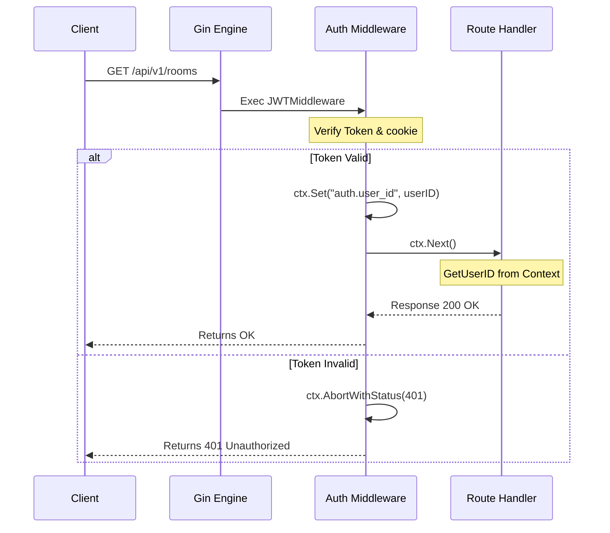

# Gin Web Framework - Graduate Level

This document provides graduate-level interview preparation material on the Gin web framework, covering middleware execution flow, context values, routing groups, and path parameters.

---

## Q&A Sets

### Q1: How does Gin's middleware execution chain work, and how do we propagate request-scoped values using `gin.Context`?

#### Interviewer Intent
The interviewer is looking to check:
- Basic understanding of HTTP middleware concepts.
- Understanding of the middleware chain execution order (`ctx.Next()` vs `ctx.Abort()`).
- Ability to share values (like authenticated user IDs) between middleware and handler functions.

#### Strong Answer
Gin uses a chain-of-responsibility pattern to execute middleware. When a request matches a route, Gin runs all registered middleware handlers and the main handler in a sequential slice:

1. **Middleware Chain**: Handlers are executed in order.
2. **`ctx.Next()`**: Suspends the current middleware's execution, runs the next middleware/handler in the chain, and then resumes execution of the current middleware after the down-stream handlers return.
3. **`ctx.Abort()`**: Stops downstream handlers from executing. This is crucial for authentication middleware; if validation fails, calling `ctx.AbortWithStatusJSON()` prevents unauthorized access to the main route handler.
4. **Value Propagation**: To pass request-scoped variables (e.g., authenticated user details) through the chain, we use `ctx.Set(key, value)`. Downstream middleware or route handlers retrieve this value using `ctx.Get(key)`.

#### Common Mistakes
- **Forgetting `ctx.Abort()` on Auth Failure**: Simply writing an HTTP error status (like `ctx.JSON(401, ...)`) does NOT stop downstream handlers from running. If you do not call `ctx.Abort()`, the main handler will execute anyway, leading to severe security bugs.
- **Relying on Global Variables**: Storing request-scoped state (like the current user) in global variables causes race conditions and data leaks across concurrent requests. Always store request state in the thread-safe `gin.Context`.
- **Calling `ctx.Next()` at the end of a middleware**: Calling `ctx.Next()` at the very end of a middleware function is redundant because Gin automatically advances the handler index when a function returns.

#### Follow-up Questions
- What happens if you call `ctx.Next()` multiple times in a single middleware? (It executes downstream handlers multiple times, causing corrupted responses).
- What is the difference between `ctx.Abort()` and `return`? (`ctx.Abort()` prevents execution of subsequent handlers in the slice, whereas `return` only exits the current middleware function).

#### How DSAblitz demonstrates this concept
In DSAblitz, the JWT verification middleware validates the user's access cookie, extracts the user ID, and sets it on the Gin context using the key `auth.user_id`. Downstream handlers retrieve the user ID using helper functions.

#### Relevant code references
- `[middleware.go:L11-L28](file:///home/tanishq/dsablitz/backend/internal/auth/middleware.go#L11-L28)`: `JWTMiddleware` validating the JWT cookie, calling `ctx.Set`, and forwarding execution via `ctx.Next()`.
- `[middleware.go:L30-L38](file:///home/tanishq/dsablitz/backend/internal/auth/middleware.go#L30-L38)`: `UserIDFromContext` helper pulling the `auth.user_id` context parameter.
- `[routes.go:L171-L181](file:///home/tanishq/dsablitz/backend/internal/rooms/routes.go#L171-L181)`: Handlers fetching the user ID from the Gin context using the helper method.

#### Related documentation
- [Overall Architecture](file:///home/tanishq/dsablitz/docs/architecture/overall_architecture.md)
- [Project Context](file:///home/tanishq/dsablitz/docs/PROJECT_CONTEXT.md)

---

### Q2: How does Gin handle REST route groupings and dynamic path parameters?

#### Interviewer Intent
The interviewer wants to confirm that you:
- Know how to organize API routes cleanly using endpoint grouping.
- Understand how to map HTTP methods (GET, POST, DELETE, etc.).
- Know how to define and extract path parameters (like `/rooms/:code`).

#### Strong Answer
Gin provides route grouping to keep APIs modular and organized. Grouping allows you to share prefix paths (like `/api/v1`) and middleware (like authorization) across a subset of endpoints.
- **Route Grouping**: Created using `router.Group("/path")`. You can register specific HTTP method handlers under this group.
- **Dynamic Path Parameters**: Dynamic segments in a URL are defined using a colon prefix, such as `:code`. Gin compiles these paths into a tree structure. To retrieve the variable in a handler, use `ctx.Param("variable_name")`.

For example, a route registered as `POST /api/v1/rooms/:code/join` will match request URLs like `/api/v1/rooms/ABCD12/join`. Calling `ctx.Param("code")` will return `"ABCD12"`.

#### Common Mistakes
- **Incorrect parameter name in `ctx.Param`**: Misspelling the key (e.g. calling `ctx.Param("room_code")` when the route is defined as `/:code`) returns an empty string without throwing an error.
- **Overlapping routes**: Registering routes that conflict with wildcard routes (e.g., `GET /rooms/:code` and `GET /rooms/active`) can lead to unexpected routing decisions depending on registration order.
- **Confusing Query parameters with Path parameters**: Using `ctx.Query()` to extract variables defined as path parameters (`:code`) will return empty values. Use `ctx.Param()` for path parameters and `ctx.Query()` or `ctx.DefaultQuery()` for URL query strings (like `/rooms?status=waiting`).

#### Follow-up Questions
1. How do you define a wildcard path parameter that matches everything downstream? (Use an asterisk, e.g., `/files/*filepath`).
2. Can a Gin route group have its own separate middleware? (Yes, by calling `group.Use(middleware)`).

#### How DSAblitz demonstrates this concept
DSAblitz structures all REST routes under the `/api/v1` API group. The rooms module registers multiple endpoints under the `/rooms` group, using the dynamic path parameter `:code` to identify targeted game rooms.

#### Relevant code references
- `[routes.go:L40-L71](file:///home/tanishq/dsablitz/backend/internal/server/routes.go#L40-L71)`: Mapping API versions and creating groups like `api.Group("/rooms")`.
- `[routes.go:L21-L33](file:///home/tanishq/dsablitz/backend/internal/rooms/routes.go#L21-L33)`: Registering nested protected endpoints under the rooms route group (e.g., `protected.POST("/:code/join", handler.JoinRoom)`).
- `[routes.go:L61-L66](file:///home/tanishq/dsablitz/backend/internal/rooms/routes.go#L61-L66)`: The `JoinRoom` handler retrieving the path parameter `code` via `ctx.Param("code")`.

#### Related documentation
- [Overall Architecture](file:///home/tanishq/dsablitz/docs/architecture/overall_architecture.md)
- [Project Context](file:///home/tanishq/dsablitz/docs/PROJECT_CONTEXT.md)

---

## Key Takeaways
- Gin execution flow uses a handler chain. Use `ctx.Next()` to run downstream code, and `ctx.Abort()` to stop execution.
- Propagate values (like user ID) using `ctx.Set` and `ctx.Get`. Never use global state.
- Route groups organize endpoints. Dynamic path segments (`:param`) are extracted via `ctx.Param("param")`.

## Interview Questions
1. How would you write a simple Gin logging middleware that prints the response time of a request?
2. What happens if a middleware fails to call `ctx.Abort()` when authentication fails?

## Common Mistakes
- Mismatching the path parameter name in the routing registration and the handler call.
- Confusing path parameters (`ctx.Param`) with query parameters (`ctx.Query`).

## Related Documents
- [PROJECT_CONTEXT.md](file:///home/tanishq/dsablitz/docs/PROJECT_CONTEXT.md)
- [Overall Architecture](file:///home/tanishq/dsablitz/docs/architecture/overall_architecture.md)

## Lessons Learned
- Structuring routes within individual modules keeps the entry-point server clean and preserves boundary encapsulation.
