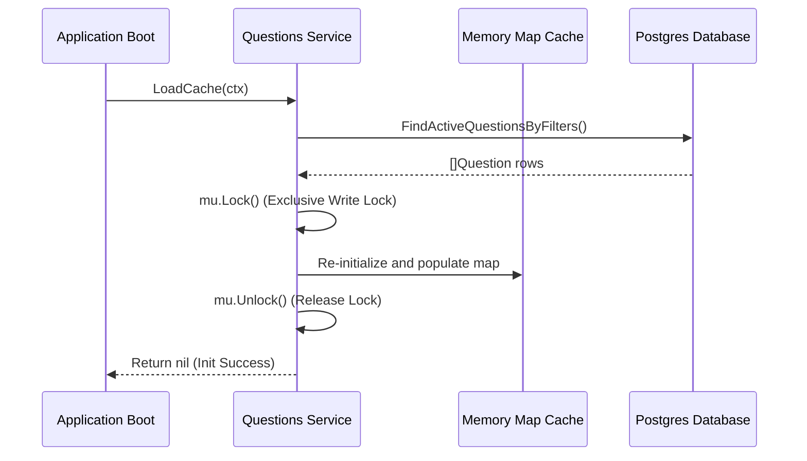

# Go Concurrency & RWMutex Cache - Graduate Level

This document provides interview preparation material on Go concurrency, standard synchronization primitives (`sync.Mutex` and `sync.RWMutex`), and safe caching patterns.

---

## Q&A Sets

### Q1: Why are maps in Go not thread-safe by default, and how do we protect them under concurrent conditions?

#### Interviewer Intent
The interviewer wants to verify if you understand:
- The concurrent execution model of Go goroutines.
- The behavior of maps in Go when accessed concurrently (specifically read-write or write-write collisions).
- How to apply standard library primitives (`sync.Mutex` and `sync.RWMutex`) to prevent data races and runtime panics.

#### Strong Answer
Go maps do not support concurrent operations natively. If one goroutine writes to a map while another goroutine is reading or writing to it, the Go runtime detects this unsafe concurrent access and throws a fatal runtime panic (`fatal error: concurrent map read and map write` or `fatal error: concurrent map writes`). The runtime crashes immediately because maps are designed for speed rather than synchronization safety, and a concurrent read/write can corrupt the internal bucket memory layout of the hash map.

To protect a map, we wrap it with a synchronization primitive:
1. **`sync.Mutex`**: Extends mutual exclusion. Only one goroutine can read or write to the map at any given time.
2. **`sync.RWMutex`**: Extends a reader-writer lock. It allows multiple readers to read the map concurrently, but restricts write access to a single goroutine, blocking all readers during writes.

For read-heavy workloads (like catalog data that is rarely updated), `sync.RWMutex` is significantly more efficient than `sync.Mutex` because readers do not block other readers.

#### Common Mistakes
- **Assuming maps can be safely read concurrently while writing**: Many candidates think that only write-write collisions cause problems. In Go, a concurrent read and write *will* trigger a fatal runtime panic.
- **Forgetting to unlock**: Not unlocking the mutex (especially when returning early due to an error) results in a permanent deadlock. Using `defer mu.Unlock()` or `defer mu.RUnlock()` immediately after acquiring the lock is the safest pattern.
- **Copying Mutexes**: Mutexes contain internal state and must not be copied. Wrapping a mutex in a struct and passing that struct by value copies the mutex, which breaks the synchronization. Structs holding mutexes must always be passed by pointer.

#### Follow-up Questions
1. What is the difference between `Lock()` and `RLock()` in Go?
2. What happens if a goroutine calls `Unlock()` on a mutex that is not locked? (It panics with `sync: unlock of unlocked mutex`).
3. Does the Go race detector find concurrent map accesses? (Yes, it detects them by looking at memory access operations).

#### How DSAblitz demonstrates this concept
In DSAblitz, the stateless questions catalog reads are offloaded from PostgreSQL to a thread-safe in-memory cache managed by `sync.RWMutex` within the questions module. The service protects the map of questions from concurrent access.

#### Relevant code references
- `[service.go:L18-L22](file:///home/tanishq/dsablitz/backend/internal/questions/service.go#L18-L22)`: Definition of the `Service` struct housing `mu sync.RWMutex` and `cache map[uuid.UUID]Question`.
- `[service.go:L48-L57](file:///home/tanishq/dsablitz/backend/internal/questions/service.go#L48-L57)`: `GetQuestionByID` acquiring read lock (`s.mu.RLock()`) and releasing it (`s.mu.RUnlock()`).

#### Related documentation
- [Project Context](file:///home/tanishq/dsablitz/docs/PROJECT_CONTEXT.md)
- [Cache Design](file:///home/tanishq/dsablitz/docs/deep-dives/cache_design.md)

---

### Q2: How does the in-memory cache initialization work at application startup, and how does it utilize a write-lock?

#### Interviewer Intent
The interviewer is checking if you understand:
- How to write safe initialization patterns for read-only caches loaded from a database.
- How to apply the write-lock (`Lock()`) of a `sync.RWMutex` during cache population or reloading.
- How application bootstrap processes manage state before accepting client requests.

#### Strong Answer
In a read-heavy system, the database is queried at boot time to populate a memory cache. This prevents query overhead during active gameplay. Populating the cache requires acquiring a write-lock (`Lock()`) to guarantee that no concurrent reads can access a partially initialized map.

The initialization workflow:
1. Query active questions from the database.
2. Acquire the exclusive write-lock using `mu.Lock()`.
3. Re-initialize the internal map cache to clear stale data.
4. Populate the map with active questions.
5. Release the write-lock using `defer mu.Unlock()`.

This pattern ensures that any client requesting a question during a bootstrap/refresh sequence is blocked until the cache is fully and atomically loaded.

#### Common Mistakes
- **Not lock-protecting the cache during initial load**: Some assume that since the server is starting up, no locks are needed. However, if cache reload is triggered at runtime or if health-check queries run concurrently during startup, a race condition will occur.
- **Double locking**: Calling `s.mu.Lock()` twice in the same goroutine without releasing it first causes a deadlock.
- **Re-slicing maps concurrently**: Re-allocating the map pointer (`s.cache = make(...)`) without a write-lock leads to undefined memory read panics for concurrent readers.

#### Follow-up Questions
1. How do you trigger cache reloads at runtime without restarting the application?
2. If `LoadCache` fails, should the application fail to start or fall back to DB queries? (In DSAblitz, it fails to start to guarantee strict latency limits).

#### How DSAblitz demonstrates this concept
The questions service loads active questions into memory at startup. The caching logic is self-contained and avoids database queries for question lookups.

#### Relevant code references
- `[service.go:L31-L46](file:///home/tanishq/dsablitz/backend/internal/questions/service.go#L31-L46)`: The `LoadCache` function querying active questions and utilizing `s.mu.Lock()` to write to the cache safely.
- `[routes.go:L47-L51](file:///home/tanishq/dsablitz/backend/internal/server/routes.go#L47-L51)`: The server bootstrap where `LoadCache` is called before registering routes.

#### Related documentation
- [Database Indexing](file:///home/tanishq/dsablitz/docs/database/indexing.md)
- [Cache Design](file:///home/tanishq/dsablitz/docs/deep-dives/cache_design.md)

---

## Key Takeaways
- Go maps are **not thread-safe**. Concurrent reads and writes result in unrecoverable crashes.
- Use `sync.RWMutex` for read-heavy cache systems because it permits multiple concurrent readers while enforcing exclusive writes.
- Always use `defer` to release locks, preventing deadlocks during early returns.

## Interview Questions
1. Why does Go panic on concurrent map access rather than just allowing dirty reads?
2. Explain the difference between `sync.Mutex` and `sync.RWMutex` in terms of performance under high-concurrency read operations.

## Common Mistakes
- Assuming read operations on Go maps do not need synchronization when writes are occurring.
- Copying Structs containing locks, which invalidates the lock's internal state.

## Related Documents
- [PROJECT_CONTEXT.md](file:///home/tanishq/dsablitz/docs/PROJECT_CONTEXT.md)
- [Cache Design Deep Dive](file:///home/tanishq/dsablitz/docs/deep-dives/cache_design.md)

## Lessons Learned
- Implementing deterministic caching layers at application startup isolates database concerns from performance-critical gameplay APIs.
