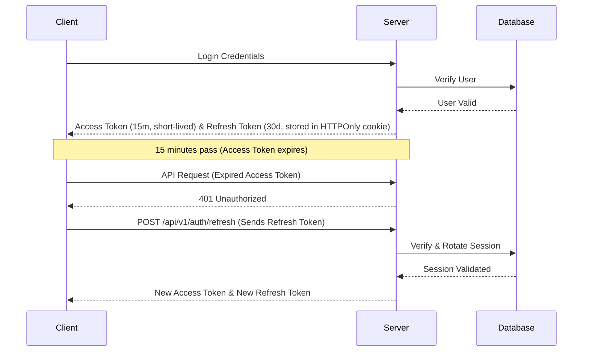

# JWT Security - Graduate Level Interview Prep

This guide covers the fundamental concepts of token-based authentication, token isolation, and client-side cookie security configuration within the context of the DSAblitz platform.

---

## Q&A Sets

### Q1: Explain the difference between Access Tokens and Refresh Tokens. Why does our application use both instead of a single long-lived token?

#### Interviewer Intent
Assess the candidate's understanding of basic authentication mechanics, security-versus-convenience trade-offs, and token expiration strategies.

#### Strong Answer
An access token is a short-lived token (in our case, 15 minutes) used to authenticate requests to protected API endpoints. A refresh token is a long-lived token (in our case, 30 days) used solely to obtain a new access token when the current one expires. 

Using a single long-lived token is a major security vulnerability: if that token is intercepted or leaked (e.g., via network sniffing, client-side vulnerabilities, or log leakage), an attacker gains access to the user's account for the entire duration of the token's lifetime. By splitting this responsibility:
1. **Access Tokens** are kept short-lived. Even if an access token is compromised, the attacker's window of opportunity is limited to a maximum of 15 minutes.
2. **Refresh Tokens** are kept secure and are sent only to specific authentication endpoints. They are used to fetch a new access token seamlessly behind the scenes, providing a smooth user experience without forcing users to re-enter credentials repeatedly.

#### Common Mistakes
* Suggesting that access tokens should be stored in `localStorage` while refresh tokens are stored in cookies, exposing access tokens to XSS.
* Recommending long expiration periods (e.g., 24 hours) for access tokens to reduce database lookup overhead for sessions.
* Believing that access tokens must be stored in the database to verify them (which defeats the purpose of stateless JWT verification).

#### Follow-up Questions
* How does the server verify a JWT's validity without querying the database for every request?
* If access tokens are stateless, how do we immediately revoke access if a user's account is suspended?
* What are the trade-offs of storing tokens in cookies versus HTTP custom headers?

#### How DSAblitz demonstrates this concept
DSAblitz uses a split-token architecture configured in `backend/internal/auth/token.go`. Access tokens are short-lived JWTs (15 minutes), and refresh tokens are securely generated, cryptographically strong random strings (30 days) tracked in the database to allow revocation.

#### Relevant code references
* [token.go:L16-L21](file:///home/tanishq/dsablitz/backend/internal/auth/token.go#L16-L21) - Token TTL constants.
* [token.go:L56-L86](file:///home/tanishq/dsablitz/backend/internal/auth/token.go#L56-L86) - Generation of access tokens using HS256.
* [token.go:L136-L143](file:///home/tanishq/dsablitz/backend/internal/auth/token.go#L136-L143) - Secure generation of refresh tokens using `crypto/rand`.

#### Related documentation
* [PROJECT_CONTEXT.md](file:///home/tanishq/dsablitz/docs/PROJECT_CONTEXT.md)
* [api/auth.md](file:///home/tanishq/dsablitz/docs/api/auth.md)

---

### Q2: How do you secure authentication tokens stored in client-side cookies against Cross-Site Scripting (XSS) and Cross-Site Request Forgery (CSRF)?

#### Interviewer Intent
Verify the candidate's understanding of browser security mechanisms, cookie flags, and mitigation of common web vulnerabilities.

#### Strong Answer
To secure tokens stored in cookies, we use a combination of standard browser security attributes:
1. **`HttpOnly`**: When set to `true`, this flag prevents client-side JavaScript (like `document.cookie`) from accessing the cookie. This is a critical defense against XSS; even if an attacker injects malicious JS into the application, they cannot steal the tokens programmatically.
2. **`Secure`**: This flag ensures the cookie is only transmitted over encrypted channels (HTTPS). It prevents the cookie from being sent in plaintext over unencrypted connections, protecting against packet sniffing.
3. **`SameSite` (Lax or Strict)**: This attribute controls whether cookies are sent with cross-site requests. Setting `SameSite=Lax` ensures the cookie is sent on safe top-level navigations (e.g., following a link) but withheld on cross-site subrequests (e.g., images or POST requests initiated by external sites). This mitigates CSRF attacks by ensuring external malicious sites cannot perform authenticated actions on behalf of the user.

#### Common Mistakes
* Leaving the `HttpOnly` flag off, which allows scripts to access the cookie.
* Believing that `SameSite=Lax` entirely eliminates the need for CSRF tokens or custom headers for non-idempotent operations.
* Setting `SameSite=None` without the `Secure` flag (which is rejected by modern browsers).

#### Follow-up Questions
* What is the difference between `SameSite=Lax` and `SameSite=Strict`?
* How would you handle local development on `localhost` where HTTPS is not configured, with respect to the `Secure` attribute?
* If an attacker exploits XSS, can they still trigger requests to the backend that automatically include the `HttpOnly` cookie? (Yes, they can perform actions, but they cannot read/extract the token itself).

#### How DSAblitz demonstrates this concept
In `backend/internal/auth/handler.go`, both cookies are set using Gin's `SetCookie` method. The `HttpOnly` parameter is hardcoded to `true` (the last argument), the `Secure` parameter is dynamically controlled via configuration (`cookieSecure`), and `SetSameSite(http.SameSiteLaxMode)` is set explicitly.

#### Relevant code references
* [handler.go:L114-L134](file:///home/tanishq/dsablitz/backend/internal/auth/handler.go#L114-L134) - `setAuthCookies` setting SameSite, HttpOnly, and Secure.
* [handler.go:L136-L156](file:///home/tanishq/dsablitz/backend/internal/auth/handler.go#L136-L156) - `clearAuthCookies` cleaning up cookies during logout.

#### Related documentation
* [api/auth.md](file:///home/tanishq/dsablitz/docs/api/auth.md)
* [flows/login_flow.md](file:///home/tanishq/dsablitz/docs/flows/login_flow.md)

---

### Q3: Why is the cookie path attribute important for token security, and how should it be configured for access versus refresh tokens?

#### Interviewer Intent
Check if the candidate knows how to restrict cookie transmission scoping using the `Path` attribute to minimize attack surface and reduce unnecessary network overhead.

#### Strong Answer
The cookie `Path` attribute dictates which request paths the browser will attach the cookie to. By restricting the cookie path, we prevent the browser from sending cookies on requests where they are not required, protecting the tokens from unnecessary exposure and reducing HTTP header overhead.

In our multi-token design:
* **Access Tokens** are needed for all API calls (e.g., `/api/v1/rooms`, `/api/v1/battle`). Therefore, the access token cookie path is configured as `/`, meaning it is transmitted on all backend requests.
* **Refresh Tokens** are only ever needed for two operations: rotating the session (`/api/v1/auth/refresh`) and logging out (`/api/v1/auth/logout`). By restricting the path of the refresh token cookie to `/api/v1/auth`, the browser will **never** attach the refresh token when the user requests questions, matches, or user ratings. If an attacker compromises a non-auth endpoint, the refresh token cookie is not even present in the request context, significantly isolating it.

#### Common Mistakes
* Setting both the access and refresh token paths to `/`, unnecessarily sending the sensitive refresh token with every request.
* Forgetting that cookie paths are case-sensitive and hierarchy-dependent.
* Assuming the cookie path protects the token if the entire domain is compromised via a wildcard DNS or subdomain takeover.

#### Follow-up Questions
* If a domain has a static asset server at `example.com/static`, will it receive the refresh token?
* How does scoping cookie paths affect cookie size/bandwidth overhead in large applications?
* What happens when the path attribute is omitted entirely? (It defaults to the path of the request that set the cookie).

#### How DSAblitz demonstrates this concept
DSAblitz isolates cookie paths inside `backend/internal/auth/handler.go`. The access token is scoped to `accessCookiePath = "/"` while the refresh token is scoped strictly to `refreshCookiePath = "/api/v1/auth"`.

#### Relevant code references
* [handler.go:L10-L16](file:///home/tanishq/dsablitz/backend/internal/auth/handler.go#L10-L16) - Cookie path configuration constants.
* [handler.go:L116-L133](file:///home/tanishq/dsablitz/backend/internal/auth/handler.go#L116-L133) - Application of the cookie paths in `SetCookie`.

#### Related documentation
* [api/auth.md](file:///home/tanishq/dsablitz/docs/api/auth.md)

---

## Key Takeaways
* **Split-Token Architecture**: Short-lived access tokens mitigate compromise windows, while long-lived refresh tokens manage sessions.
* **HttpOnly & Secure**: Secure against JS-based extraction (XSS) and require encrypted transit (HTTPS).
* **SameSite**: Lax/Strict flags mitigate CSRF by preventing browsers from attaching authentication cookies to cross-site requests.
* **Path Isolation**: Limits refresh token exposure by scoping its transmissions strictly to the `/api/v1/auth` path.

## Interview Questions
1. Why does DSAblitz use `HttpOnly` cookies instead of localStorage for storing authentication tokens?
2. What are the expiration durations for access and refresh tokens in DSAblitz, and what is the reasoning behind them?
3. How does restricting the refresh token's cookie path to `/api/v1/auth` protect it from leakage?

## Common Mistakes
* Storing tokens in unsafe client storage (localStorage) which is vulnerable to XSS.
* Overly long lifetimes on stateless access tokens.
* Sending the refresh token with every standard API request by misconfiguring the cookie path to `/`.

## Related Documents
* [PROJECT_CONTEXT.md](file:///home/tanishq/dsablitz/docs/PROJECT_CONTEXT.md)
* [api/auth.md](file:///home/tanishq/dsablitz/docs/api/auth.md)
* [flows/login_flow.md](file:///home/tanishq/dsablitz/docs/flows/login_flow.md)

## Lessons Learned
* Always isolate credentials. Scoping cookies by path and limiting access durations reduces the security exposure of the application.
* Relying on standard web browser security properties (SameSite, Secure, HttpOnly) is a robust and standardized approach to defending web APIs.
