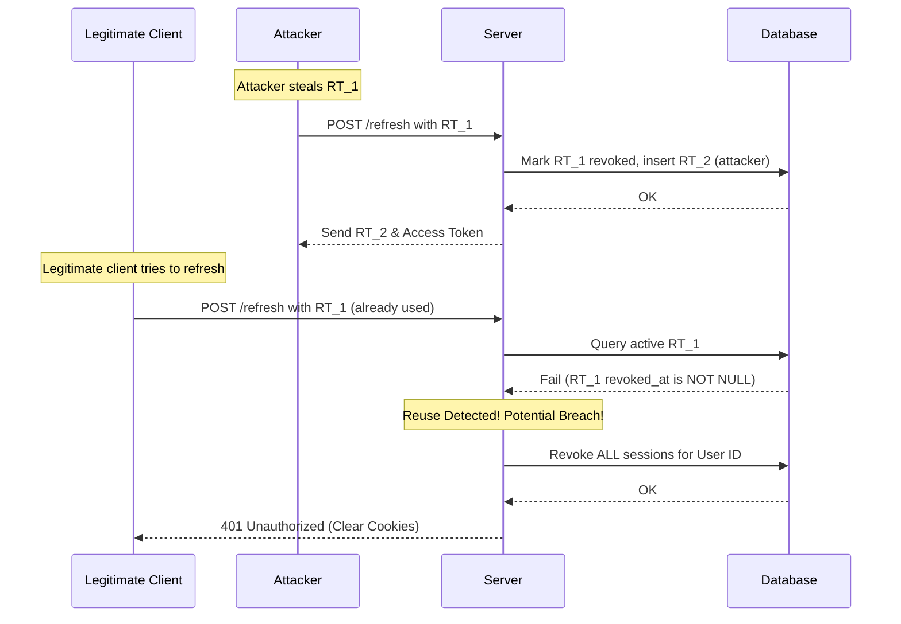

# JWT Security - Senior Level Interview Prep

This guide covers advanced security architecture, session hijacking detection, database scaling limits, and concurrency race conditions in token rotation systems.

---

## Q&A Sets

### Q1: Detail how Refresh Token Rotation (RTR) detects session hijacking. What architectural and UX challenges (like network race conditions) arise, and how do we resolve them?

#### Interviewer Intent
Evaluate the candidate's deep security knowledge, understanding of session lifecycle vulnerabilities, and experience handling real-world production race conditions.

#### Strong Answer
Refresh Token Rotation (RTR) is a security mechanism where every token exchange invalidates the old refresh token and issues a new one. This limits the lifetime of any single refresh token to a single request.

If an attacker intercepts a user's refresh token ($RT_1$) and calls `/refresh`, they receive a new token ($RT_2$), while $RT_1$ is marked as revoked in the database (`revoked_at = NOW()`). When the legitimate user's browser subsequently attempts to refresh using $RT_1$, the server detects that $RT_1$ has already been revoked.

In a strict security model, detecting reuse of a revoked token triggers **breach detection**: the server invalidates all active sessions for that user ID, forcing a full login. This prevents the attacker ($RT_2$) from continuing their session.



However, RTR introduces a critical **network race condition**: if a user has poor connectivity, their client might send a refresh request, not receive the response, and retry. The first request revokes $RT_1$ and generates $RT_2$ (which is lost in transit). The retry request sends $RT_1$ again. Under strict RTR, this looks like reuse, logging the user out and degrading UX.

To resolve this in production, we can introduce a **rotation grace period** (e.g., 10-30 seconds). During this window:
1. When a refresh token is rotated, we store the new token hash but permit the old token to be reused once if it falls within the grace window.
2. We acquire a row lock on the session (using `FOR UPDATE`) to serialize concurrent requests and prevent double-spending tokens.

#### Common Mistakes
* Implementing RTR without a database transaction, allowing the old token to remain valid if the database insert of the new token fails.
* Not implementing a grace period, causing frequent random logouts for users on high-latency mobile networks.
* Failing to serialize incoming concurrent requests on the same session, leading to database deadlocks or duplicate session rows.

#### Follow-up Questions
* How does the grace period affect the security threat model? (It slightly widens the attack window, but resolves the mobile connection retry issue).
* How would you implement the grace period in Go? (By storing the `rotated_at` timestamp and allowing tokens to be validated if `NOW() - rotated_at < grace_period`).
* How do database locking structures like `FOR UPDATE` protect against concurrent double-submits during token exchange?

#### How DSAblitz demonstrates this concept
DSAblitz enforces transactional session rotation in `Repository.RotateSession`. It uses database transactions to atomically revoke the old token and insert the new token, preventing inconsistent session states. It uses `RowsAffected() != 1` checks to detect if a token is already rotated or invalid.

#### Relevant code references
* [service.go:L104-L113](file:///home/tanishq/dsablitz/backend/internal/auth/service.go#L104-L113) - Calling session rotation.
* [repository.go:L164-L199](file:///home/tanishq/dsablitz/backend/internal/auth/repository.go#L164-L199) - `RotateSession` method executing revocation and creation atomically inside a database transaction.

#### Related documentation
* [deep-dives/idempotency.md](file:///home/tanishq/dsablitz/docs/deep-dives/idempotency.md)
* [database/transactions.md](file:///home/tanishq/dsablitz/docs/database/transactions.md)

---

### Q2: How do you design and optimize database storage for user sessions at scale (e.g., millions of active sessions)? Discuss cleanup strategies, table bloat, and cache optimization.

#### Interviewer Intent
Assess system design capabilities, database optimization experience, and understanding of PostgreSQL storage internals (table bloat, vacuuming, and buffer pool optimization).

#### Strong Answer
Scaling session storage to millions of active rows in relational databases like PostgreSQL requires managing two main problems: table write overhead and storage bloat.

1. **Table Bloat & Cleanup**: Every session rotation marks a row as revoked (`revoked_at = NOW()`). In PostgreSQL, an UPDATE is essentially a DELETE followed by an INSERT (MVCC). This creates "dead tuples". If we do not clean up expired and revoked sessions, the table grows indefinitely, causing query performance to degrade.
   * **Cleanup Strategy**: We run a background worker (e.g., Go cron or k8s cronjob) that periodically deletes dead session rows in batches:
     ```sql
     DELETE FROM auth_sessions 
     WHERE expires_at < NOW() 
        OR (revoked_at IS NOT NULL AND revoked_at < NOW() - INTERVAL '7 days');
     ```
     We batch these deletes (e.g., `LIMIT 5000` per query) to avoid long table locks, transaction log (WAL) spikes, and CPU bottlenecks.

2. **Index Optimization**: A full index on `refresh_token_hash` would grow proportionally to the table size. To optimize memory, we use a **partial index**:
   ```sql
   CREATE INDEX idx_auth_sessions_refresh_token_hash_active
       ON auth_sessions(refresh_token_hash)
       WHERE revoked_at IS NULL;
   ```
   This index excludes revoked sessions. Because revoked rows represent the vast majority of historical data, this partial index remains small enough to fit entirely in the database server's RAM buffer pool (cache). Lookup times remain `O(log N)` with a very small `N`.

3. **Partitioning**: For ultra-high scale, we partition the `auth_sessions` table by range using the `expires_at` column. Each week or month gets its own physical partition table. Dropping an expired partition is a metadata operation (`DROP TABLE partition_name`), which completely bypasses the write-heavy delete and autovacuum cycles.

#### Common Mistakes
* Running a single `DELETE FROM auth_sessions WHERE expires_at < NOW();` on a table with 50 million rows, locking the table, exhausting connection pools, and blocking logins.
* Not monitoring vacuuming health, leading to transaction ID wraparound or massive index bloat.
* Using string UUIDs as primary keys without sorting, causing random B-Tree page splits and high disk write amplification (fixed by using `gen_random_uuid()` or sequential UUIDs like ULIDs).

#### Follow-up Questions
* Why is dropping a partition more performant than running a `DELETE` query?
* How does autovacuum handle the dead tuples created by high-frequency session rotations?
* What are the trade-offs of using Redis instead of PostgreSQL for session storage? (Redis is faster but ephemeral; Postgres provides relational integrity, cascading deletes, and transactional guarantees).

#### How DSAblitz demonstrates this concept
DSAblitz structures the database schema for scale. It uses UUID data types, enforces constraints, and utilizes partial indexing on the active token hash to ensure the index fits in RAM.

#### Relevant code references
* [000002_create_auth_sessions.up.sql:L1-L20](file:///home/tanishq/dsablitz/backend/migrations/000002_create_auth_sessions.up.sql#L1-L20) - Database constraints, partial active session index, and expiry indexes.

#### Related documentation
* [database/indexing.md](file:///home/tanishq/dsablitz/docs/database/indexing.md)
* [database/schema.md](file:///home/tanishq/dsablitz/docs/database/schema.md)

---

## Key Takeaways
* **RTR Breach Detection**: Token reuse detection acts as an intrusion warning, allowing immediate revocation of all sessions for a compromised account.
* **Grace Periods**: Essential to balance strict security with real-world network latency and client retries.
* **Partial Indexing**: Filters out revoked data to minimize index footprint, ensuring lookups run directly in database memory.
* **MVCC Table Bloat**: Frequent updates create dead tuples. Batch cleanups or partition drops are required to keep queries fast.

## Interview Questions
1. How does a grace period in Refresh Token Rotation protect against network retries, and what are the security trade-offs?
2. What database index structures would you use to support token verification and table cleanups?
3. How does PostgreSQL's MVCC model affect tables with high write/update rates like `auth_sessions`?

## Common Mistakes
* Failing to use database transactions during rotation, causing data inconsistency when inserts fail.
* Running massive unbatched `DELETE` statements to clean up expired sessions, blocking API traffic.
* Ignoring database autovacuum settings under high session rotation workloads.

## Related Documents
* [database/transactions.md](file:///home/tanishq/dsablitz/docs/database/transactions.md)
* [database/indexing.md](file:///home/tanishq/dsablitz/docs/database/indexing.md)
* [deep-dives/transaction_boundaries.md](file:///home/tanishq/dsablitz/docs/deep-dives/transaction_boundaries.md)

## Lessons Learned
* Scalable authentication systems require careful coordination between security policies and database engine mechanics.
* Always size database indexes to fit within the active buffer pool. Exclude historical or inactive records via partial indexes.
