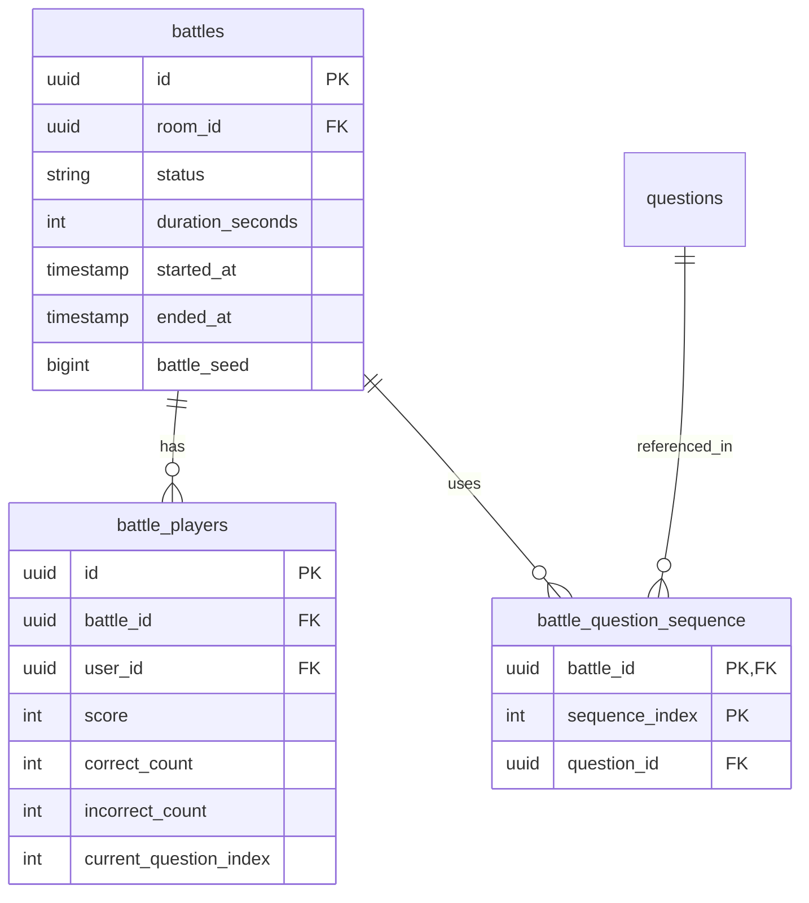

# DSAblitz Mock Interview: Graduate / Intern Level (45 Minutes)

This document structures a mock interview designed for junior developers and graduate candidates. The focus is on relational database schema designs, basic separation of concerns, and clean coding principles, as implemented in **DSAblitz**.

---

## Interview Session Structure
- **00:00 - 00:05**: Introduction and candidate background check.
- **00:05 - 00:20**: Scenario 1: Relational Schema Design for 1v1 Matches.
- **00:20 - 00:40**: Scenario 2: Separation of Concerns (Static vs. Dynamic Data).
- **00:40 - 00:45**: Candidate Q&A and wrap-up.

---

## Scenario 1: Relational Schema Design for 1v1 Matches

### Question
> *"In a 1v1 matchmaking platform like DSAblitz, players start a battle and compete over a sequence of 200 questions. How would you design a database schema to store matches, participating players, and the sequence of questions each match uses? Explain the relationships between your tables."*

### Interviewer Intent
The interviewer is evaluating the candidate's understanding of:
1. Database normalization (1NF, 2NF, 3NF).
2. Primary Key (PK) and Foreign Key (FK) relationships.
3. Why junction tables are used instead of storing JSON or arrays directly in a single row.

### Strong Answer
To store matches, player participation, and question sequences, we should use a fully normalized relational schema rather than storing lists of data in a single row. This guarantees data integrity and enables rich query access.



1. **`battles` Table**: Stores match metadata such as status (active, completed), durations, starts/ends, and a seed value for generating questions.
2. **`battle_players` Table**: A junction table that maps users to battles. Storing players in a separate table rather than denormalized columns inside `battles` (like `player_1_id`, `player_2_id`) allows us to easily scale to larger lobbies in the future and maintain normalized statistics (score, correctness counters) per player.
3. **`battle_question_sequence` Table**: Maps a battle to a specific sequence of question IDs. We use a composite primary key consisting of `(battle_id, sequence_index)`. This guarantees that for each index in a match, there is exactly one designated question.

Using foreign key constraints ensures that we cannot delete a question if it is currently referenced in an active match sequence, preventing database corruption.

### Common Mistakes
- **Using a denormalized array inside `battles`**: Suggesting to store a `uuid[]` array of question IDs directly inside the `battles` table. While this saves a join, it violates First Normal Form (1NF), makes it impossible to enforce database-level foreign key constraints on individual questions, and prevents querying which battles used a specific question without slow sequential table scans.
- **Forgetting Primary and Foreign Keys**: Designing tables without specifying how they join, or omitting index paths.

### Follow-up Questions
1. *Why did we choose to create a `battle_question_sequence` table instead of having each player fetch questions randomly at runtime?*
2. *How does the schema handle storing player scores? Should they be calculated on the fly from submissions, or persisted directly in `battle_players`?*

### How DSAblitz demonstrates this concept
DSAblitz implements this exact normalized layout.
- **Relational Models**: Defined in [models.go:L115-L124](file:///home/tanishq/dsablitz/backend/internal/rooms/models.go#L115-L124) and battle struct schemas.
- **Sequence Generation & Insertion**: Structured inside `StartBattleTx` where match sequences are inserted using Go database handlers in [service.go:L103-L154](file:///home/tanishq/dsablitz/backend/internal/battle/service.go#L103-L154).

### Related Documentation
- [Database Schema](file:///home/tanishq/dsablitz/docs/database/schema.md)
- [Submission Lifecycle](file:///home/tanishq/dsablitz/docs/deep-dives/submission_lifecycle.md)

---

## Scenario 2: Separation of Concerns (Static vs. Dynamic Data)

### Question
> *"In our platform, we have a catalog of questions. We also have live battles where users submit answers and score points. How would you structure your backend modules to separate the read-heavy static question catalog from the transaction-heavy battle scoring logic? What safety measures would you add to your JSON payloads to prevent players from cheating?"*

### Interviewer Intent
The interviewer wants to see if you can:
1. Define clear boundaries between application modules.
2. Design secure APIs using Data Transfer Objects (DTOs) to prevent data leaks.
3. Differentiate between stateless operations (validating an MCQ option) and stateful operations (incrementing a player's score).

### Strong Answer
To keep the system scalable and secure, we must separate **read-heavy static catalog data** from **write-heavy gameplay transaction data**.

```
[Questions Module]                      [Battle Module]
   - Static Question Catalog               - Active Match Progress
   - Stateless Validation                  - DB Write Operations
   - Sanitized DTOs (No Answers)           - Pessimistic Locks
```

1. **Module Boundaries**:
   - **Questions Module**: Operates as a stateless catalog. It is responsible for loading questions into memory and performing stateless verification (e.g. comparing if option `A` is the correct answer). It does not know anything about battles, scores, or active players.
   - **Battle Module**: Handles gameplay states. It manages the active transaction, locking the player's progression row, updating indices, and recording submissions. It calls the Questions module only to fetch sanitized details or validate a raw answer.

2. **Security & Payload Sanitization (Anti-Cheat)**:
   - We must never expose the database entity (`Question`) directly to the client because it contains the fields `correct_answer` and `explanation`.
   - Instead, the controller maps the database entity to a client-safe DTO called `SanitizedQuestionResponse`. This DTO excludes sensitive answer keys.
   - The validation is performed entirely on the backend: the client submits their selected option, and the server fetches the real answer from memory or the database to verify it.

This decoupling guarantees that players cannot scrape answers from browser networks or memory, maintaining competitive integrity.

### Common Mistakes
- **Coupling Modules**: Suggesting that the Questions service should update the player's score. This tightly couples the catalog to the battle loop, making it impossible to scale the catalog separately or cache it aggressively.
- **Client-side Verification**: Validating the answer on the client side and sending `isCorrect: true` to the server API, which is a major security vulnerability.

### Follow-up Questions
1. *What is a DTO, and why do we prefer it over serializing database models directly to JSON?*
2. *If we need to render the correct answer and explanation *after* the battle ends, how would you change the API design?*

### How DSAblitz demonstrates this concept
DSAblitz implements strict DTO boundaries and stateless validation loops.
- **Payload Sanitization**: Convert queries to sanitized models in [service.go:L59-L67](file:///home/tanishq/dsablitz/backend/internal/questions/service.go#L59-L67).
- **Stateless Validation Hook**: Handled in [service.go:L69-L75](file:///home/tanishq/dsablitz/backend/internal/questions/service.go#L69-L75).

### Related Documentation
- [Questions Flow](file:///home/tanishq/dsablitz/docs/flows/questions_flow.md)
- [Module Boundaries](file:///home/tanishq/dsablitz/docs/architecture/module_boundaries.md)

---

## Key Takeaways
- **Normalization First**: High-throughput multiplayer schemas require structured relational designs (junction tables) to enforce consistency.
- **Zero Trust Client**: Never trust the client with sensitive data. Exclude answers from payloads using sanitized DTOs and validate submissions strictly on the server.
- **Domain Separation**: Keep static read-heavy catalogs decoupled from dynamic write-heavy gameplay loops to ensure scalability and maintainability.

## Interview Questions
1. *What are foreign key constraints, and why are they critical in a multiplayer match database?*
2. *Explain the security risks of serializing database models directly to HTTP responses.*
3. *Why do we separate static question data from live player battle scores?*

## Common Mistakes
1. **Denormalization for MVP**: Storing comma-separated strings of IDs instead of proper relational foreign keys.
2. **Leaking Answers**: Including answer attributes in response JSON, enabling client-side reverse engineering.
3. **Circular Modules**: Creating cyclic dependencies by letting the Questions package import Battle services.

## Related Documents
- [PROJECT_CONTEXT.md](file:///home/tanishq/dsablitz/docs/PROJECT_CONTEXT.md)
- [Overall Architecture](file:///home/tanishq/dsablitz/docs/architecture/overall_architecture.md)

## Lessons Learned
- Writing clean schemas at the start prevents expensive migrations later.
- Restricting client response models using DTOs is a fundamental anti-cheat security practice.
