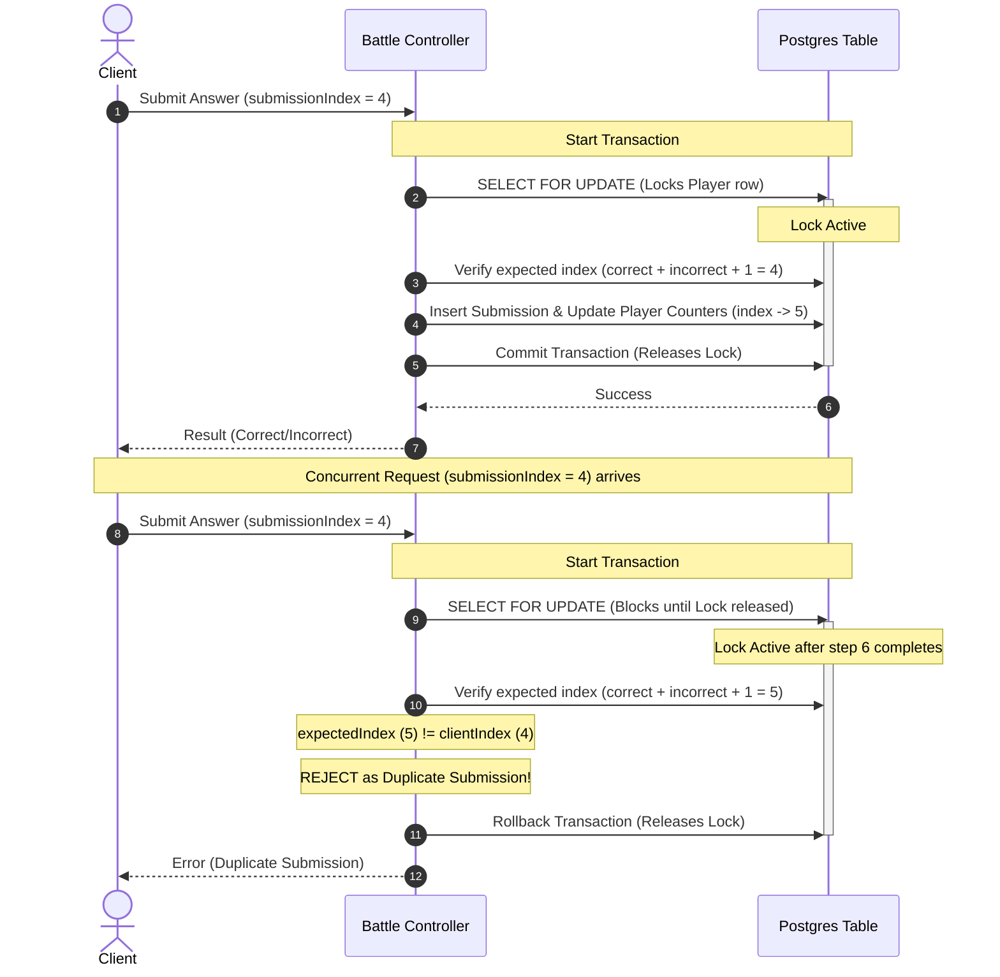

# DSAblitz Mock Interview: SDE1 Level (1 Hour)

This document structures a mock interview designed for mid-level engineers (SDE1). The focus is on concurrency control, preventing race conditions, and enforcing clean module interactions in Go, as implemented in **DSAblitz**.

---

## Interview Session Structure
- **00:00 - 00:05**: Introduction and project walkthrough.
- **00:05 - 00:30**: Scenario 1: Preventing Race Conditions in Fast-Submissions.
- **00:30 - 00:55**: Scenario 2: Dependency Inversion & Cross-Module Transactions.
- **00:55 - 01:00**: Technical feedback and Q&A.

---

## Scenario 1: Preventing Race Conditions in Fast-Submissions

### Question
> *"In competitive multiplayer games, players can trigger multiple actions in sub-second intervals (e.g. double-clicking a submit button). If our backend receives two concurrent HTTP submission requests for the same question from the same user, how do you prevent race conditions that could lead to double-scoring or out-of-order state progressions? Detail your database locking strategy and validation checks."*

### Interviewer Intent
The interviewer is looking for:
1. Deep understanding of concurrency issues (race conditions, dirty reads).
2. Knowledge of database locking mechanisms (`SELECT ... FOR UPDATE`).
3. Application of business logic checks, such as client-provided monotonic index verification to reject duplicate submissions.

### Strong Answer
To prevent concurrency issues during fast submissions, we must serialize updates at the database level and implement strict validation guards. Relying on application-level locks (like Go mutexes) does not work if the server is scaled horizontally.



We solve this using a two-layered defense:

#### 1. Pessimistic Row Locking (`SELECT ... FOR UPDATE`)
We lock the player's status row within an atomic transaction. In Go, using `pgx`, we query the database:
```sql
SELECT score, correct_count, incorrect_count, current_question_index, current_question_attempts 
FROM battle_players 
WHERE battle_id = $1 AND user_id = $2 
FOR UPDATE;
```
This acquires a exclusive lock on that specific player's progression record. Any concurrent submission request for the same user will block at this query until the first transaction commits or rolls back.

#### 2. Monotonic Submission Index Verification
Once the lock is acquired, we perform verification against a client-supplied `submissionIndex` (which represents the client's expected progress pointer):
- The server computes the expected index: $\text{expectedIndex} = \text{correct\_count} + \text{incorrect\_count} + 1$.
- If `clientIndex < expectedIndex`, we immediately reject the request as a duplicate or stale submission.
- If `clientIndex > expectedIndex`, we reject it as an out-of-order submission.

Additionally, we query the `submissions` table for the current question:
- If a submission with identical answers already exists for this question, we return a duplicate error.

Finally, we update the player's counters, insert the submission, and commit the transaction, releasing the lock. The blocked concurrent request will now unblock, read the updated counters, and fail the index validation check, preventing double-scoring.

### Common Mistakes
- **Using application-level mutexes (`sync.Mutex`)**: Assuming `sync.Mutex` is sufficient. While it prevents races on a single server, it fails as soon as we run multiple horizontal instances of the application behind a load balancer.
- **Locking the entire table**: Suggesting table-level locks, which destroys performance and prevents other players from submitting answers concurrently.
- **Validating before locking**: Querying player stats, validating the index in Go, and *then* starting the transaction or lock. This allows a race condition to occur between the read and the lock.

### Follow-up Questions
1. *What is the difference between pessimistic locking (`FOR UPDATE`) and optimistic concurrency control (OCC), and when would you use OCC instead?*
2. *How do you prevent connection pool starvation if a database query blocks under high lock contention?*

### How DSAblitz demonstrates this concept
DSAblitz utilizes transactional row locking and index matching in its battle engine.
- **Pessimistic Row Locking**: Implemented via repository query in [service.go:L192-L198](file:///home/tanishq/dsablitz/backend/internal/battle/service.go#L192-L198).
- **Index Verification**: Matches monotonic progression indices in [service.go:L227-L233](file:///home/tanishq/dsablitz/backend/internal/battle/service.go#L227-L233).
- **Identical Submission Prevention**: Checks historical question records at [service.go:L235-L244](file:///home/tanishq/dsablitz/backend/internal/battle/service.go#L235-L244).

### Related Documentation
- [Websocket Concurrency](file:///home/tanishq/dsablitz/docs/deep-dives/websocket_concurrency.md)
- [Submission Lifecycle](file:///home/tanishq/dsablitz/docs/deep-dives/submission_lifecycle.md)

---

## Scenario 2: Dependency Inversion & Cross-Module Transactions

### Question
> *"In a modular monolith, how do you handle actions that span multiple packages (e.g. Rooms and Battle) without creating circular dependencies, while ensuring all write operations commit or roll back in a single atomic database transaction?"*

### Interviewer Intent
The interviewer wants to evaluate your:
1. Understanding of clean architecture and dependency injection.
2. Ability to prevent circular dependencies in Go.
3. Design of transaction boundaries that span multiple decoupled modules.

### Strong Answer
To execute atomic actions across packages without circular imports, we must apply **Dependency Inversion** and use a **Shared Transaction Context**.

```
[Rooms Module]
  - Service
  - Repository
  - BattleCoordinator (Interface) <─── [Implemented by Server Adapter]
                                           └── Calls [Battle Module]
```

#### 1. Preventing Circular Dependencies
In Go, package `A` cannot import package `B` if `B` also imports `A`. To decouple the Rooms module from the Battle module:
- The Rooms module defines an interface: `BattleCoordinator`. This interface specifies the methods Rooms needs to start a match.
- The Battle module is completely unaware of the Rooms package.
- An adapter (e.g. `battleCoordinatorAdapter` in the `server` or coordination package) implements the `BattleCoordinator` interface and calls the Battle service.
- At application startup, this adapter is injected into the Rooms service.

#### 2. Atomic Transaction Propagation
To ensure the operations (updating the room status and creating the battle records) run atomically:
- The Rooms service starts a database transaction: `tx, err := repo.Begin()`.
- The `pgx.Tx` handle is passed as an argument to the interface method: `BattleCoordinator.StartBattle(ctx, tx, roomID, players, seed)`.
- The Battle module executes all its writes (inserting battle rows, sequences, and players) on this same transaction handle `tx`.
- If any operation fails in either module, the Rooms service calls `tx.Rollback()`, reverting all changes across both modules. If everything succeeds, the Rooms service calls `tx.Commit()`.

This maintains complete database atomicity while keeping codebases modular and decoupled.

### Common Mistakes
- **Circular Imports**: Importing `battle` inside `rooms` and `rooms` inside `battle` to synchronize states, which prevents the Go compiler from building the app.
- **Double Transactions**: Starting a new transaction (`tx.Begin()`) inside the Battle coordinator while another transaction is already active on the same connection, causing Postgres syntax errors.
- **Ignoring Rollbacks**: Failing to handle errors properly, leaving the database in an inconsistent state (e.g. a room marked `in_battle` but no corresponding record in the `battles` table).

### Follow-up Questions
1. *Why does the database connection pool deadlock if we start nested transactions inside a single execution thread?*
2. *How would you write a unit test for the Rooms service by mocking the `BattleCoordinator` interface?*

### How DSAblitz demonstrates this concept
DSAblitz wires its modules using interfaces and passes parent transactions.
- **Interface Definition**: Rooms module defines `BattleCoordinator` in [models.go:L121-L124](file:///home/tanishq/dsablitz/backend/internal/rooms/models.go#L121-L124).
- **Adapter Wiring**: Implemented in [routes.go:L21-L35](file:///home/tanishq/dsablitz/backend/internal/server/routes.go#L21-L35).
- **Transactional Call**: Propagates `pgx.Tx` to start the battle atomically in [service.go:L406-L414](file:///home/tanishq/dsablitz/backend/internal/rooms/service.go#L406-L414).

### Related Documentation
- [Transaction Boundaries](file:///home/tanishq/dsablitz/docs/deep-dives/transaction_boundaries.md)
- [Module Boundaries](file:///home/tanishq/dsablitz/docs/architecture/module_boundaries.md)

---

## Key Takeaways
- **Database Serialization**: Use row locks (`SELECT ... FOR UPDATE`) to handle concurrency, ensuring consistency across distributed environments.
- **Monotonic Guards**: Validate submission counters on the server to reject duplicate or out-of-order client requests.
- **Dependency Inversion**: Use interfaces defined by the caller and adapters at the wiring layer to decouple modules and prevent circular dependencies in Go.
- **Contextual Transactions**: Pass parent transaction handles (`pgx.Tx`) to downstream modules to maintain database atomicity.

## Interview Questions
1. *Why is an application-level lock insufficient for resolving race conditions in a distributed system?*
2. *How do you enforce transaction boundaries across modular packages in Go?*
3. *What are the architectural benefits of using adapters to wire decoupled modules?*

## Common Mistakes
1. **Application Mutex in Production**: Implementing memory locks (`sync.Mutex`) to solve concurrency, which fails when scaling to multiple server instances.
2. **Circular Dependencies**: Failing to use interfaces for cross-package communication, blocking compilation.
3. **Orphaned Writes**: Writing database changes outside of the parent transaction scope, leading to data inconsistencies.

## Related Documents
- [PROJECT_CONTEXT.md](file:///home/tanishq/dsablitz/docs/PROJECT_CONTEXT.md)
- [Module Interactions](file:///home/tanishq/dsablitz/docs/architecture/module_interactions.md)

## Lessons Learned
- Enforcing database constraints and serializing requests at the data layer ensures correctness.
- Maintaining clean interfaces from the start makes future microservice migration straightforward.
