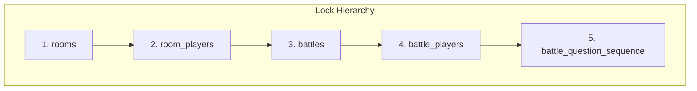

# DSAblitz Mock Interview: Senior Level (90 Minutes)

This document structures a mock interview designed for senior engineers. The focus is on distributed system design, deadlock prevention in database transactions, cache invalidation strategies at scale, and stateful algorithmic game design in **DSAblitz**.

---

## Interview Session Structure
- **00:00 - 00:10**: Introduction and deep system overview.
- **00:10 - 00:35**: Scenario 1: Deadlock Analysis & Transaction Ordering.
- **00:35 - 01:00**: Scenario 2: Scale-Out Caching & Consistency (Pub/Sub).
- **01:00 - 01:25**: Scenario 3: Stateful Determinism & PRNG Game Balancing.
- **01:25 - 01:30**: Candidate evaluation and architectural discussion.

---

## Scenario 1: Deadlock Analysis & Transaction Ordering

### Question
> *"In our platform, we have background cleanups (e.g. ExpireRooms) that periodically lock multiple rooms and their players to mark them expired. We also have live users joining, leaving, and starting battles in these rooms. How do you design your locking strategies to guarantee that these concurrent transactions never result in database deadlocks? What boundaries do you establish for PostgreSQL retry loops?"*

### Interviewer Intent
The interviewer is checking for:
1. Understanding of database lock mechanics (exclusive locks, shared locks) and how deadlocks occur.
2. Ability to define a strict global lock hierarchy across tables.
3. Knowledge of query sorting (`ORDER BY`) to serialize locks.
4. Correct placement of retry loops relative to transactional blocks (PostgreSQL abort-and-retry boundary rule).

### Strong Answer
To prevent database deadlocks, we must enforce a strict **Global Lock Ordering Rule** and sort locked resources deterministically.



#### 1. Global Lock Ordering Rule
A deadlock occurs when Transaction A locks Resource 1 and waits for Resource 2, while Transaction B locks Resource 2 and waits for Resource 1. We eliminate this by requiring all transactions to acquire locks in the exact same table hierarchy:
$$\text{rooms} \rightarrow \text{room\_players} \rightarrow \text{battles} \rightarrow \text{battle\_players} \rightarrow \text{battle\_question\_sequence}$$

#### 2. Deterministic Row Ordering
When a transaction locks multiple rows in the same table (such as a batch cleanup in `ExpireRooms` or batch processing), the rows must be ordered deterministically before acquiring locks. For example:
```sql
SELECT id FROM rooms
WHERE status IN ('waiting', 'ready') AND expires_at < NOW()
ORDER BY id ASC
FOR UPDATE;
```
Sorting by primary key (`ORDER BY id ASC`) guarantees that if two transactions attempt to lock the same subset of expired rooms, they will lock Room 1 first, then Room 2, and so on. One transaction will block on Room 1, allowing the other to complete, preventing cyclic wait conditions.

#### 3. Postgres Abort & Retry Boundary Rule
PostgreSQL aborts a transaction permanently as soon as any SQL error occurs (such as a serialization failure or primary key collision). Therefore:
- We must place retry loops **outside** the transaction block.
- Each retry attempt must start a clean, fresh transaction.
- If we generate a room code and hit a collision, we rollback, exit the transaction, and generate a new code in a fresh transaction block.

```go
// Correct placement: Retry outside transaction
for i := 0; i < maxRetries; i++ {
    err := repo.WithTransaction(ctx, func(tx pgx.Tx) error {
        // SQL operations...
    })
    if err == nil {
        break
    }
}
```

### Common Mistakes
- **Sorting in Application Code after Locking**: Querying rows, locking them, and then sorting them in Go. The lock is acquired during the query, so the unsorted database execution is what triggers the deadlock.
- **Nested Retries**: Placing retry loops inside `WithTransaction`. Once a query fails inside a Postgres transaction, all subsequent queries in that same transaction will fail with `current transaction is aborted, commands ignored until end of transaction block`.

### Follow-up Questions
1. *What is the difference between `FOR UPDATE` and `FOR NO KEY UPDATE` in PostgreSQL, and how does it affect table concurrency?*
2. *How does lock escalation work in relational databases, and how do we prevent row locks from escalating to table locks?*

### How DSAblitz demonstrates this concept
DSAblitz enforces deterministic row ordering and retry boundaries.
- **Lock Sorting in ExpireRooms**: Rooms are sorted using `ORDER BY id ASC` before locking in [service.go:L427-L440](file:///home/tanishq/dsablitz/backend/internal/rooms/service.go#L427-L440).
- **Postgres Retry Boundary**: Room code collision retry loops are placed outside transaction blocks in [service.go:L56-L113](file:///home/tanishq/dsablitz/backend/internal/rooms/service.go#L56-L113).

### Related Documentation
- [Room Transactions](file:///home/tanishq/dsablitz/docs/deep-dives/room_transactions.md)
- [Database Transactions](file:///home/tanishq/dsablitz/docs/database/transactions.md)

---

## Scenario 2: Scale-Out Caching & Consistency (Pub/Sub)

### Question
> *"To optimize performance, we cache questions in memory at startup. When we scale horizontally to multiple application nodes, this local cache introduces consistency issues when updates occur. How do you design a distributed cache invalidation mechanism using Redis Pub/Sub to coordinate updates across nodes while maintaining nanosecond read latencies?"*

### Interviewer Intent
The interviewer wants to evaluate your:
1. Understanding of caching architectures (distributed vs. local).
2. Ability to design a reliable cache invalidation protocol.
3. Management of edge cases like network partitions, message loss, and race conditions during concurrent updates.

### Strong Answer
To maintain nanosecond read speeds, we must keep the local cache (`sync.RWMutex` map) on each node. To ensure consistency across nodes, we implement a **Pub/Sub Invalidation Pattern** using Redis:

```
                  ┌───────────────┐
                  │  PostgreSQL   │
                  └───────▲───────┘
                          │
  [Admin Request]   ┌─────┴─────┐
  ─────────────────►│  Node A   ├──────┐
                    └─────┬─────┘      │ 2. Publish Invalidation
                          │            ▼
                     1. Write     ┌─────────┐
                          │       │  Redis  │
                          ▼       └───┬─────┘
                    ┌───────────┐     │
                    │ Local RAM │     │ 3. Invalidate
                    └───────────┘     ▼
                                  ┌─────────┐
                                  │ Node B  │
                                  └─────────┘
```

#### 1. Invalidation Flow
1. Node A receives an admin update request. It updates the database record.
2. Node A updates its own local cache and publishes an invalidation event to a Redis Pub/Sub channel (e.g. `questions:invalidation`).
3. Node B (and all other instances) subscribes to this channel at startup. Upon receiving the invalidation event (containing the updated question UUID), it invalidates its local memory copy or triggers a reload query against Postgres.

#### 2. Managing Message Loss and Partitions
Redis Pub/Sub is a fire-and-forget protocol; it does not guarantee delivery. If a node loses connection to Redis during an invalidation event, its cache will remain stale. We mitigate this using:
- **Version Tracking**: Each question has a `version` or `updated_at` timestamp.
- **Heartbeat & Sync Check**: Nodes periodically publish their cache version hash. If a mismatch is detected, the stale node re-syncs its cache from PostgreSQL.
- **Local Fallback**: If a query misses the local cache, the node queries PostgreSQL directly.

This combines the performance of local memory lookups with the consistency of a distributed cache.

### Common Mistakes
- **Writing to Cache before Database**: Updating the local memory cache before the database transaction commits. If the database update fails, the cache is left with invalid data.
- **Polling the Database**: Suggesting that each node query the database periodically to check for updates, which adds unnecessary database load.

### Follow-up Questions
1. *What happens to your nodes if Redis goes down? How do you ensure the application fails gracefully?*
2. *How do you prevent a cache stampede if multiple nodes attempt to reload a question from the database simultaneously?*

### How DSAblitz demonstrates this concept
DSAblitz uses an in-memory cache for questions and outlines the transition to Redis Pub/Sub invalidations.
- **Local Cache Implementation**: Defined in [service.go:L31-L57](file:///home/tanishq/dsablitz/backend/internal/questions/service.go#L31-L57).
- **V2 Distributed Cache Invalidation**: Outlined as Phase 5 Technical Debt in [PROJECT_CONTEXT.md:L82-L86](file:///home/tanishq/dsablitz/docs/PROJECT_CONTEXT.md#L82-L86).

### Related Documentation
- [Cache Design](file:///home/tanishq/dsablitz/docs/deep-dives/cache_design.md)
- [PROJECT_CONTEXT.md](file:///home/tanishq/dsablitz/docs/PROJECT_CONTEXT.md)

---

## Scenario 3: Stateful Determinism & PRNG Game Balancing

### Question
> *"In a 1v1 battle match, we must generate a sequence of 200 question IDs using a deterministic seed so that both players receive the exact same questions in the same order. If the active question bank contains only 50 questions, how do you generate this sequence without repeating patterns, and how do you ensure the random number generator's state is managed correctly?"*

### Interviewer Intent
The interviewer is looking for:
1. Understanding of deterministic randomness and seed management.
2. Correct usage of Pseudo-Random Number Generators (PRNG) in Go (`math/rand` vs. `crypto/rand`).
3. Algorithmic design to prevent repeating patterns in shuffles.

### Strong Answer
To generate a deterministic, fair, and non-repeating sequence of 200 questions from a bank of 50, we use a **Stateful Reshuffle Algorithm** with an isolated PRNG.

```
Question Bank (50 Questions)
  ├── Cycle 1: Shuffle -> Append (50 IDs)
  ├── Cycle 2: Reshuffle (Same PRNG instance) -> Append (50 IDs)
  ├── Cycle 3: Reshuffle (Same PRNG instance) -> Append (50 IDs)
  └── Cycle 4: Reshuffle (Same PRNG instance) -> Append (50 IDs)
Sequence Total = 200 IDs (Deterministic, No Repeating Patterns)
```

#### 1. Isolated PRNG State
We must avoid using Go's global random functions (like `rand.Intn`), as concurrent matches calling these functions would alter the global generator's state, breaking determinism.
Instead, we initialize an isolated PRNG instance for each match using the match's seed:
```go
r := rand.New(rand.NewSource(battleSeed))
```

#### 2. Stateful Reshuffle Algorithm
If we simply shuffled the 50 questions once and repeated that list four times to reach 200, a player reaching Question 51 would immediately know the order of all remaining questions.
To prevent this pattern from repeating, we shuffle the pool of questions, append it to our sequence, and then shuffle the pool **again** using the **same** PRNG instance. Because the PRNG updates its internal state after each shuffle, each of the four cycles will be shuffled differently:

```go
func (s *Service) GenerateSequence(activeQuestions []questions.Question, seed int64) []uuid.UUID {
    r := rand.New(rand.NewSource(seed))
    sequence := make([]uuid.UUID, 0, MaxQuestionStreamSize)

    for len(sequence) < MaxQuestionStreamSize {
        poolCopy := make([]questions.Question, len(activeQuestions))
        copy(poolCopy, activeQuestions)

        r.Shuffle(len(poolCopy), func(i, j int) {
            poolCopy[i], poolCopy[j] = poolCopy[j], poolCopy[i]
        })

        for _, q := range poolCopy {
            if len(sequence) < MaxQuestionStreamSize {
                sequence = append(sequence, q.ID)
            }
        }
    }
    return sequence
}
```

This guarantees that both players receive the exact same sequence of questions (fairness), but the sequence does not contain repeating patterns (game balance).

### Common Mistakes
- **Using a Static Modulo Loop**: Shuffling once and looping over the sequence (`shuffled[i % len(shuffled)]`), which creates a predictable repeating pattern.
- **Modifying the Master Slice**: Shuffling the original slice of questions instead of copying it. This corrupts the question bank catalog for other active matches.
- **Using `crypto/rand` for Shuffling**: Suggesting `crypto/rand` to generate the sequence. `crypto/rand` is cryptographically secure but not seed-based, meaning it cannot generate a deterministic sequence for two separate players.

### Follow-up Questions
1. *How do you securely generate the initial seed to prevent players from predicting the match sequence?*
2. *If the question bank grows to thousands of questions, how would you optimize this generation pipeline?*

### How DSAblitz demonstrates this concept
DSAblitz generates deterministic match sequences using isolated PRNG instances.
- **Initial Seed Generation**: Securely generated using `crypto/rand` in [service.go:L400-L404](file:///home/tanishq/dsablitz/backend/internal/rooms/service.go#L400-L404) and [service.go:L476-L482](file:///home/tanishq/dsablitz/backend/internal/rooms/service.go#L476-L482).
- **Stateful Reshuffle Algorithm**: Implemented in the battle service in [service.go:L372-L392](file:///home/tanishq/dsablitz/backend/internal/battle/service.go#L372-L392).

### Related Documentation
- [Battle Lifecycle](file:///home/tanishq/dsablitz/docs/flows/battle_lifecycle.md)
- [PROJECT_CONTEXT.md](file:///home/tanishq/dsablitz/docs/PROJECT_CONTEXT.md)

---

## Key Takeaways
- **Deterministic Locks**: Enforce a strict lock hierarchy and sort rows (`ORDER BY id ASC`) before locking to prevent database deadlocks.
- **Distributed Cache Invalidation**: Combine local in-memory caches with Redis Pub/Sub invalidation channels to maintain low read latencies and guarantee consistency across nodes.
- **Isolated PRNG State**: Avoid global random states in concurrent applications. Use isolated, seed-based PRNG instances to guarantee deterministic execution.

## Interview Questions
1. *How does PostgreSQL resolve deadlocks, and how can we prevent them in our application code?*
2. *Explain the architectural tradeoffs between Redis Pub/Sub invalidation and a centralized Redis cache.*
3. *Why is `crypto/rand` used to generate seeds, while `math/rand` is used to generate match sequences?*

## Common Mistakes
1. **Unsorted Exclusive Locks**: Locking multiple rows concurrently without sorting, leading to deadlocks.
2. **Global Random Calls**: Using global random functions (`rand.Seed()`), which breaks determinism in concurrent environments.
3. **Invalidating Cache before Database Commits**: Publishing invalidation events before the database transaction has committed.

## Related Documents
- [PROJECT_CONTEXT.md](file:///home/tanishq/dsablitz/docs/PROJECT_CONTEXT.md)
- [Cache Design](file:///home/tanishq/dsablitz/docs/deep-dives/cache_design.md)
- [Room Transactions](file:///home/tanishq/dsablitz/docs/deep-dives/room_transactions.md)

## Lessons Learned
- Lock ordering rules must be treated as absolute constraints in system design.
- Local in-memory caches should be used for static catalogs, using distributed invalidation channels to scale horizontally.
