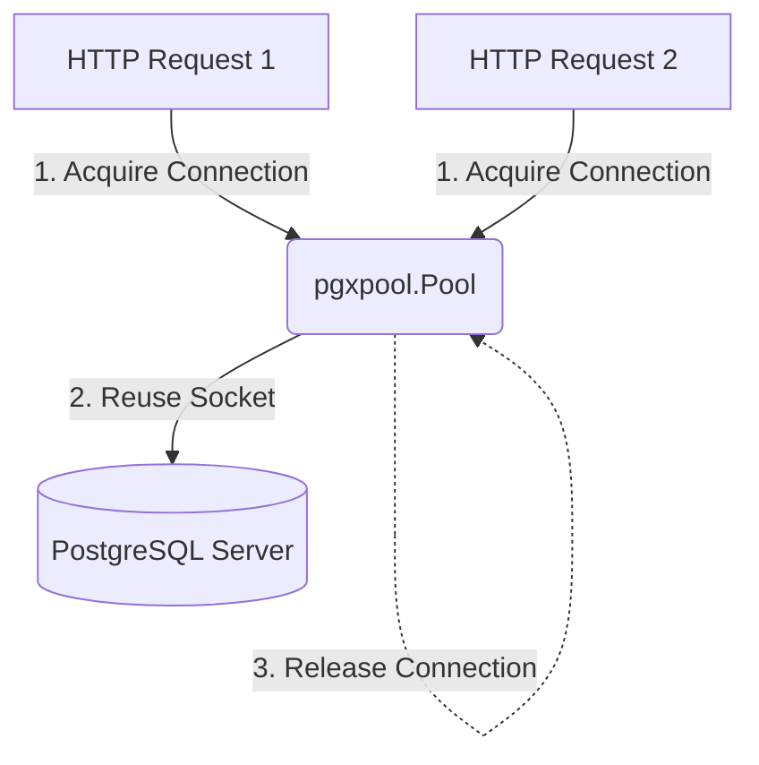

# Pgx Database Driver - Graduate Level

This document provides graduate-level interview preparation material on the `pgx` Go driver for PostgreSQL, focusing on connection pooling and query parameterization.

---

## Q&A Sets

### Q1: Why do we use a connection pool like `pgxpool.Pool` instead of opening and closing a new database connection for every HTTP request?

#### Interviewer Intent
The interviewer wants to verify:
- Understanding of network overhead and socket management.
- Knowledge of connection lifecycle limits.
- Basic usage of `pgxpool.Pool` to manage database connections in Go.

#### Strong Answer
Opening a new database connection for every request is extremely slow and inefficient. Establishing a connection requires a multi-step handshake: resolving the DNS, establishing a TCP connection, completing the TLS handshake, and authenticating the database user. This process can take tens to hundreds of milliseconds. Furthermore, database servers have a strict limit on the number of concurrent open sockets; if every concurrent HTTP request opened a new connection, the database would quickly run out of file descriptors and crash due to socket exhaustion.

A **Connection Pool** (like `pgxpool.Pool` in pgx) resolves this by:
1. **Pre-allocating** a set of active connections at application startup.
2. **Reusing Connections**: When a query runs, the driver acquires an idle connection from the pool, executes the query, and immediately returns the connection to the pool.
3. **Bounding Concurrency**: The pool limits the maximum number of concurrent active connections to the database, queuing request threads if the limit is reached.

This keeps query latency low and protects the database server from connection spikes.

#### Common Mistakes
- **Opening a pool for every query**: Calling `pgxpool.New(...)` inside a function. The pool should be initialized once at startup (e.g., in `main.go`) and shared across the application.
- **Forgetting to close the pool**: Failing to call `pool.Close()` when the application shuts down, leaving open connections on the Postgres database server.
- **Hardcoding connection counts**: Not configuring connection pool bounds (such as `min_conns` and `max_conns` in the connection string) to match server hardware.

#### Follow-up Questions
1. How do you check if the database is reachable after initializing the pool? (By calling `pool.Ping(ctx)`).
2. What happens if all connections in the pool are busy? (Incoming queries block and wait for a connection to be released, or fail with a timeout if they wait too long).

#### How DSAblitz demonstrates this concept
In DSAblitz, the platform layer initializes a single database manager containing a `pgxpool.Pool` instance. This pool is passed to repositories to execute queries.

#### Relevant code references
- `[database.go:L11-L31](file:///home/tanishq/dsablitz/backend/internal/platform/database/database.go#L11-L31)`: `Connect` function initializing `pgxpool.Pool` and verifying connection with `pool.Ping(ctx)`.
- `[server.go:L37-L74](file:///home/tanishq/dsablitz/backend/internal/server/routes.go#L37-L74)`: Registering routes and passing the shared `db.Pool()` to repositories at application startup.

#### Related documentation
- [Overall Architecture](file:///home/tanishq/dsablitz/docs/architecture/overall_architecture.md)
- [Project Context](file:///home/tanishq/dsablitz/docs/PROJECT_CONTEXT.md)

---

### Q2: Why does `pgx` use placeholder parameters (like `$1`, `$2`) instead of string concatenation, and how does it prevent SQL injection?

#### Interviewer Intent
The interviewer wants to test your knowledge of:
- Basic database security principles.
- SQL injection vulnerabilities and mitigation.
- The use of prepared statements and parameter binding in database drivers.

#### Strong Answer
Writing queries by concatenating strings (e.g., `"SELECT * FROM users WHERE code = '" + input + "'"`) is a major security vulnerability. If the input contains malicious SQL commands (e.g. `' OR '1'='1`), the database compiles and executes them, leading to **SQL Injection**.

`pgx` prevents SQL injection by forcing the use of **placeholders** (like `$1`, `$2`):
1. **Separation of Code and Data**: The query structure is sent with placeholders (e.g. `SELECT * FROM users WHERE code = $1`). The database compiles this query template first.
2. **Safe Parameter Binding**: The actual parameters are sent separately. The database driver and PostgreSQL treat the parameter values strictly as literal values, never as executable code. Even if a user enters `' OR '1'='1` as the room code, the database searches for a room whose literal code is the string `"' OR '1'='1"`, rendering the attack harmless.
3. **Type Checking**: PostgreSQL validates that the passed parameter matches the expected column type (e.g. checking that a UUID parameter is a valid UUID format) before executing the query.

#### Common Mistakes
- **Mixing placeholder types**: Mixing Go standard library placeholder style (`?`) with Postgres style (`$1`). `pgx` requires the PostgreSQL-native `$1` syntax. Using `?` will trigger SQL syntax errors.
- **Concatenating query parts in Go**: Constructing parts of queries dynamically using strings (e.g. column names or ordering directions) because placeholders can only be used for values, not identifiers.
- **Forgetting that parameters are 1-indexed**: In PostgreSQL, placeholders start at `$1`, not `$0`.

#### Follow-up Questions
1. Can you use placeholders for table names or column names? (No. Database engines require structure identifiers to be known at compilation time. Placeholders can only represent values).
2. What protocol does pgx use to send queries and parameters separately? (The PostgreSQL extended query protocol).

#### How DSAblitz demonstrates this concept
All repositories in DSAblitz execute SQL queries using placeholders to bind parameters safely.

#### Relevant code references
- `[repository.go:L59-L67](file:///home/tanishq/dsablitz/backend/internal/rooms/repository.go#L59-L67)`: `GetRoomByCode` using `$1` to query rooms safely.
- `[repository.go:L120-L128](file:///home/tanishq/dsablitz/backend/internal/battle/repository.go#L120-L128)`: `GetBattlePlayerForUpdate` binding `$1` and `$2` parameters.

#### Related documentation
- [Database Transactions](file:///home/tanishq/dsablitz/docs/database/transactions.md)
- [Project Context](file:///home/tanishq/dsablitz/docs/PROJECT_CONTEXT.md)

---

## Key Takeaways
- **`pgxpool.Pool`** manages a set of reusable TCP connections, reducing connection overhead and socket consumption.
- Never use string concatenation to construct queries; always use native PostgreSQL placeholders (`$1`, `$2`) to prevent **SQL injection**.
- Placeholders isolate literal values from the SQL execution engine, ensuring parameter data is never compiled as code.

## Interview Questions
1. How would you configure connection pool limits (min, max, idle lifetime) in pgx?
2. What error occurs if you try to pass 1-based placeholder values out of order?

## Common Mistakes
- Initializing a new connection pool instance for every query or API request.
- Using `?` placeholders instead of `$1` in pgx queries.

## Related Documents
- [PROJECT_CONTEXT.md](file:///home/tanishq/dsablitz/docs/PROJECT_CONTEXT.md)
- [Database Transactions Guide](file:///home/tanishq/dsablitz/docs/database/transactions.md)

## Lessons Learned
- Initializing and verifying the database pool during application bootstrap guarantees that database connection failures are caught before routing traffic.
