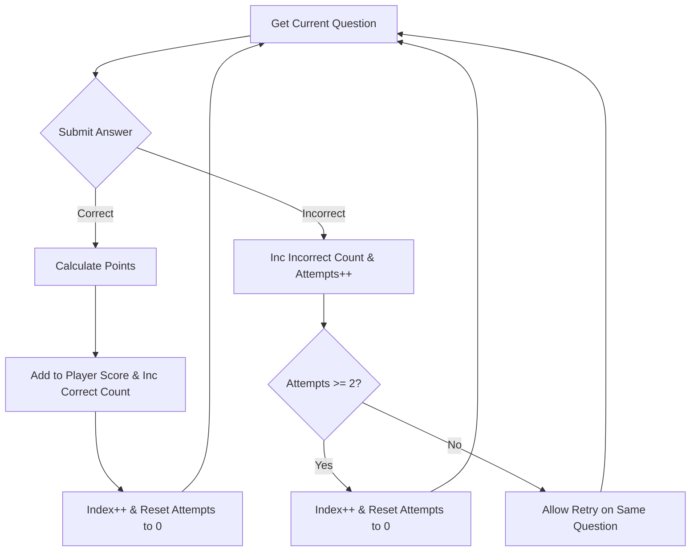

# DSAblitz Interview Prep: Graduate / Internship Level

This document covers the high-level architecture, module breakdown, gameplay constraints, and core progression mechanics of DSAblitz. It is tailored for graduate-level and internship interview preparation.

---

## 🗂️ Q&A Sets

### Q1: Can you describe the high-level architecture of DSAblitz and explain the responsibilities of each core module?

#### Interviewer Intent
The interviewer wants to assess your understanding of software architecture styles—specifically the **Modular Monolith**—and whether you can clearly organize business concerns into logical domains (separation of concerns) instead of creating unstructured "spaghetti" code.

#### Strong Answer
DSAblitz is structured as a **Modular Monolith** in Go. Rather than adopting a distributed microservices architecture early on—which introduces high network latency, serialization overhead, complex deployments, and distributed transaction issues (e.g., Saga or 2-Phase Commit)—we kept all services in a single repository and database. However, we enforce strict logical boundaries between packages. Each module operates independently, defines its own domain entities, and exposes clear interfaces for cross-module communication.

The system is divided into five core modules under `backend/internal/`:
1. **auth**: Handles user authentication, credential verification, and JWT session token generation and validation.
2. **users**: Manages user profiles, historical stats, and competitive ratings (Elo/Glicko).
3. **rooms**: Owns the multiplayer matchmaking lobby, WebSocket presence tracking, room code generation, and ready states.
4. **battle**: Houses the core gameplay logic, including active match status, player score counters, answer submission evaluations, and points allocation.
5. **questions**: A stateless, read-optimized catalog containing the questions database, cached in-memory for zero-I/O validation.

```mermaid
graph TD
    subgraph Client Layer
        Web[React & WebSockets Client]
    </td>
    subgraph Modular Monolith Backend
        Gin[Gin Router & Middleware] --> Auth[Auth Module]
        Gin --> Users[Users Module]
        Gin --> Rooms[Rooms Module]
        Gin --> Battle[Battle Module]
        Gin --> Questions[Questions Module]
    end
    subgraph Database Layer
        DB[(PostgreSQL Database)]
    end
    Rooms --> DB
    Battle --> DB
    Questions --> DB
    Auth --> DB
```

#### Common Mistakes
* **Assuming it is microservices**: Stating that modules talk over HTTP or gRPC. In our modular monolith, they communicate through direct in-memory Go interface method calls, which eliminates network overhead.
* **Fuzzy boundaries**: Suggesting that the `rooms` module can directly query the `battle` database tables or vice-versa. All database operations are private to each module's repository layer.

#### Follow-up Questions
* Why not build this as a microservice from day one?
* How does the system prevent the `rooms` package from importing the `battle` package to keep them decoupled?

#### How DSAblitz demonstrates this concept
The application startup configures and wires all modules together inside `routes.go`, passing the relevant repositories and interface-based coordinators to maintain strict boundaries.

#### Relevant code references
* [routes.go:L37-L74](file:///home/tanishq/dsablitz/backend/internal/server/routes.go#L37-L74): Registration and dependency injection of `auth`, `users`, `questions`, `battle`, and `rooms` modules.

#### Related documentation
* [PROJECT_CONTEXT.md:L28-L37](file:///home/tanishq/dsablitz/docs/PROJECT_CONTEXT.md#L28-L37)
* [0001_modular_monolith_design.md](file:///home/tanishq/dsablitz/docs/adr/0001_modular_monolith_design.md)
* [overall_architecture.md](file:///home/tanishq/dsablitz/docs/architecture/overall_architecture.md)

---

### Q2: Explain the 1v1 gameplay format of DSAblitz and detail how the "Option C" progression policy is implemented.

#### Interviewer Intent
The interviewer is checking your ability to translate written business rules and gameplay mechanics into stateful database and logic transitions, and how you manage state counters under user actions.

#### Strong Answer
DSAblitz features a 1v1 quiz-based battle format with a match duration of either 5 or 10 minutes. Rather than writing code in a sandbox, players answer multiple-choice (MCQ), complexity prediction, numeric, and algorithm ordering questions in a rapid-fire sequence. Both players receive a shared, deterministically shuffled question stream, but they progress through it **asynchronously**. The faster a player solves questions, the more questions they can attempt.

The progression is governed by the **Option C Progression Policy**:
1. A player is allowed a **maximum of 2 attempts** per question.
2. If the player submits a **correct** answer on their first or second attempt:
   * Points are awarded (using a score calculator).
   * The player's score increases.
   * `correct_count` increments.
   * The player advances to the next question (`current_question_index` increases by 1).
   * The attempt counter for the current question (`current_question_attempts`) resets to 0.
3. If the player submits an **incorrect** answer:
   * `incorrect_count` increments.
   * `current_question_attempts` increments by 1.
   * If the attempt count reaches 2, the question is **skipped** with 0 points scored. The player advances to the next question (`current_question_index` increases by 1), and `current_question_attempts` resets to 0.
   * If the attempt count is less than 2, the player is allowed to submit a retry answer for the same question.



#### Common Mistakes
* **Forgetting to reset the attempt counter**: Not resetting `current_question_attempts` to 0 when skipping or correctly solving a question, which breaks the attempt limit for the next question.
* **Allowing infinite submissions**: Failing to enforce the maximum boundary of 2 attempts, which allows users to brute-force multiple-choice options.

#### Follow-up Questions
* How does the database store these attempt counts and indexes per player?
* What happens to the battle state when the duration expires or a player exhausts all questions in the stream?

#### How DSAblitz demonstrates this concept
In `battle/service.go`, the `SubmitAnswer` function loads the player's progression record inside a database transaction, verifies correctness, applies the Option C logic block, and writes the updated counters back to PostgreSQL.

#### Relevant code references
* [models.go:L77-L81](file:///home/tanishq/dsablitz/backend/internal/battle/models.go#L77-L81): `BattlePlayer` fields tracking `score`, `correct_count`, `incorrect_count`, `current_question_index`, and `current_question_attempts`.
* [service.go:L259-L275](file:///home/tanishq/dsablitz/backend/internal/battle/service.go#L259-L275): Code block executing the Option C progression checks inside `SubmitAnswer`.

#### Related documentation
* [PROJECT_CONTEXT.md:L45-L50](file:///home/tanishq/dsablitz/docs/PROJECT_CONTEXT.md#L45-L50)
* [submission_lifecycle.md](file:///home/tanishq/dsablitz/docs/deep-dives/submission_lifecycle.md)

---

## 📌 Key Takeaways
* **Modular Monolith**: Enforces package logical isolation in a single runtime, avoiding distributed system tax while keeping code clean.
* **1v1 Asynchronous Match**: Players solve a shared question pool at their own pace, tracking their scores and progression independently.
* **Option C Policy**: Strictly enforces a 2-attempt limit per question, resetting progress pointers and attempt counters on completion or skip.

## ❓ Interview Questions
1. Why is the modular monolith a suitable architecture pattern for early-stage startups compared to microservices?
2. How does the Option C progression policy prevent players from guessing multiple-choice answers indefinitely?
3. What are the key properties of the `BattlePlayer` entity that track game state?

## ⚠️ Common Mistakes
* Hardcoding module communication or bypassing repositories to query other domain tables directly.
* Neglecting to validate and reset attempts on question skips, allowing incorrect state progression in subsequent rounds.

## 🔗 Related Documents
* [overall_architecture.md](file:///home/tanishq/dsablitz/docs/architecture/overall_architecture.md)
* [module_boundaries.md](file:///home/tanishq/dsablitz/docs/architecture/module_boundaries.md)
* [submission_lifecycle.md](file:///home/tanishq/dsablitz/docs/deep-dives/submission_lifecycle.md)

## 💡 Lessons Learned
* Enforcing boundaries at the compilation level (Go packages) is highly effective for keeping logical architectures clean and preparing for future scaling needs.
* Translating complex gameplay logic into state models requires careful, transactional boundary updates to prevent exploits (such as double-submitting correct answers).
