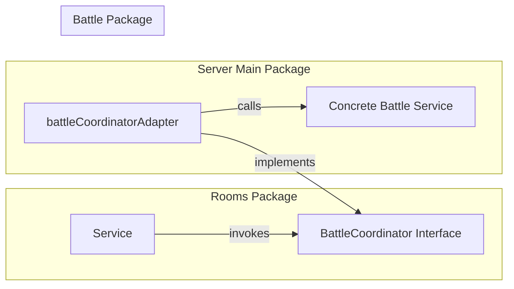

# DSAblitz Interview Prep: SDE-1 / Production Engineer Level

This document details the intermediate system designs, algorithmic determinism, package dependency rules, and caching mechanisms in DSAblitz. It is tailored for SDE-1 and production engineering interview preparation.

---

## 🗂️ Q&A Sets

### Q1: How does DSAblitz generate a deterministic question stream for players, and why is this design preferred over pure random selection?

#### Interviewer Intent
The interviewer is evaluating your knowledge of Pseudo-Random Number Generation (PRNG) state isolation, database storage optimization, and how to guarantee absolute fairness in multiplayer competition.

#### Strong Answer
In a competitive 1v1 match, competitive integrity requires that both players face the exact same sequence of questions. If players received completely random questions, one might get easier topics while the other gets harder ones, skewing the results. 

To solve this without storing a massive list of questions per player in the database (which wastes storage and increases read/write overhead), DSAblitz uses a **seed-based deterministic sequence generator**. 
1. When a battle is initialized, the system generates a cryptographically secure random `int64` seed (using `crypto/rand`). This seed is stored in the `battles` table.
2. The sequence generator instantiates a local, isolated PRNG source using `rand.New(rand.NewSource(seed))`.
3. It takes a read-only list of all active questions from the database, shuffles them using the local PRNG, and maps their IDs to a sequence array.
4. If the active question bank size is smaller than the target match stream capacity (`MaxQuestionStreamSize = 200`), the generator loops, duplicates the question pool, reshuffles the copies, and appends them to the sequence until it reaches exactly 200 questions.
5. This sequence is inserted into the `battle_question_sequence` table once for the entire battle.
6. As players progress through the match, the system uses their database-backed `current_question_index` to look up the question ID from the sequence.

Because the sequence is pre-generated and fixed for the battle, we guarantee that both players see identical questions in the exact same order, even though they solve them asynchronously at different speeds.

#### Common Mistakes
* **Using the global random generator**: Calling `rand.Seed()` and `rand.Intn()` globally. Since global random generators are shared across all concurrent goroutines, multiple matches running at the same time would pollute each other's random state, rendering the sequences non-deterministic.
* **Shuffling the original question pool in-place**: Not copying the active questions list before shuffling, which leads to memory race conditions if other processes are reading the master question bank list concurrently.

#### Follow-up Questions
* What is the difference between `crypto/rand` and `math/rand` in Go, and why do we use both?
* How does the system resolve a player's current question ID from the database using a single optimized query?

#### How DSAblitz demonstrates this concept
In `battle/service.go`, the `GenerateSequence` function copies the question pool, instantiates a local PRNG using the battle seed, and shuffles the copy to populate the sequence.

#### Relevant code references
* [service.go:L373-L392](file:///home/tanishq/dsablitz/backend/internal/battle/service.go#L373-L392): The `GenerateSequence` method in the battle service.
* [service.go:L400-L404](file:///home/tanishq/dsablitz/backend/internal/rooms/service.go#L400-L404): Cryptographic seed generation during battle initialization.

#### Related documentation
* [PROJECT_CONTEXT.md:L49-L50](file:///home/tanishq/dsablitz/docs/PROJECT_CONTEXT.md#L49-L50)
* [002_shared_question_stream.md](file:///home/tanishq/dsablitz/docs/decisions/002_shared_question_stream.md)

---

### Q2: Explain the Dependency Inversion Boundary Rule between the Rooms and Battle modules. How is it implemented in the codebase?

#### Interviewer Intent
The interviewer wants to see if you understand the Dependency Inversion Principle (DIP), package decoupling, and how to avoid circular dependency compilation errors in Go.

#### Strong Answer
In a modular monolith, modules should remain decoupled so they can be compiled independently and potentially extracted into microservices later. Furthermore, Go strictly forbids circular package imports (if package `rooms` imports `battle`, and `battle` imports `rooms`, the code will fail to compile).

To resolve this, we enforce a **Dependency Inversion Boundary Rule**:
1. The `rooms` module must never import the concrete `battle` module.
2. All interactions—such as launching or aborting a battle from the rooms lobby—are declared as interface contracts owned by the caller (`rooms`). 
3. The `rooms` package defines the `BattleCoordinator` interface:
   ```go
   type BattleCoordinator interface {
       StartBattle(ctx context.Context, tx pgx.Tx, roomID uuid.UUID, players []BattlePlayer, seed int64) (uuid.UUID, error)
   }
   ```
4. A concrete implementation of this interface does not exist in either the `rooms` or `battle` packages. Instead, the wiring is done in the main/server assembly package (`routes.go`) using an adapter:
   ```go
   type battleCoordinatorAdapter struct {
       battleService *battle.Service
   }
   ```
5. The adapter's `StartBattle` method maps the room player models into battle player models and forwards the call to the concrete `battleService.StartBattleTx` function.
6. During startup, the server instantiates the adapter and injects it into the rooms service constructor: `rooms.NewService(roomsRepo, battleAdapter)`.

This decoupling ensures that the `rooms` package remains completely ignorant of the `battle` package's internal models, controllers, and business logic.



#### Common Mistakes
* **Defining the interface in the wrong package**: Putting the `BattleCoordinator` interface in the `battle` package. Under DIP, the interface must be defined in the client package (`rooms`) that consumes the behavior, thereby defining the dependency contract it requires.
* **Leaking domain models**: Importing `battle.BattlePlayer` structs inside the `rooms` package. The interface must only reference primitives or types declared inside the `rooms` package, requiring the adapter layer to translate between the two domain models.

#### Follow-up Questions
* Why do we pass the raw `pgx.Tx` transaction handle through the `BattleCoordinator` interface?
* How does this interface-based separation simplify testing?

#### How DSAblitz demonstrates this concept
The rooms service receives the coordinator interface at startup, and the server package registers the adapter to bridge the rooms and battle packages.

#### Relevant code references
* [models.go:L121-L124](file:///home/tanishq/dsablitz/backend/internal/rooms/models.go#L121-L124): Definition of the `BattleCoordinator` interface in the `rooms` package.
* [routes.go:L21-L35](file:///home/tanishq/dsablitz/backend/internal/server/routes.go#L21-L35): The `battleCoordinatorAdapter` implementing the interface and wrapping `battle.Service`.

#### Related documentation
* [PROJECT_CONTEXT.md:L64-L66](file:///home/tanishq/dsablitz/docs/PROJECT_CONTEXT.md#L64-L66)
* [ADR_rooms_battle_dependency.md](file:///home/tanishq/dsablitz/docs/decisions/ADR_rooms_battle_dependency.md)
* [module_boundaries.md](file:///home/tanishq/dsablitz/docs/architecture/module_boundaries.md)

---

### Q3: Describe the caching strategy implemented in the Questions module. How does it optimize answer validation performance?

#### Interviewer Intent
The interviewer wants to assess your capacity to optimize hot execution paths, select appropriate synchronization primitives for concurrent memory access, and design secure APIs that prevent cheating.

#### Strong Answer
Evaluating user answer submissions is a very high-frequency operation. Querying the database to fetch the correct answer for every submission would introduce massive latency and saturate the PostgreSQL connection pool.

To optimize this, DSAblitz employs an **in-memory thread-safe cache** inside the Questions module:
1. **Startup Caching**: During application initialization, the Questions module fetches all active questions from PostgreSQL and populates a local Go map (`map[uuid.UUID]Question`) inside the `Service` struct.
2. **Synchronization**: Because multiple concurrent HTTP requests read this map simultaneously, we protect it using a `sync.RWMutex`. This allows concurrent readers to query the cache without blocking each other, while securing exclusive access for write locks (used during startup or cache reloads).
3. **Cache Fallback**: When fetching a question by ID, the system performs a read-locked lookup in the map. If there is a cache miss, it queries the database repository as a fallback.
4. **Decoupled Verification**: The `ValidateAnswer` method in the service performs a read-locked cache query to retrieve the question metadata, then runs stateless verification logic (comparing string values, numeric tolerances, or ordering arrays) entirely in memory with zero database I/O.
5. **Anti-Cheating Security**: To prevent players from scraping correct answers, the Questions API never exposes the database entity directly. The service sanitizes the payload by converting the internal `Question` struct into a client-safe `SanitizedQuestionResponse` DTO, completely omitting sensitive columns like `correct_answer` and `explanation`.

#### Common Mistakes
* **Using a standard map without synchronization**: Accessing a raw Go `map` concurrently across goroutines, which causes a fatal runtime panic (`fatal error: concurrent map read and concurrent map write`).
* **Using sync.Mutex instead of sync.RWMutex**: Using a standard mutual exclusion lock. In read-heavy scenarios, `sync.Mutex` serializes all reads, resulting in unnecessary thread contention and bottlenecks under high user traffic.

#### Follow-up Questions
* How would you handle cache invalidation in a multi-node deployment when an admin updates a question (e.g. Redis Pub/Sub)?
* Why is stateless validation preferred over maintaining validation state in the Questions service?

#### How DSAblitz demonstrates this concept
In `questions/service.go`, the cache map is loaded at startup under a write lock, and reads are performed under a read lock (`RLock`).

#### Relevant code references
* [service.go:L18-L57](file:///home/tanishq/dsablitz/backend/internal/questions/service.go#L18-L57): Questions service struct, cache mapping, mutex implementation, and DB fallback.
* [validation.go:L22-L68](file:///home/tanishq/dsablitz/backend/internal/questions/validation.go#L22-L68): Stateless validation rules mapping MCQs, complexities, floats, and algorithm ordering.

#### Related documentation
* [PROJECT_CONTEXT.md:L51-L52](file:///home/tanishq/dsablitz/docs/PROJECT_CONTEXT.md#L51-L52)
* [cache_design.md](file:///home/tanishq/dsablitz/docs/deep-dives/cache_design.md)
* [001_questions_module_security_and_design.md](file:///home/tanishq/dsablitz/docs/decisions/001_questions_module_security_and_design.md)

---

## 📌 Key Takeaways
* **Seed-Based Shuffling**: Guarantees identical question streams for both players, preserving competitive fairness without DB storage overhead.
* **Adapter Pattern**: Decouples room lifecycle events from concrete battle mechanics, strictly enforcing compiler-level package boundaries.
* **Read-Locked Caching**: Uses a `sync.RWMutex` map cache to offload hot-path answer verification, securing sub-millisecond execution times.

## ❓ Interview Questions
1. Why is global PRNG state unsafe for concurrent system operations, and how do we resolve it?
2. How does the adapter pattern solve the problem of circular imports in Go?
3. What is the performance difference between a standard Mutex and a Read-Write Mutex in read-heavy applications?

## ⚠️ Common Mistakes
* Injecting concrete domain entities across package boundaries, causing structural tightly-coupled dependencies.
* Failing to sanitize sensitive columns in API responses, exposing answers directly to frontend clients.

## 🔗 Related Documents
* [ADR_rooms_battle_dependency.md](file:///home/tanishq/dsablitz/docs/decisions/ADR_rooms_battle_dependency.md)
* [cache_design.md](file:///home/tanishq/dsablitz/docs/deep-dives/cache_design.md)
* [002_shared_question_stream.md](file:///home/tanishq/dsablitz/docs/decisions/002_shared_question_stream.md)

## 💡 Lessons Learned
* Structuring dependencies through adapters prevents package boundaries from eroding over time as features expand.
* Ephemeral state generators (like PRNGs) should be instantiated locally and isolated per transaction context to avoid cross-goroutine state leakage.
