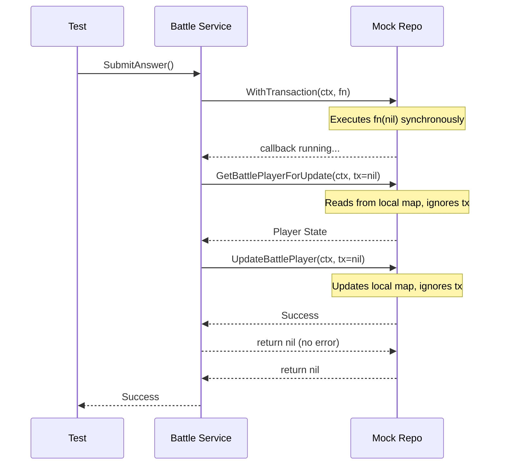

# Testing Strategies - Senior Level Interview Prep

This guide explores advanced testing patterns for transaction boundary enforcement, database transaction mock adapters, transaction propagation, and cross-module consistency without live database connections.

---

## Q&A Sets

### Q1: How do you mock database transactions and verify transactional boundary enforcement in Go service tests without using a database connection pool?

#### Interviewer Intent
Assess the candidate's mastery of database abstraction, ability to mock complex block-based APIs (like transaction blocks), and knowledge of transaction propagation verification.

#### Strong Answer
In Go, database libraries like `pgx` use callback-based transaction handlers (e.g., `WithTransaction(ctx, fn)`) to ensure atomic execution. When testing services that perform multiple coordinate writes inside a transaction, mocking the transaction state without a database is a major architectural challenge.

We solve this using the **Nil-Transaction Mock Adapter Pattern**:
1. **Interface Definition**: The database repository interface declares a transaction wrapper method that accepts a callback function:
   ```go
   type BattleRepository interface {
       WithTransaction(ctx context.Context, fn func(tx pgx.Tx) error) error
       InsertBattle(ctx context.Context, tx pgx.Tx, b Battle) error
       // ... other queries
   }
   ```
2. **Production Implementation**: The real repository opens a physical transaction using `db.Begin(ctx)`, passes the `pgx.Tx` object to the callback `fn(tx)`, and handles `Commit` or `Rollback` based on whether the callback returned an error:
   ```go
   func (r *Repository) WithTransaction(ctx context.Context, fn func(tx pgx.Tx) error) error {
       tx, err := r.db.Begin(ctx)
       if err != nil { return err }
       defer tx.Rollback(ctx)
       if err := fn(tx); err != nil { return err }
       return tx.Commit(ctx)
   }
   ```
3. **Mock Implementation**: In unit tests, the mock repository simply executes the callback synchronously, passing `nil` as the transaction object:
   ```go
   func (m *mockBattleRepository) WithTransaction(ctx context.Context, fn func(tx pgx.Tx) error) error {
       return fn(nil)
   }
   ```
4. **Query Mocking**: The mock query methods (like `InsertBattle(ctx, tx, b)`) accept the `pgx.Tx` parameter but **completely ignore it**. Instead, they update local in-memory maps.



#### Why this works
This pattern achieves several critical design goals:
* **Signature Compatibility**: The service code executes identically in production and testing, passing `tx` through all repository methods without branching or reflection.
* **No Database Required**: We assert correctness of business operations and write ordering without paying the latency and complexity cost of a database connection.
* **Rollback Assertions**: If any operation in the callback returns an error, the mock returns that error. In production, this causes the deferred `tx.Rollback` to fire. In tests, we can verify that the mock state remains unmodified or that the error propagates correctly to the caller.

#### Common Mistakes
* Passing dummy mock implementations of `pgx.Tx` that require extensive mock configuration, bloating the test code with useless boilerplates.
* Bypassing transactions in tests by exposing separate non-transactional methods on the service, which hides transaction bugs (e.g. failing to pass the transaction handle to a query).
* Not verifying that all operations inside the service transaction block actually receive and use the shared `tx` variable, leading to silent query escapes in production.

#### Follow-up Questions
* How does this pattern help verify that a query does not "escape" the transaction boundary in production? (If a repository method uses `r.db.Query` instead of `tx.Query`, it bypasses the transaction. We catch this during code reviews by checking if the passed `tx` is ignored in the production repository).
* How would you simulate a database commit failure (e.g., serialization failure) using this mock adapter?
* If the callback function panics, how does the production deferred `Rollback` handle it compared to the mock?

#### How DSAblitz demonstrates this concept
DSAblitz utilizes this pattern in `backend/internal/battle/service_test.go`. The mock repository implements `WithTransaction` by executing the closure with a `nil` transaction handle, while the production repository in `repository.go` manages the actual pgx transactional lifecycle.

#### Relevant code references
* [repository.go:L27-L43](file:///home/tanishq/dsablitz/backend/internal/battle/repository.go#L27-L43) - Production transaction block with defer rollbacks and commits.
* [service_test.go:L83-L85](file:///home/tanishq/dsablitz/backend/internal/battle/service_test.go#L83-L85) - Mock transaction execution forwarding `nil` to the callback.
* [service.go:L192-L293](file:///home/tanishq/dsablitz/backend/internal/battle/service.go#L192-L293) - Coordinated transactional submission engine in the service layer.

#### Related documentation
* [database/transactions.md](file:///home/tanishq/dsablitz/docs/database/transactions.md)
* [deep-dives/transaction_boundaries.md](file:///home/tanishq/dsablitz/docs/deep-dives/transaction_boundaries.md)

---

### Q2: How do you design and test cross-module transaction boundaries to ensure atomicity when operations span multiple independent service domains?

#### Interviewer Intent
Assess capabilities in microservices/modular monolith architecture design, database connection lifecycle management, and testing transactional consistency across module boundaries.

#### Strong Answer
In a modular monolith, modules should be decoupled. However, certain operations must be transactional across module boundaries. For example, when starting a battle in DSAblitz:
1. The **Rooms** module must update the room's status from `ready` to `in_battle`.
2. The **Battle** module must generate a question sequence and initialize player scores.

If the Battle module fails to initialize (e.g., no active questions available), the Room status change must roll back. To achieve this without tight coupling:
* We define a **Shared Transaction Context**. The cross-module interface method accepts a transaction handle (`pgx.Tx`):
  ```go
  type BattleCoordinator interface {
      StartBattle(ctx context.Context, tx pgx.Tx, roomID uuid.UUID, players []BattlePlayer, seed int64) (uuid.UUID, error)
  }
  ```
* The Rooms service controls the transaction boundary, opening the transaction using `repo.WithTransaction` and calling the Battle service, passing `tx` down.
* The Battle service executes all its database writes on the passed `tx` (using its own repository methods like `InsertBattleTx(ctx, tx, ...)`).

To test this cross-module flow:
1. We mock the `BattleCoordinator` in the Rooms service unit tests.
2. In the integration test suite, we integrate both services. Since both mock repositories (Rooms and Battle) implement `WithTransaction` as `fn(nil)`, the Rooms service starts the transaction, passes `tx = nil` to the Battle service, and both services record their state changes in their respective in-memory maps.
3. We can then assert that:
   * The Room state was updated in the Rooms mock repository.
   * The Battle and sequence records were initialized in the Battle mock repository.
   * If the Battle mock is configured to return an error, the Room state remains unchanged (rolled back).

#### Common Mistakes
* Allowing the Battle service to open a nested transaction inside the parent transaction, causing connection pool starvation or deadlocks in PostgreSQL.
* Declaring cross-module methods that do not accept a transaction handle, making it impossible to roll back the entire operation if a later write fails.
* Using distributed transaction protocols (like 2PC or Saga) when a single database transaction handle can be passed via simple interface injection, adding unnecessary complexity.

#### Follow-up Questions
* What is connection pool starvation, and how does sharing the transaction context prevent it? (Opening nested transactions consumes multiple database connections from the pool; if all connections are waiting on nested transactions to complete, the system deadlocks).
* What are the trade-offs of passing `pgx.Tx` across modules vs using domain events? (Shared transactions provide immediate consistency but couple database layers; domain events provide eventual consistency but require handling partial failures asynchronously).
* How would you handle transaction boundaries if Rooms and Battle were separate physical microservices? (You would use the Saga pattern with compensating transactions, since they cannot share a single pgx connection).

#### How DSAblitz demonstrates this concept
DSAblitz enforces modular boundaries and transaction sharing. The Rooms module's service initializes the database transaction and invokes `battleCoordinator.StartBattle`, passing the parent transaction down. If battle sequence generation fails, the room state remains unchanged.

#### Relevant code references
* [service.go:L406-L414](file:///home/tanishq/dsablitz/backend/internal/rooms/service.go#L406-L414) - Rooms service invoking the Battle coordinator inside a parent transaction.
* [service.go:L102-L154](file:///home/tanishq/dsablitz/backend/internal/battle/service.go#L102-L154) - Battle service implementing `StartBattleTx` to run inside the shared transaction handle.

#### Related documentation
* [deep-dives/transaction_boundaries.md](file:///home/tanishq/dsablitz/docs/deep-dives/transaction_boundaries.md)
* [architecture/module_boundaries.md](file:///home/tanishq/dsablitz/docs/architecture/module_boundaries.md)

---

## Key Takeaways
* **Nil-Transaction Mocking**: Mocking transactional wrappers via `fn(nil)` avoids complex DB mocks while retaining production method signatures.
* **Transaction Context Sharing**: Sharing the `pgx.Tx` transaction handle across modules prevents connection pool starvation and enforces atomicity.
* **Decoupled Boundary Integration**: Using mock coordinators allows modules to verify boundary conditions (such as rollbacks) in microsecond-fast tests.

## Interview Questions
1. Describe the Nil-Transaction Mock Adapter pattern. How does it maintain code compatibility without needing a real database?
2. What is connection pool starvation, and how does passing a single transaction context resolve it?
3. How do you test that cross-module mutations roll back successfully when a secondary write operation fails?

## Common Mistakes
* Mocking database drivers (like `sqlmock`) for high-level service tests, which results in brittle tests that break upon minor SQL formatting changes.
* Using nested transaction blocks (`BEGIN` within `BEGIN`), which are not natively supported by PostgreSQL without savepoints.
* Overlooking transaction propagation, allowing queries to run outside the transaction boundary and read dirty states.

## Related Documents
* [database/transactions.md](file:///home/tanishq/dsablitz/docs/database/transactions.md)
* [deep-dives/transaction_boundaries.md](file:///home/tanishq/dsablitz/docs/deep-dives/transaction_boundaries.md)
* [architecture/module_interactions.md](file:///home/tanishq/dsablitz/docs/architecture/module_interactions.md)

## Lessons Learned
* Scalable modular systems must enforce strict rules for transaction boundaries and connection sharing to prevent deadlocks and pool starvation.
* Keep testing tools simple: in-memory stateful mocks are far more maintainable than heavy database simulation frameworks.
